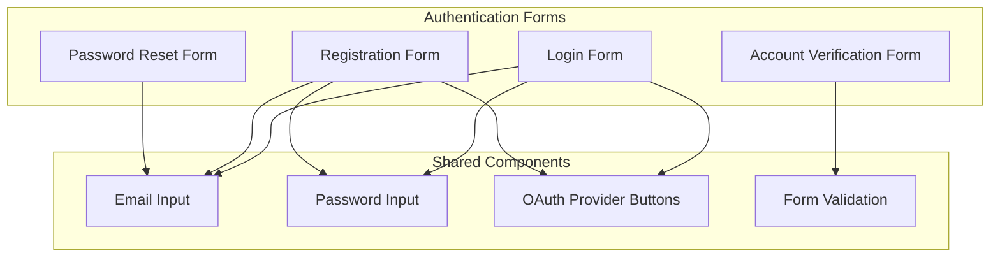

# Authentication Form Components

The Authentication Form components provide standardized interfaces for user authentication, including login, registration, password reset, and account verification.

## Component Overview



## Login Form

The LoginForm component provides a standardized interface for user authentication.

### Component API

```typescript
interface LoginFormProps {
  onSubmit: (credentials: { email: string; password: string }) => Promise<void>;
  onOAuthLogin: (provider: "google" | "github" | "facebook") => Promise<void>;
  onForgotPassword: () => void;
  onRegister: () => void;
  isLoading?: boolean;
  error?: string;
}
```

### Features

- Email and password input fields with validation
- "Remember me" option for persistent sessions
- OAuth provider buttons for third-party authentication
- Links to registration and password reset forms
- Error message display for failed authentication attempts
- Loading state during authentication process

## Registration Form

The RegisterForm component provides a form for new user registration.

### Component API

```typescript
interface RegisterFormProps {
  onSubmit: (userData: { email: string; password: string; displayName?: string; acceptTerms: boolean }) => Promise<void>;
  onOAuthRegister: (provider: "google" | "github" | "facebook") => Promise<void>;
  onLogin: () => void;
  isLoading?: boolean;
  error?: string;
}
```

### Features

- Email, password, and display name input fields
- Password strength indicator
- Terms and conditions acceptance checkbox
- OAuth provider buttons for third-party registration
- Link to login form for existing users
- Error message display for registration issues
- Loading state during registration process

## Password Reset Form

The PasswordResetForm component provides a form for resetting forgotten passwords.

### Component API

```typescript
interface PasswordResetFormProps {
  onSubmit: (email: string) => Promise<void>;
  onBack: () => void;
  isLoading?: boolean;
  error?: string;
  success?: boolean;
}
```

### Features

- Email input field for identifying the account
- Clear instructions for the reset process
- Success message after reset email is sent
- Error message display for reset issues
- Loading state during reset process
- Back button to return to login form

## Account Verification Form

The VerificationForm component provides a form for verifying user accounts.

### Component API

```typescript
interface VerificationFormProps {
  onSubmit: (code: string) => Promise<void>;
  onResendCode: () => Promise<void>;
  email: string;
  isLoading?: boolean;
  error?: string;
}
```

### Features

- Verification code input field
- Clear instructions for the verification process
- Option to resend verification code
- Error message display for verification issues
- Loading state during verification process
- Email display to confirm which account is being verified

## Shared Components

### Email Input

Standardized email input with:

- Validation for email format
- Autocomplete support
- Error state display
- Focus management

### Password Input

Standardized password input with:

- Show/hide password toggle
- Password strength indicator
- Validation for password requirements
- Error state display

### OAuth Provider Buttons

Standardized buttons for OAuth authentication:

- Google, GitHub, and Facebook providers
- Consistent styling and behavior
- Loading states during authentication
- Error handling for OAuth failures

### Form Validation

Shared validation logic for:

- Email format validation
- Password strength requirements
- Required field validation
- Error message formatting

## Accessibility

The Authentication Form components implement the following accessibility features:

- Proper form labeling and ARIA attributes
- Keyboard navigation and focus management
- High contrast visual indicators for form states
- Error announcements for screen readers
- Responsive design for various screen sizes

## Related Documentation

- [Authentication Login Flow](../flows/authentication-login.md)
- [Authentication Registration Flow](../flows/authentication-registration.md)
- [Login Page](../pages/login.md)
- [Register Page](../pages/register.md)
