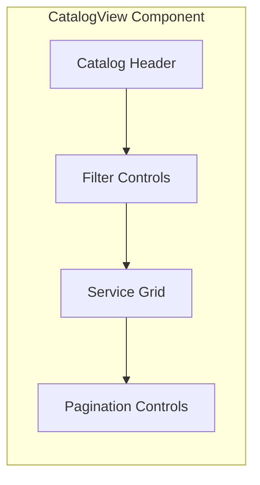

# CatalogView Component

The CatalogView component provides a container for displaying and managing command catalogs. It handles catalog navigation, filtering, and command display for both the global catalog and user inventory.

## Visual Structure



The CatalogView displays a header with catalog information, filter controls for refining the displayed commands, a grid of service cards, and pagination controls for navigating through large catalogs.

## Component API

```typescript
interface CatalogViewProps {
  catalog: {
    id: string;
    name: string;
    description?: string;
    services: Service[];
    totalCount: number;
  };
  filters?: {
    search?: string;
    labels?: string[];
    sortBy?: "popularity" | "name" | "date" | "rating";
    sortDirection?: "asc" | "desc";
  };
  onFilterChange?: (filters: any) => void;
  onServiceSelect?: (serviceId: string) => void;
  onServiceImport?: (serviceId: string) => void;
  onPageChange?: (page: number) => void;
  itemsPerPage?: number;
  currentPage?: number;
}
```

## Behavior

The CatalogView implements the following behaviors:

- **Catalog Display**: Shows a grid of services from the specified catalog
- **Filtering**: Allows filtering services by search terms, labels, and other criteria
- **Sorting**: Enables sorting services by various attributes
- **Pagination**: Provides navigation through large catalogs with page controls
- **Service Selection**: Handles selection of services for viewing details
- **Service Import**: Facilitates importing services to the user's inventory
- **Empty States**: Displays appropriate messaging when no services match filters

## States

The CatalogView can exist in several states:

- **Default**: Shows the catalog with default sorting and no filters
- **Filtered**: Displays services matching the applied filters
- **Empty**: Shows a message when no services match the current filters
- **Loading**: Displays a loading indicator while fetching catalog data
- **Error**: Shows an error message when catalog data cannot be loaded

## Usage Example

```jsx
<CatalogView
  catalog={{
    id: "global",
    name: "Global Catalog",
    description: "Community-shared commands",
    services: [...],
    totalCount: 250
  }}
  filters={{
    search: "google",
    labels: ["search"],
    sortBy: "popularity",
    sortDirection: "desc"
  }}
  onFilterChange={(filters) => console.log("Filters changed:", filters)}
  onServiceSelect={(id) => console.log(`Selected service: ${id}`)}
  onServiceImport={(id) => console.log(`Importing service: ${id}`)}
  onPageChange={(page) => console.log(`Navigating to page: ${page}`)}
  itemsPerPage={20}
  currentPage={1}
/>
```

## Filtering Capabilities

The CatalogView provides comprehensive filtering options:

- **Text Search**: Filter services by name, description, or URL
- **Label Filtering**: Filter services by one or more labels
- **Sorting Options**: Sort by popularity, name, date, or rating
- **Sort Direction**: Toggle between ascending and descending order
- **Advanced Filters**: Filter by verification status, creator, or other metadata

## Pagination

For large catalogs, the component implements pagination with:

- **Page Navigation**: Controls for moving between pages
- **Items Per Page**: Configurable number of items displayed per page
- **Total Count**: Display of total matching services
- **Current Position**: Indication of current page position

## Accessibility

The CatalogView implements the following accessibility features:

- Keyboard navigation through the catalog
- ARIA attributes for dynamic content
- Focus management for filter controls
- Screen reader announcements for filter changes and pagination

## Related Components

- [ServiceGrid](ServiceGrid.md) - Grid display of services within the catalog
- [ServiceCard](ServiceCard.md) - Individual service cards in the grid
- [LabelBar](LabelBar.md) - Label filtering for the catalog
- [SearchBar](SearchBar.md) - Text search for the catalog

## Related Documentation

- [Global Catalog Model](../models/global-catalog.md)
- [Inventory Model](../models/inventory.md)
- [Global Catalog Page](../pages/global-catalog.md)
