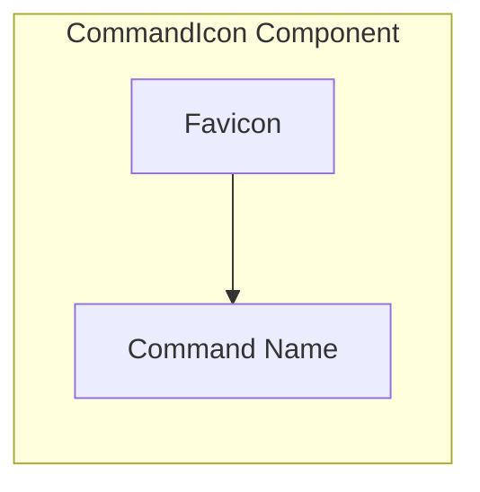

# CommandIcon Component

The CommandIcon component provides a visual representation of a command in the ServiceGrid. It displays the command's favicon and name in a Windows 95-style icon format.

## Visual Structure



The CommandIcon displays a favicon image at the top and the command name as a label below it. The component uses a consistent size and styling to create a uniform grid appearance, similar to desktop icons in traditional operating systems.

## Component API

```typescript
interface CommandIconProps {
  command: {
    id: string;
    name: string;
    icon?: string;
    url: string;
  };
  isSelected?: boolean;
  onClick?: (commandId: string) => void;
  onDoubleClick?: (commandId: string) => void;
  onContextMenu?: (event: React.MouseEvent, commandId: string) => void;
}
```

## Behavior

The CommandIcon implements the following behaviors:

- **Icon Display**: Shows the command's favicon, either from the domain or a custom icon
- **Fallback Icon**: Displays a default icon when no favicon is available
- **Label Display**: Shows the command name below the icon
- **Selection State**: Visually indicates when the command is selected
- **Click Handling**: Processes single clicks for selection
- **Double-Click Handling**: Processes double clicks for execution
- **Context Menu**: Supports right-click for additional options
- **Drag and Drop**: Enables drag-and-drop for organization

## States

The CommandIcon can exist in several states:

- **Default**: Normal display state
- **Selected**: Visually highlighted when selected
- **Hover**: Visual feedback when the mouse is over the icon
- **Dragging**: Visual state during drag operations
- **Loading**: Shown while the favicon is loading
- **Error**: Displayed when the favicon fails to load

## Usage Example

```jsx
<CommandIcon
  command={{
    id: "cmd_google",
    name: "Google",
    icon: "https://www.google.com/favicon.ico",
    url: "https://www.google.com",
  }}
  isSelected={false}
  onClick={(id) => console.log(`Selected command: ${id}`)}
  onDoubleClick={(id) => console.log(`Executing command: ${id}`)}
  onContextMenu={(event, id) => console.log(`Context menu for: ${id}`)}
/>
```

## Favicon Handling

The CommandIcon implements several strategies for favicon handling:

- **Direct URL**: Uses the favicon URL if provided in the command data
- **Domain Extraction**: Extracts the domain from the command URL to construct a favicon URL
- **Favicon Service**: Falls back to a favicon service (e.g., Google's favicon service)
- **Default Icon**: Uses a default icon when no favicon can be loaded
- **Caching**: Caches favicons to reduce network requests and improve performance

## Accessibility

The CommandIcon implements the following accessibility features:

- Keyboard navigation and selection
- ARIA attributes for selection state
- High contrast visual indicators
- Screen reader support for command names and states

## Related Components

- [[ServiceGrid|ServiceGrid]] - Container component that displays multiple CommandIcons
- [[CommandCard|CommandCard]] - Expanded view of command information
- [[LabelBar|LabelBar]] - Filtering system that affects which CommandIcons are displayed

## Related Documentation

- [[../models/command|Command Model]]
- [[../pages/inventory|Inventory Page]]
- [[../flows/command-execution|Command Execution Flow]]
