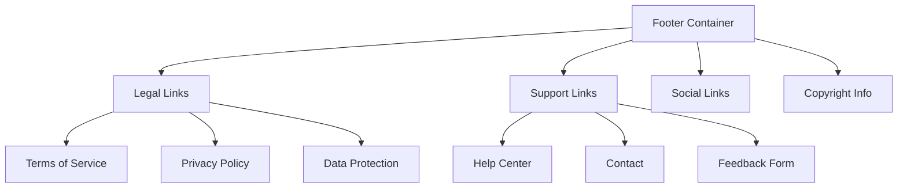

# Footer Component

The Footer component provides secondary navigation and legal information access across the meows.space application. It appears at the bottom of each page with standardized styling.

## Component Structure



## Implementation Details

The Footer component is implemented as a React functional component with the following features:

- Responsive grid layout that adapts to different screen sizes
- Organized sections for legal, support, and social links
- Standardized styling with the application theme
- Minimal height to maximize content area

## Navigation Structure

The Footer provides access to three categories of pages:

1. **Legal Documentation**

   - Terms of Service
   - Privacy Policy
   - Data Protection

2. **Help & Support**

   - Help Center
   - Contact Information
   - Feedback Form

3. **Social & Community**
   - Social Media Links
   - Community Resources
   - Developer Documentation

## Responsive Behavior

The component implements two distinct layouts based on viewport width:

- **Mobile** (<768px): Single column with collapsible sections
- **Desktop** (≥768px): Multi-column grid with all sections visible

## Usage

```tsx
import { Footer } from "components/Footer";

function App() {
  return (
    <div className="app">
      <Header />
      <main>{/* Page content */}</main>
      <Footer />
    </div>
  );
}
```

## Accessibility

The Footer component implements the following accessibility features:

- Semantic HTML structure with appropriate heading levels
- Proper link grouping with ARIA landmarks
- High contrast mode compatibility
- Screen reader optimization

## Related Components

- [Header](Header.md): Primary navigation component
- [TermsOfService](../pages/terms-of-use.md): Legal page linked from footer
- [PrivacyPolicy](../pages/privacy-policy.md): Legal page linked from footer
- [HelpCenter](../pages/help.md): Support page linked from footer
