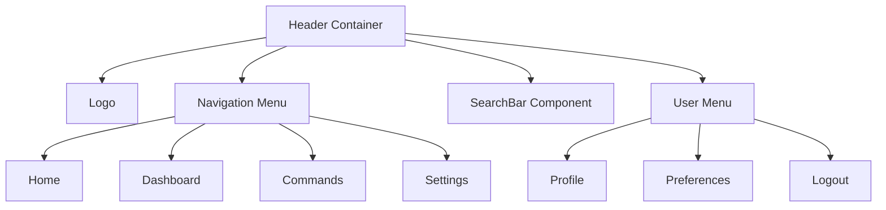

# Header Component

The Header component provides the primary navigation interface for the meows.space application. It appears at the top of all application pages with fixed positioning.

## Component Structure



## Implementation Details

The Header component is implemented as a React functional component with the following features:

- Fixed positioning at the top of the viewport
- Responsive design that adapts to different screen sizes
- Collapsible navigation menu for mobile devices
- Integration with the authentication system to display user-specific options
- Direct access to the SearchBar component for command execution

## State Management

The Header component interacts with several state contexts:

- **Authentication Context**: Determines which user-specific options to display
- **Theme Context**: Controls the visual appearance of the header
- **Navigation Context**: Tracks the current active page

## Responsive Behavior

The component implements three distinct layouts based on viewport width:

- **Mobile** (<768px): Hamburger menu with collapsible navigation
- **Tablet** (768px-1024px): Compact navigation with abbreviated labels
- **Desktop** (>1024px): Full navigation with complete labels and additional options

## Usage

```tsx
import { Header } from "components/Header";

function App() {
  return (
    <div className="app">
      <Header />
      <main>{/* Page content */}</main>
      <Footer />
    </div>
  );
}
```

## Accessibility

The Header component implements the following accessibility features:

- Proper ARIA roles and attributes for navigation elements
- Keyboard navigation support with focus management
- High contrast mode compatibility
- Screen reader announcements for state changes

## Related Components

- [SearchBar](SearchBar.md): Integrated in the header for command execution
- [Footer](Footer.md): Complementary navigation component
- [UserMenu](UserMenu.md): User-specific options displayed in the header
