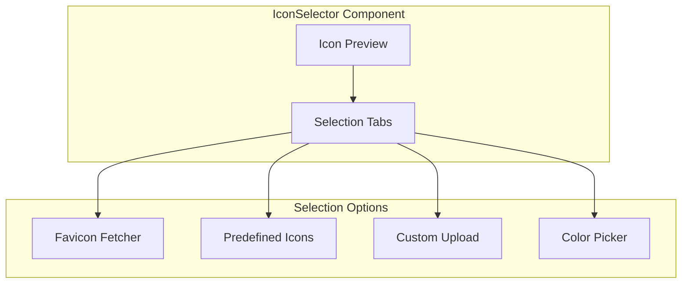

# IconSelector Component

The IconSelector component provides an interface for selecting and customizing icons for services. It allows users to choose from predefined icons, fetch favicons from domains, or upload custom icons.

## Visual Structure



The IconSelector displays a preview of the selected icon and tabs for different selection methods. Users can fetch favicons from domains, choose from predefined icons, upload custom images, or customize colors.

## Component API

```typescript
interface IconSelectorProps {
  value: string | null;
  onChange: (iconUrl: string | null) => void;
  serviceUrl?: string;
  defaultIcon?: string;
  size?: "small" | "medium" | "large";
  allowCustomUpload?: boolean;
  maxUploadSize?: number;
  onError?: (error: Error) => void;
}
```

## Behavior

The IconSelector implements the following behaviors:

- **Icon Preview**: Displays the currently selected icon
- **Favicon Fetching**: Automatically fetches favicons from service domains
- **Predefined Icons**: Provides a gallery of common service icons
- **Custom Upload**: Allows uploading custom icon images
- **Color Customization**: Enables customizing icon colors
- **Error Handling**: Manages errors in icon loading or processing
- **Responsive Design**: Adapts to different screen sizes and devices

## Selection Methods

### Favicon Fetching

The component can automatically fetch favicons from domains:

- Extracts domain from service URL
- Attempts to fetch favicon.ico
- Falls back to Google's favicon service
- Provides preview of fetched favicon
- Handles loading and error states

### Predefined Icons

The component includes a gallery of common service icons:

- Categorized by service type (social, productivity, development)
- Search functionality for finding specific icons
- Preview on hover
- Selection with single click
- Pagination for large icon sets

### Custom Upload

Users can upload their own custom icons:

- Drag-and-drop interface
- File browser dialog
- Image cropping and resizing
- Format conversion (to PNG/SVG)
- Size and format validation

### Color Customization

For simple icons, users can customize colors:

- Color picker for primary and secondary colors
- Preset color schemes
- Background color options
- Transparency settings
- Preview of color changes

## Usage Example

```jsx
<IconSelector
  value="https://www.google.com/favicon.ico"
  onChange={(iconUrl) => console.log("Icon selected:", iconUrl)}
  serviceUrl="https://www.google.com"
  defaultIcon="/default-icon.png"
  size="medium"
  allowCustomUpload={true}
  maxUploadSize={1024 * 1024} // 1MB
  onError={(error) => console.error("Icon error:", error)}
/>
```

## Icon Processing

The component handles several icon processing tasks:

- **Resizing**: Ensures icons are appropriately sized
- **Format Conversion**: Converts uploads to web-friendly formats
- **Optimization**: Compresses images for performance
- **Caching**: Caches processed icons for performance
- **Fallbacks**: Provides fallback icons when selected icons fail to load

## Accessibility

The IconSelector implements the following accessibility features:

- Keyboard navigation for icon selection
- ARIA attributes for dynamic content
- Focus management for selection tabs
- Alternative text for icon images
- High contrast mode support

## Related Components

- [ServiceBuilder](ServiceBuilder.md) - Parent component that uses the IconSelector
- [ParameterEditor](ParameterEditor.md) - Component for editing service parameters
- [ServiceIcon](ServiceIcon.md) - Component that displays the selected icon

## Related Documentation

- [Service Model](../models/service.md)
- [Create Service Page](../pages/create-service.md)
- [Service Details Page](../pages/service-details.md)
