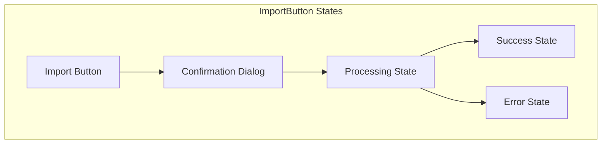

# ImportButton Component

The ImportButton component provides a button for importing commands from the global catalog to a user's inventory. It handles the import process with confirmation and success states.

## Visual Structure



The ImportButton transitions through several visual states during the import process, providing feedback to the user at each step.

## Component API

```typescript
interface ImportButtonProps {
  serviceId: string;
  serviceName: string;
  onImport: (serviceId: string) => Promise<boolean>;
  onSuccess?: () => void;
  onError?: (error: Error) => void;
  customizeBeforeImport?: boolean;
  buttonSize?: "small" | "medium" | "large";
  buttonVariant?: "primary" | "secondary" | "text";
}
```

## Behavior

The ImportButton implements the following behaviors:

- **Import Initiation**: Starts the import process when clicked
- **Confirmation**: Requests user confirmation before proceeding
- **Customization Option**: Optionally allows customizing the command before import
- **Progress Indication**: Shows a loading state during the import process
- **Success Feedback**: Displays success confirmation when import completes
- **Error Handling**: Shows error messages if import fails
- **Inventory Navigation**: Optionally navigates to inventory after successful import

## States

The ImportButton can exist in several states:

- **Default**: Ready to initiate import
- **Confirming**: Showing confirmation dialog
- **Processing**: Import in progress
- **Success**: Import completed successfully
- **Error**: Import failed with error

## Usage Example

```jsx
<ImportButton
  serviceId="svc_google"
  serviceName="Google Search"
  onImport={async (id) => {
    try {
      await importService(id);
      return true;
    } catch (error) {
      console.error(error);
      return false;
    }
  }}
  onSuccess={() => console.log("Import successful")}
  onError={(error) => console.error("Import failed:", error)}
  customizeBeforeImport={true}
  buttonSize="medium"
  buttonVariant="primary"
/>
```

## Confirmation Dialog

The confirmation dialog provides:

- Service name and description
- Option to customize before import
- Confirmation and cancel buttons
- Information about what happens after import

## Customization Flow

When customization is enabled:

1. User clicks "Customize" in confirmation dialog
2. System navigates to ServiceBuilder with pre-filled service data
3. User modifies service properties as needed
4. User completes customization and confirms import
5. System adds customized service to inventory

## Success Feedback

After successful import, the component:

- Shows a success message with the service name
- Provides a link to view the service in inventory
- Offers an option to import another service
- Automatically reverts to default state after a delay

## Error Handling

If import fails, the component:

- Displays an error message with details
- Provides retry and cancel options
- Logs error details for troubleshooting
- Allows user to report the issue

## Related Components

- [ServiceCard](ServiceCard.md) - Card component that contains the ImportButton
- [ServiceBuilder](ServiceBuilder.md) - Used for customizing services before import
- [ServiceGrid](ServiceGrid.md) - Grid that displays imported services

## Related Documentation

- [Global Catalog Page](../pages/global-catalog.md)
- [Command Management Flow](../flows/command-management.md)
- [Service Model](../models/service.md)
