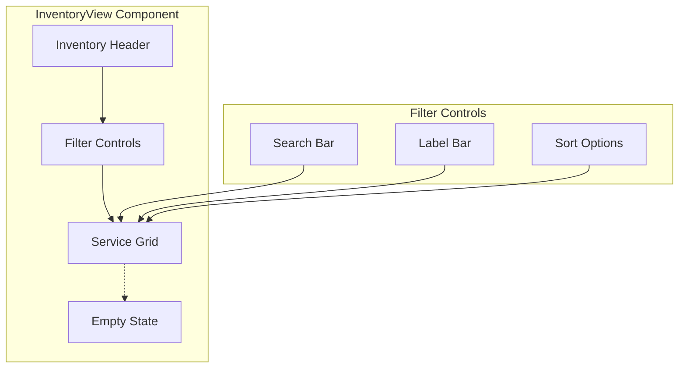

# InventoryView Component

The InventoryView component provides a container for displaying and managing a user's personal command inventory. It handles inventory navigation, filtering, and command display within the Inventory page.

## Visual Structure



The InventoryView displays a header with inventory information, filter controls for refining the displayed commands, and a grid of service icons. When no commands match the current filters or the inventory is empty, an appropriate empty state is shown.

## Component API

```typescript
interface InventoryViewProps {
  inventory: {
    id: string;
    name: string;
    services: Service[];
    labels: Label[];
  };
  filters?: {
    search?: string;
    labels?: string[];
    sortBy?: "name" | "date" | "usage";
    sortDirection?: "asc" | "desc";
  };
  onFilterChange?: (filters: any) => void;
  onServiceSelect?: (serviceId: string) => void;
  onServiceEdit?: (serviceId: string) => void;
  onServiceDelete?: (serviceId: string) => void;
  onCreateService?: () => void;
}
```

## Behavior

The InventoryView implements the following behaviors:

- **Inventory Display**: Shows a grid of services from the user's inventory
- **Filtering**: Allows filtering services by search terms, labels, and other criteria
- **Sorting**: Enables sorting services by various attributes
- **Custom Ordering**: Supports drag-and-drop reordering of services with persistence
- **Service Management**: Provides interfaces for adding, editing, and removing services
- **Empty States**: Displays appropriate messaging when no services match filters

## Custom Service Ordering

The InventoryView supports custom ordering of services through drag-and-drop:

- Users can drag services to any position in the grid
- The custom order is saved to user preferences automatically
- Different orders can be maintained for different label selections
- The order persists across sessions and devices
- When a label is selected, its specific custom order is applied
- Default sorting options are available when no custom order exists

The custom ordering is implemented through:

1. Drag-and-drop event handling in the ServiceGrid
2. Order persistence in the UserPreferences model
3. Order synchronization across devices
4. Label-specific ordering support

## States

The InventoryView can exist in several states:

- **Default**: Shows all services in the inventory
- **Filtered**: Displays services matching the applied filters
- **Empty**: Shows an empty state when the inventory contains no services
- **No Results**: Shows a message when no services match the current filters
- **Loading**: Displays a loading indicator while fetching inventory data
- **Error**: Shows an error message when inventory data cannot be loaded

## Usage Example

```jsx
<InventoryView
  inventory={{
    id: "personal",
    name: "My Commands",
    services: [...],
    labels: [...]
  }}
  filters={{
    search: "google",
    labels: ["search"],
    sortBy: "usage",
    sortDirection: "desc"
  }}
  onFilterChange={(filters) => console.log("Filters changed:", filters)}
  onServiceSelect={(id) => console.log(`Selected service: ${id}`)}
  onServiceEdit={(id) => console.log(`Editing service: ${id}`)}
  onServiceDelete={(id) => console.log(`Deleting service: ${id}`)}
  onCreateService={() => console.log("Creating new service")}
/>
```

## Empty States

The InventoryView provides different empty states based on the context:

- **Empty Inventory**: Shown when the user has no services, with a call-to-action to create or import services
- **No Filter Results**: Displayed when filters return no results, with suggestions to modify the filters
- **Error State**: Shown when there's an error loading the inventory, with retry options

## Drag and Drop Organization

The component implements drag-and-drop functionality for organizing services:

- Services can be dragged to rearrange their order
- Visual feedback indicates valid drop targets
- Position changes are persisted to the inventory
- Keyboard shortcuts provide accessibility for organization

## Context Menu

Right-clicking on a service opens a context menu with options:

- Edit service
- Delete service
- Duplicate service
- Add to favorites
- Share service
- View usage statistics

## Accessibility

The InventoryView implements the following accessibility features:

- Keyboard navigation for all interactive elements
- ARIA attributes for dynamic content
- Focus management for filter controls and grid items
- Screen reader announcements for state changes
- High contrast visual indicators for selected items

## Related Components

- [ServiceGrid](ServiceGrid.md) - Grid display of services within the inventory
- [ServiceIcon](ServiceIcon.md) - Individual service icons in the grid
- [LabelBar](LabelBar.md) - Label filtering for the inventory
- [SearchBar](SearchBar.md) - Text search for the inventory

## Related Documentation

- [Inventory Model](../models/inventory.md)
- [Inventory Page](../pages/inventory.md)
- [Command Management Flow](../flows/command-management.md)
