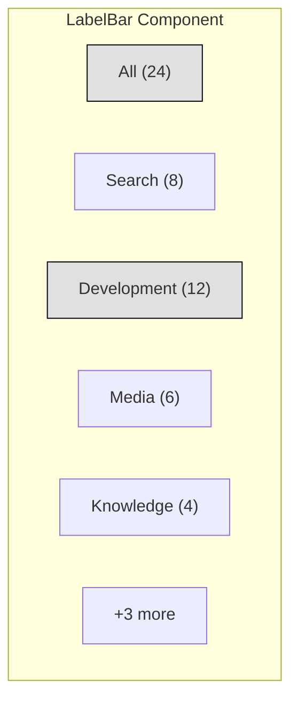

# LabelBar Component

The LabelBar component provides a horizontal filtering interface for organizing and accessing commands by label. It displays a scrollable list of available labels with selection indicators and count badges.

## Visual Structure



The LabelBar displays labels in a horizontal scrollable container. Each label shows its name and the count of associated commands. Selected labels are visually highlighted. When there are more labels than can fit in the available space, a "+X more" button appears to access additional labels.

## Component API

```typescript
interface LabelBarProps {
  labels: Label[];
  selectedLabels: string[];
  onLabelSelect: (labelId: string) => void;
  onLabelMultiSelect: (labelId: string, isCtrlPressed: boolean) => void;
  maxVisible?: number;
}

interface Label {
  id: string;
  name: string;
  count: number;
  color?: string;
}
```

## Behavior

The LabelBar implements the following behaviors:

- **Label Selection**: Clicking a label selects it and filters the associated command view
- **Multi-selection**: Ctrl+Click allows selecting multiple labels (AND filtering)
- **Horizontal Scrolling**: Scroll horizontally when more labels exist than can fit
- **Overflow Handling**: Shows a "+X more" button when labels exceed available space
- **Count Indicators**: Displays the number of commands associated with each label
- **Visual Feedback**: Highlights selected labels and provides hover states

## States

The LabelBar can exist in several states:

- **Default**: Shows all available labels with none selected
- **Single Selection**: One label is selected, filtering to show only its commands
- **Multi Selection**: Multiple labels are selected (AND logic for filtering)
- **Empty**: No labels exist in the system
- **Overflow**: More labels exist than can be displayed at once

## Usage Example

```jsx
<LabelBar
  labels={[
    { id: "search", name: "Search", count: 8 },
    { id: "dev", name: "Development", count: 12 },
    { id: "media", name: "Media", count: 6 },
    { id: "knowledge", name: "Knowledge", count: 4 },
  ]}
  selectedLabels={["dev"]}
  onLabelSelect={(labelId) => console.log(`Selected label: ${labelId}`)}
  onLabelMultiSelect={(labelId, isCtrlPressed) => console.log(`Multi-selected label: ${labelId}`)}
  maxVisible={5}
/>
```

## Accessibility

The LabelBar implements the following accessibility features:

- Keyboard navigation between labels
- ARIA attributes for selection state
- High contrast visual indicators
- Screen reader announcements for selection changes

## Related Components

- [ServiceGrid](ServiceGrid.md) - Displays commands filtered by the selected labels
- [ServiceIcon](ServiceIcon.md) - Individual command icons displayed in the grid
- [SearchBar](SearchBar.md) - Works in conjunction with label filtering

## Related Documentation

- [Label Model](../models/label.md)
- [Inventory Page](../pages/inventory.md)
- [Command Management Flow](../flows/command-management.md)

## Structure

The LabelBar implements a horizontal scrolling interface with the following features:

- Horizontal scrolling label list
- Label pills showing category names and command counts
- Multiple selection for combined filtering
- Visual indicators for active labels

## Functionality

### Label Display

The LabelBar displays labels as interactive pills that show:

- Label name
- Command count for each label
- Visual indicator for active state

### Filtering

The component enables filtering through:

- Single label selection
- Multiple label selection (AND operation)
- Label toggling
- Clear all filters option

### Navigation

The LabelBar provides navigation features:

- Horizontal scrolling for many labels
- Overflow indicators
- Scroll buttons for desktop
- Touch/swipe support for mobile

### Organization

Labels can be:

- Reordered through drag-and-drop
- Pinned to always appear first
- Hidden from the main view
- Grouped into categories

## Technical Implementation

The LabelBar implements several key features:

- Horizontal virtualized list
- Drag-and-drop reordering
- Responsive design for different screen sizes
- Touch and mouse interaction support
- Visual feedback for selection states

## Usage in Pages

The LabelBar appears on multiple pages:

- Inventory (/personal)
- Global Catalog (/catalog)
