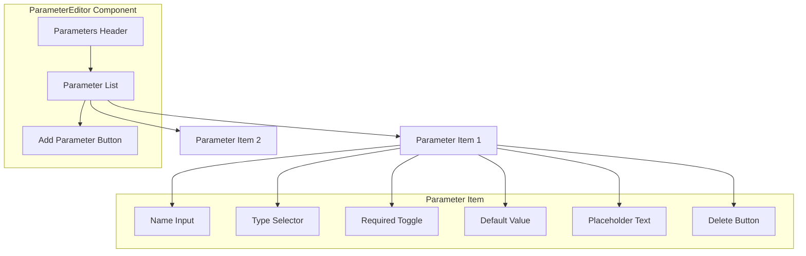

# ParameterEditor Component

The ParameterEditor component provides an interface for configuring parameters in dynamic commands. It allows users to define, edit, and validate parameters used in URL templates.

## Visual Structure



The ParameterEditor displays a list of parameters with configuration options for each. Users can add, edit, and remove parameters, with each parameter having properties like name, type, required status, default value, and placeholder text.

## Component API

```typescript
interface ParameterEditorProps {
  parameters: Parameter[];
  onChange: (parameters: Parameter[]) => void;
  urlTemplate?: string;
  onValidationError?: (errors: ValidationError[]) => void;
  maxParameters?: number;
}

interface Parameter {
  id: string;
  name: string;
  type: "string" | "number" | "boolean" | "date";
  required: boolean;
  defaultValue?: string;
  placeholder?: string;
  description?: string;
}

interface ValidationError {
  parameterId: string;
  field: string;
  message: string;
}
```

## Behavior

The ParameterEditor implements the following behaviors:

- **Parameter Management**: Add, edit, and remove parameters
- **Type Configuration**: Set parameter types with appropriate validation
- **Required Status**: Toggle whether parameters are required or optional
- **Default Values**: Set default values for parameters
- **Placeholder Text**: Define placeholder text for parameter input
- **Parameter Validation**: Validate parameter names and configurations
- **Template Integration**: Highlight parameters used in the URL template

## Parameter Types

The component supports several parameter types:

- **String**: Text input with optional validation patterns
- **Number**: Numeric input with optional min/max values
- **Boolean**: Toggle or checkbox input
- **Date**: Date picker input with format options

## Validation

The ParameterEditor performs several validation checks:

- **Name Uniqueness**: Ensures parameter names are unique
- **Name Format**: Validates parameter names follow allowed patterns
- **Template Usage**: Verifies parameters are used in the URL template
- **Required Parameters**: Checks that required parameters have default values
- **Type Compatibility**: Ensures default values match parameter types

## Usage Example

```jsx
<ParameterEditor
  parameters={[
    {
      id: "param1",
      name: "query",
      type: "string",
      required: true,
      placeholder: "Search term",
      description: "The search query to use",
    },
    {
      id: "param2",
      name: "limit",
      type: "number",
      required: false,
      defaultValue: "10",
      placeholder: "Result limit",
      description: "Maximum number of results",
    },
  ]}
  onChange={(parameters) => console.log("Parameters updated:", parameters)}
  urlTemplate="https://example.com/search?q={query}&limit={limit}"
  onValidationError={(errors) => console.error("Validation errors:", errors)}
  maxParameters={5}
/>
```

## Template Integration

The ParameterEditor integrates with the URL template by:

- Highlighting parameters that are used in the template
- Warning about parameters not used in the template
- Suggesting parameters based on the template structure
- Validating parameter usage in the template

## Accessibility

The ParameterEditor implements the following accessibility features:

- Keyboard navigation for parameter management
- ARIA attributes for dynamic content
- Focus management for form controls
- Error announcements for validation issues
- High contrast visual indicators

## Related Components

- [ServiceBuilder](ServiceBuilder.md) - Parent component that uses the ParameterEditor
- [IconSelector](IconSelector.md) - Component for selecting service icons
- [URLTemplateEditor](URLTemplateEditor.md) - Component for editing URL templates

## Related Documentation

- [Service Model](../models/service.md)
- [Command Model](../models/command.md)
- [Create Service Page](../pages/create-service.md)
