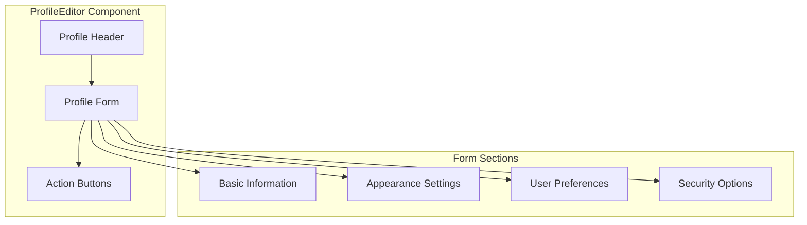

# ProfileEditor Component

The ProfileEditor component provides an interface for users to edit their profile information, including display name, profile picture, and preferences.

## Visual Structure



The ProfileEditor displays a header with the user's current profile information, a form with various sections for editing different aspects of the profile, and action buttons for saving or canceling changes.

## Component API

```typescript
interface ProfileEditorProps {
  profile: UserProfile;
  onSave: (profile: UserProfile) => Promise<void>;
  onCancel: () => void;
  isLoading?: boolean;
  error?: string;
  availableThemes?: Theme[];
}

interface UserProfile {
  displayName: string;
  email: string;
  profilePicture?: string;
  theme: string;
  defaultBrowser?: string;
  commandsPerPage: number;
  notificationPreferences: {
    email: boolean;
    browser: boolean;
  };
}

interface Theme {
  id: string;
  name: string;
  preview?: string;
}
```

## Behavior

The ProfileEditor implements the following behaviors:

- **Profile Information Editing**: Edit display name, email, and profile picture
- **Theme Selection**: Choose from available themes for the interface
- **Preference Configuration**: Set user preferences for the application
- **Form Validation**: Validate input fields before submission
- **Error Handling**: Display error messages for invalid inputs or failed saves
- **Responsive Design**: Adapt to different screen sizes and devices

## Form Sections

### Basic Information

The basic information section includes:

- Display name input
- Email address (read-only or editable based on authentication method)
- Profile picture upload or selection
- Account creation date (read-only)

### Appearance Settings

The appearance settings section includes:

- Theme selection (light, dark, system)
- Layout preferences (grid vs. list view)
- Icon size selection
- Font size adjustment

### User Preferences

The user preferences section includes:

- Default browser selection
- Commands per page setting
- Default sorting method
- Label visibility options
- Command execution preferences

### Security Options

The security options section includes:

- Password change option (if applicable)
- Two-factor authentication toggle
- Session management
- Account deletion option

## Usage Example

```jsx
<ProfileEditor
  profile={{
    displayName: "John Doe",
    email: "john@example.com",
    profilePicture: "https://example.com/profile.jpg",
    theme: "dark",
    defaultBrowser: "chrome",
    commandsPerPage: 20,
    notificationPreferences: {
      email: true,
      browser: false,
    },
  }}
  onSave={async (profile) => {
    try {
      await saveUserProfile(profile);
      showSuccessMessage("Profile saved successfully");
    } catch (error) {
      console.error("Failed to save profile:", error);
    }
  }}
  onCancel={() => navigate("/settings")}
  isLoading={false}
  error={null}
  availableThemes={[
    { id: "light", name: "Light Theme" },
    { id: "dark", name: "Dark Theme" },
    { id: "system", name: "System Default" },
  ]}
/>
```

## Form Validation

The ProfileEditor performs several validation checks:

- **Display Name**: Ensures the display name is not empty
- **Email**: Validates email format if editable
- **Profile Picture**: Checks image size and format
- **Preferences**: Ensures numeric values are within acceptable ranges

## Accessibility

The ProfileEditor implements the following accessibility features:

- Keyboard navigation for all form controls
- ARIA attributes for form elements
- Focus management for form sections
- Error announcements for validation issues
- High contrast mode support

## Related Components

- [UserMenu](UserMenu.md) - Menu component that provides access to the ProfileEditor
- [ThemeSelector](ThemeSelector.md) - Component for selecting interface themes
- [SecuritySettings](SecuritySettings.md) - Component for managing security options

## Related Documentation

- [User Profile Model](../models/user-profile.md)
- [User Preferences Model](../models/user-preferences.md)
- [Profile Management Flow](../flows/profile-management.md)
- [Settings Page](../pages/settings.md)
