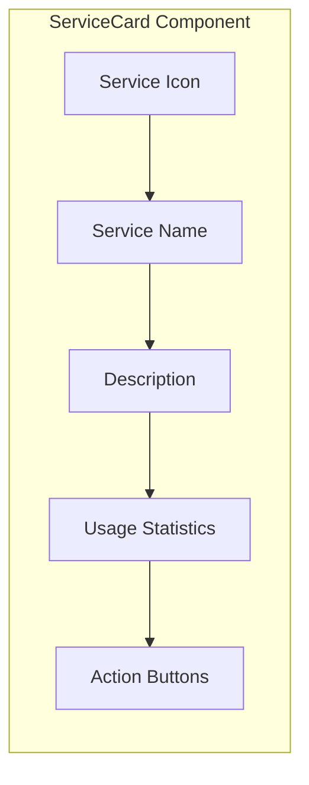

# ServiceCard Component

The ServiceCard component provides a detailed card view of a command in the catalog and inventory views. It displays the command's icon, name, description, and usage statistics in a card format.

## Visual Structure



The ServiceCard displays a service icon at the top left, the service name as a header, a description of the service, usage statistics, and action buttons for interacting with the service.

## Component API

```typescript
interface ServiceCardProps {
  service: {
    id: string;
    name: string;
    icon?: string;
    description: string;
    url: string;
    popularity?: number;
    createdAt?: Date;
    creatorId?: string;
  };
  isSelected?: boolean;
  onSelect?: (serviceId: string) => void;
  onImport?: (serviceId: string) => void;
  onShare?: (serviceId: string) => void;
  onViewDetails?: (serviceId: string) => void;
}
```

## Behavior

The ServiceCard implements the following behaviors:

- **Icon Display**: Shows the service's icon, either from the domain or a custom icon
- **Name Display**: Shows the service name as a header
- **Description Display**: Shows a truncated description of the service
- **Statistics Display**: Shows usage statistics such as popularity and creation date
- **Selection State**: Visually indicates when the service is selected
- **Action Buttons**: Provides buttons for importing, sharing, and viewing details
- **Hover Effects**: Visual feedback when the mouse is over the card

## States

The ServiceCard can exist in several states:

- **Default**: Normal display state
- **Selected**: Visually highlighted when selected
- **Hover**: Visual feedback when the mouse is over the card
- **Loading**: Shown while the service data is loading
- **Error**: Displayed when the service data fails to load

## Usage Example

```jsx
<ServiceCard
  service={{
    id: "svc_google",
    name: "Google",
    icon: "https://www.google.com/favicon.ico",
    description: "Search the web with Google",
    url: "https://www.google.com/search?q={query}",
    popularity: 4.8,
    createdAt: new Date("2023-01-15"),
    creatorId: "user_123",
  }}
  isSelected={false}
  onSelect={(id) => console.log(`Selected service: ${id}`)}
  onImport={(id) => console.log(`Importing service: ${id}`)}
  onShare={(id) => console.log(`Sharing service: ${id}`)}
  onViewDetails={(id) => console.log(`Viewing details for: ${id}`)}
/>
```

## Responsive Behavior

The ServiceCard implements responsive design:

- **Desktop**: Full card with all information and actions visible
- **Tablet**: Slightly condensed layout with all information
- **Mobile**: Simplified card with essential information and collapsible actions

## Accessibility

The ServiceCard implements the following accessibility features:

- Keyboard navigation and selection
- ARIA attributes for selection state
- High contrast visual indicators
- Screen reader support for service information

## Related Components

- [ServiceGrid](ServiceGrid.md) - Container component that displays multiple ServiceCards
- [ServiceIcon](ServiceIcon.md) - Icon representation of a service
- [LabelBar](LabelBar.md) - Filtering system that affects which ServiceCards are displayed

## Related Documentation

- [Service Model](../models/service.md)
- [Global Catalog Page](../pages/global-catalog.md)
- [Command Execution Flow](../flows/command-execution.md)
