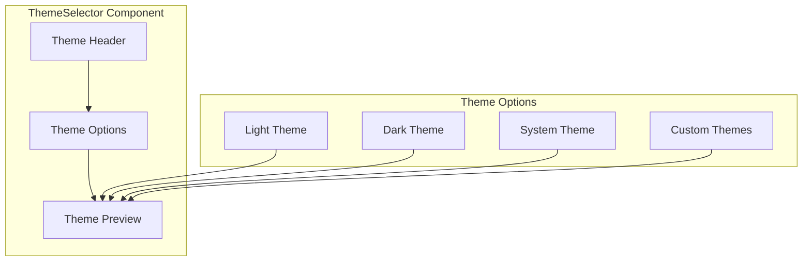

# ThemeSelector Component

The ThemeSelector component provides an interface for users to select and apply different visual themes to the application. It supports system-defined themes, user preferences, and theme previews.

## Visual Structure



The ThemeSelector displays a header, a set of theme options for selection, and a preview area that shows how the selected theme will appear when applied.

## Component API

```typescript
interface ThemeSelectorProps {
  currentTheme: string;
  onChange: (theme: string) => void;
  availableThemes: Theme[];
  showPreview?: boolean;
  previewSize?: "small" | "medium" | "large";
}

interface Theme {
  id: string;
  name: string;
  description?: string;
  preview?: string;
  isSystem?: boolean;
  isCustom?: boolean;
}
```

## Behavior

The ThemeSelector implements the following behaviors:

- **Theme Selection**: Choose from available themes (light, dark, system, custom)
- **Theme Preview**: Show a visual preview of each theme before applying
- **System Theme Detection**: Detect and apply the system theme preference
- **Theme Application**: Apply the selected theme to the application
- **Theme Persistence**: Save the theme preference for future sessions
- **Custom Theme Support**: Allow selection of user-defined custom themes

## Theme Options

The component provides several theme options:

- **Light Theme**: A light color scheme for bright environments
- **Dark Theme**: A dark color scheme for low-light environments
- **System Theme**: Follows the operating system's theme preference
- **Custom Themes**: User-defined or additional built-in themes

## Usage Example

```jsx
<ThemeSelector
  currentTheme="dark"
  onChange={(theme) => {
    setTheme(theme);
    saveThemePreference(theme);
  }}
  availableThemes={[
    { id: "light", name: "Light Theme", description: "Bright theme for daytime use" },
    { id: "dark", name: "Dark Theme", description: "Dark theme for low-light environments" },
    { id: "system", name: "System Theme", description: "Follows your system preference", isSystem: true },
    { id: "blue", name: "Blue Theme", description: "Custom blue color scheme", isCustom: true },
  ]}
  showPreview={true}
  previewSize="medium"
/>
```

## Theme Preview

The theme preview feature shows a miniature version of the application interface with the selected theme applied. This helps users understand how the theme will affect the appearance before making a selection.

The preview includes:

- Color scheme representation
- Typography samples
- UI component examples
- Light/dark mode visualization

## Accessibility

The ThemeSelector implements the following accessibility features:

- Keyboard navigation for theme selection
- ARIA attributes for interactive elements
- High contrast mode compatibility
- Screen reader announcements for theme changes
- Focus management for the selection controls

## Related Components

- [ProfileEditor](ProfileEditor.md) - Component that includes theme selection
- [UserMenu](UserMenu.md) - Menu that provides access to theme settings
- [Settings](../pages/settings.md) - Page containing theme configuration

## Related Documentation

- [User Preferences Model](../models/user-preferences.md)
- [Settings Page](../pages/settings.md)
- [User Profile Page](../pages/user-profile.md)
