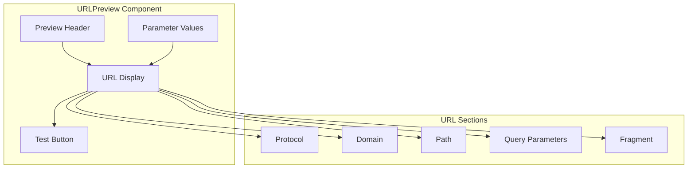

# URLPreview Component

The URLPreview component provides a visual preview of constructed URLs based on templates and parameter values. It helps users understand how their parameters will be applied to URL templates before execution.

## Visual Structure



The URLPreview displays a header, the constructed URL with syntax highlighting for different URL components, the parameter values used, and a button to test the URL.

## Component API

```typescript
interface URLPreviewProps {
  template: string;
  parameters: Parameter[];
  parameterValues: Record<string, string>;
  onTest?: () => void;
  showTestButton?: boolean;
  highlightSyntax?: boolean;
  maxLength?: number;
}

interface Parameter {
  name: string;
  value: string;
  required: boolean;
}
```

## Behavior

The URLPreview implements the following behaviors:

- **URL Construction**: Builds a complete URL from the template and parameter values
- **Syntax Highlighting**: Visually distinguishes different parts of the URL
- **Parameter Visualization**: Shows how parameters are applied in the URL
- **URL Validation**: Validates the constructed URL for correctness
- **Testing**: Provides a button to test the URL in a new tab
- **Truncation**: Handles long URLs with appropriate truncation and expansion
- **Error Indication**: Highlights missing or invalid parameters

## URL Components

The component visually distinguishes different URL components:

- **Protocol**: The URL scheme (e.g., https://)
- **Domain**: The website domain name
- **Path**: The URL path segments
- **Query Parameters**: Key-value pairs after the question mark
- **Fragment**: The hash section at the end of the URL

## Usage Example

```jsx
<URLPreview
  template="https://example.com/search?q={query}&limit={limit}"
  parameters={[
    { name: "query", value: "example search", required: true },
    { name: "limit", value: "20", required: false },
  ]}
  parameterValues={{
    query: "example search",
    limit: "20",
  }}
  onTest={() => window.open(constructedUrl, "_blank")}
  showTestButton={true}
  highlightSyntax={true}
  maxLength={100}
/>
```

## Parameter Handling

The component handles parameters in several ways:

- **Required Parameters**: Highlights missing required parameters
- **Optional Parameters**: Shows optional parameters that have values
- **Default Values**: Uses default values for parameters when provided
- **Empty Values**: Handles empty parameter values appropriately
- **Special Characters**: Properly encodes special characters in parameter values

## Accessibility

The URLPreview implements the following accessibility features:

- Keyboard access to the test button
- ARIA attributes for dynamic content
- Screen reader support for URL structure
- High contrast mode for syntax highlighting
- Focus management for interactive elements

## Related Components

- [URLTemplateEditor](URLTemplateEditor.md) - Component for editing URL templates
- [ParameterEditor](ParameterEditor.md) - Component for editing parameters
- [ServiceBuilder](ServiceBuilder.md) - Parent component that uses the URLPreview

## Related Documentation

- [Service Model](../models/service.md)
- [Command Model](../models/command.md)
- [Create Service Page](../pages/create-service.md)
