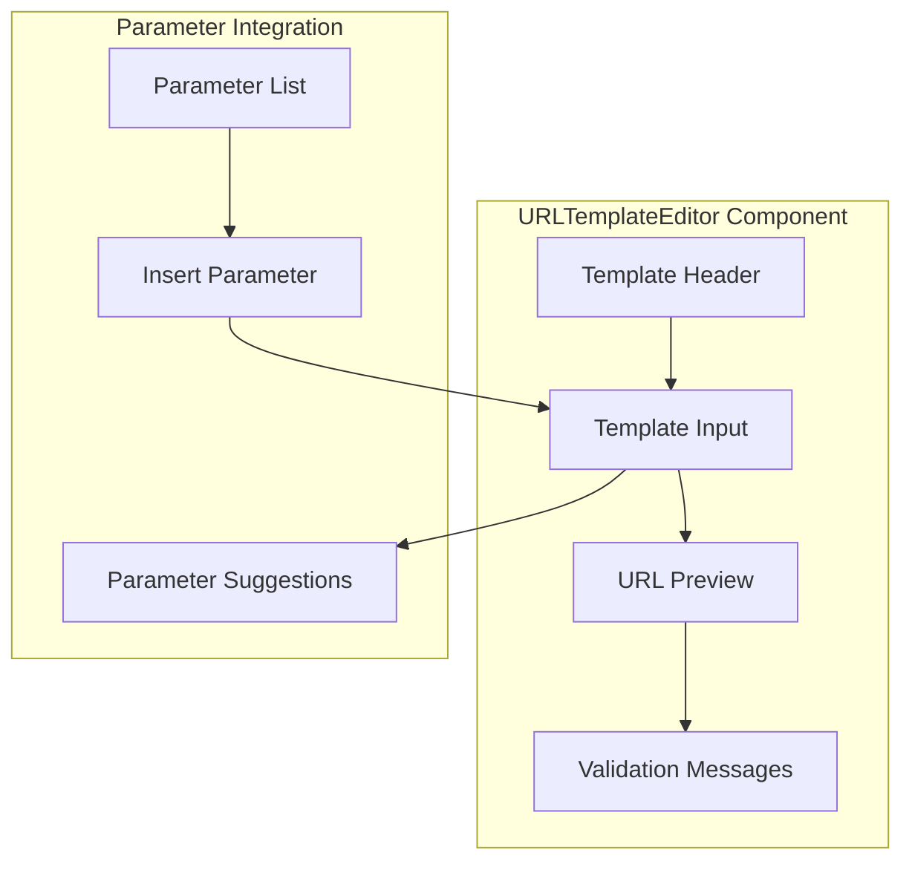

# URLTemplateEditor Component

The URLTemplateEditor component provides an interface for creating and editing URL templates with parameter placeholders. It enables users to define dynamic URLs with interpolation points for parameters.

## Visual Structure



The URLTemplateEditor displays a header, a text input for the URL template, a preview of the constructed URL with sample parameters, and validation messages. It integrates with parameters by allowing insertion of parameter placeholders and suggesting parameters based on the template structure.

## Component API

```typescript
interface URLTemplateEditorProps {
  value: string;
  onChange: (template: string) => void;
  parameters?: Parameter[];
  onParameterSuggestion?: (suggestedParams: SuggestedParameter[]) => void;
  onValidationError?: (errors: ValidationError[]) => void;
  sampleValues?: Record<string, string>;
}

interface Parameter {
  id: string;
  name: string;
  type: string;
  defaultValue?: string;
}

interface SuggestedParameter {
  name: string;
  position: number;
}

interface ValidationError {
  message: string;
  position?: number;
}
```

## Behavior

The URLTemplateEditor implements the following behaviors:

- **Template Editing**: Edit the URL template with parameter placeholders
- **Parameter Insertion**: Insert parameter placeholders at the cursor position
- **URL Preview**: Show a preview of the URL with sample parameter values
- **Syntax Highlighting**: Highlight parameter placeholders in the template
- **Validation**: Validate the template syntax and structure
- **Parameter Suggestions**: Suggest parameters based on the template structure
- **Error Handling**: Display validation errors with position information

## Template Syntax

The component supports the following template syntax:

- **Basic Parameters**: `{parameter_name}` for simple parameter insertion
- **Optional Parameters**: `{parameter_name?}` for optional parameters
- **Default Values**: `{parameter_name=default}` for parameters with default values
- **Path Parameters**: `/path/{parameter_name}` for path segments
- **Query Parameters**: `?q={parameter_name}` for query string parameters
- **Fragment Parameters**: `#{parameter_name}` for URL fragments

## Usage Example

```jsx
<URLTemplateEditor
  value="https://example.com/search?q={query}&limit={limit}"
  onChange={(template) => console.log("Template updated:", template)}
  parameters={[
    { id: "param1", name: "query", type: "string", defaultValue: "" },
    { id: "param2", name: "limit", type: "number", defaultValue: "10" },
  ]}
  onParameterSuggestion={(suggestions) => console.log("Suggested parameters:", suggestions)}
  onValidationError={(errors) => console.error("Validation errors:", errors)}
  sampleValues={{
    query: "example search",
    limit: "20",
  }}
/>
```

## Validation

The URLTemplateEditor performs several validation checks:

- **Syntax Validation**: Ensures parameter placeholders have correct syntax
- **URL Structure**: Validates the overall URL structure
- **Parameter Usage**: Checks that referenced parameters are defined
- **Required Parameters**: Identifies which parameters are required
- **Duplicate Parameters**: Warns about duplicate parameter usage

## Parameter Integration

The component integrates with parameters by:

- **Parameter Insertion**: Allowing insertion of parameters from a list
- **Parameter Extraction**: Identifying parameters used in the template
- **Parameter Suggestions**: Suggesting parameters based on URL structure
- **Parameter Validation**: Validating parameter usage against definitions

## Accessibility

The URLTemplateEditor implements the following accessibility features:

- Keyboard shortcuts for common operations
- ARIA attributes for dynamic content
- Focus management for the editor
- Error announcements for validation issues
- High contrast visual indicators for parameters

## Related Components

- [ParameterEditor](ParameterEditor.md) - Component for editing parameters used in the template
- [ServiceBuilder](ServiceBuilder.md) - Parent component that uses the URLTemplateEditor
- [URLPreview](URLPreview.md) - Component for previewing the constructed URL

## Related Documentation

- [Service Model](../models/service.md)
- [Command Model](../models/command.md)
- [Create Service Page](../pages/create-service.md)
