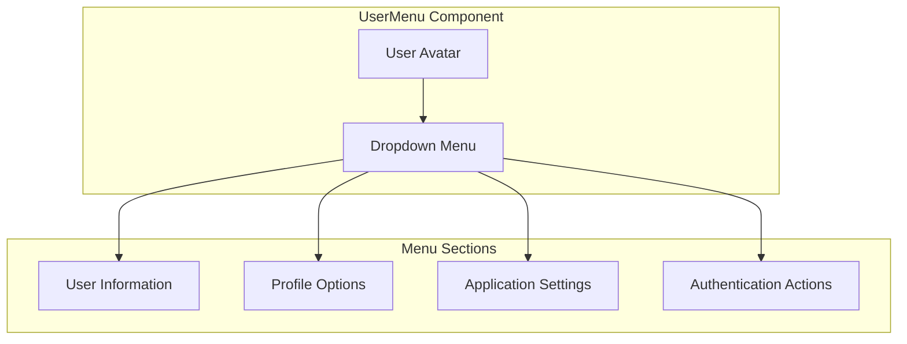

# UserMenu Component

The UserMenu component provides a dropdown menu with user-specific options and actions. It appears in the application header and gives access to profile settings, preferences, and authentication actions.

## Visual Structure



The UserMenu displays a user avatar or button that, when clicked, opens a dropdown menu with various sections for user-related options and actions.

## Component API

```typescript
interface UserMenuProps {
  user: {
    id: string;
    displayName: string;
    email: string;
    profilePicture?: string;
    isAuthenticated: boolean;
  };
  onProfileClick: () => void;
  onSettingsClick: () => void;
  onLogout: () => void;
  onLogin?: () => void;
  onRegister?: () => void;
}
```

## Behavior

The UserMenu implements the following behaviors:

- **Menu Toggle**: Opens and closes the dropdown menu when the trigger is clicked
- **User Information Display**: Shows the user's name, email, and profile picture
- **Navigation**: Provides links to profile, settings, and other user-specific pages
- **Authentication Actions**: Offers login, register, and logout options based on authentication state
- **Keyboard Navigation**: Supports keyboard navigation within the menu
- **Click Outside**: Closes the menu when clicking outside its boundaries

## Menu Sections

### User Information

The user information section displays:

- User's profile picture or avatar
- Display name
- Email address
- Account type or status

### Profile Options

The profile options section includes links to:

- View profile
- Edit profile
- Manage account
- View activity history

### Application Settings

The application settings section provides access to:

- Theme settings
- Display preferences
- Notification settings
- Privacy controls

### Authentication Actions

The authentication actions section offers:

- Logout option (for authenticated users)
- Login option (for unauthenticated users)
- Register option (for unauthenticated users)

## States

The UserMenu can exist in several states:

- **Collapsed**: Only the trigger is visible
- **Expanded**: The dropdown menu is open
- **Authenticated**: Shows user information and logout option
- **Unauthenticated**: Shows login and register options
- **Loading**: Displays a loading indicator while fetching user data

## Usage Example

```jsx
<UserMenu
  user={{
    id: "user123",
    displayName: "John Doe",
    email: "john@example.com",
    profilePicture: "https://example.com/profile.jpg",
    isAuthenticated: true,
  }}
  onProfileClick={() => navigate("/profile")}
  onSettingsClick={() => navigate("/settings")}
  onLogout={() => {
    logout();
    navigate("/");
  }}
/>
```

## Accessibility

The UserMenu implements the following accessibility features:

- ARIA attributes for dropdown functionality
- Keyboard navigation with arrow keys
- Focus management within the menu
- Screen reader announcements for menu state changes
- High contrast visual indicators for focused items

## Related Components

- [Header](Header.md) - Container component that includes the UserMenu
- [ProfileEditor](ProfileEditor.md) - Component for editing user profile information
- [AuthForms](AuthForms.md) - Authentication forms accessed through the UserMenu

## Related Documentation

- [User Profile Model](../models/user-profile.md)
- [Authentication Login Flow](../flows/authentication-login.md)
- [Profile Management Flow](../flows/profile-management.md)
