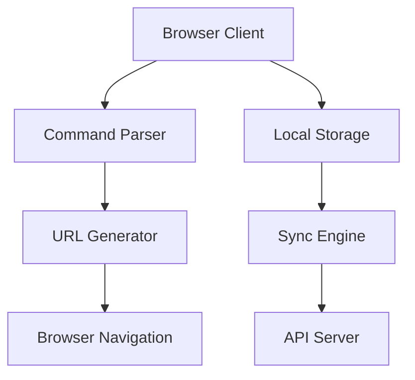
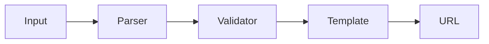
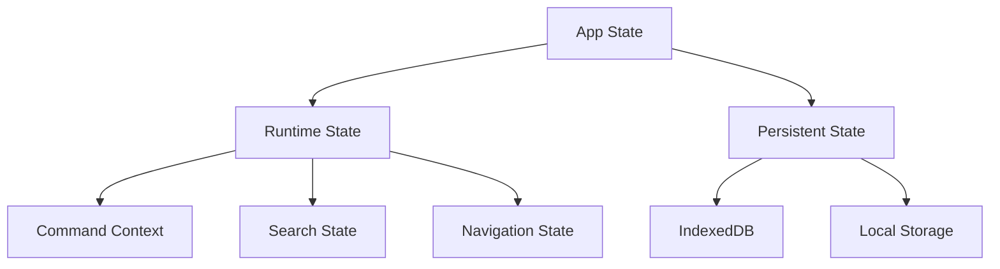
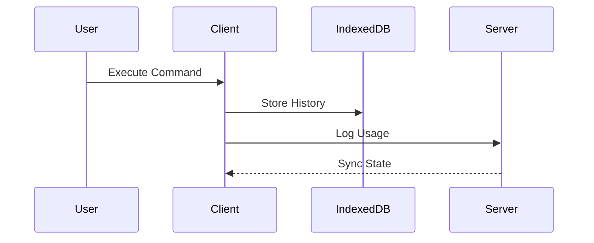

# System Architecture <!-- omit from toc -->

## Table of Contents <!-- omit from toc -->

- [Overview](#overview)
- [Core Systems](#core-systems)
  - [Command Processing](#command-processing)
  - [State Management](#state-management)
  - [Data Flow](#data-flow)
    - [Local-First Operations](#local-first-operations)
- [Performance](#performance)
  - [Initial Load](#initial-load)
  - [Data Loading](#data-loading)
  - [Caching Strategy](#caching-strategy)
- [Security](#security)
  - [Authentication](#authentication)
  - [Command Execution](#command-execution)
  - [Data Protection](#data-protection)

## Overview

## Core Systems

### Command Processing

1. Input Processing

   - Command tokenization
   - Parameter extraction
   - History management
   - Auto-completion

2. Command Resolution
   - Template matching
   - Parameter validation
   - URL generation
   - Navigation handling

### State Management

1. Runtime State

   - Active command context
   - Search/filter state
   - Navigation history
   - UI mode (search/catalog)

2. Persistent State
   - User preferences
   - Command history
   - Service metadata
   - Tag organization

### Data Flow

#### Local-First Operations

1. Command Execution

   - Local command parsing
   - URL generation
   - Browser navigation
   - History recording

2. State Synchronization
   - Background sync
   - Conflict resolution
   - State reconciliation
   - Error recovery

## Performance

### Initial Load

1. Shell (~10KB)

   - Command input
   - Basic navigation
   - Core styling

2. Core Bundle (~50KB)

   - Command parser
   - State management
   - UI components

3. Features (~20KB each)
   - Search engine
   - Icon grid
   - Tag system

### Data Loading

1. Initial Data

   - User preferences
   - Recent commands
   - Popular services

2. Progressive Loading
   - Service metadata
   - Usage statistics
   - Community data

### Caching Strategy

1. Runtime Cache

   - Command templates
   - Service metadata
   - Search index

2. Persistent Cache
   - User preferences
   - Command history
   - Service icons

## Security

### Authentication

- JWT-based auth
- OAuth providers
- Session management

### Command Execution

- URL validation
- Parameter sanitization
- Rate limiting

### Data Protection

- HTTPS only
- CSP headers
- Input validation
