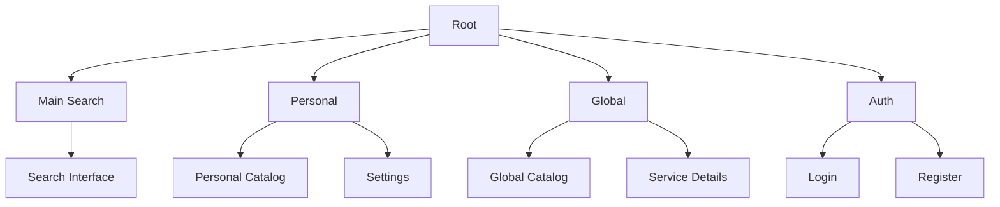

# Page Structure <!-- omit from toc -->

## Table of Contents <!-- omit from toc -->

- [Page Map](#page-map)
- [Core Pages](#core-pages)
  - [Main Search (/)](#main-search-)
  - [Personal Catalog (/personal)](#personal-catalog-personal)
  - [Global Catalog (/catalog)](#global-catalog-catalog)
  - [Settings (/settings)](#settings-settings)
- [Authentication](#authentication)
  - [Login (/auth/login)](#login-authlogin)
  - [Register (/auth/register)](#register-authregister)
- [Dynamic Routes](#dynamic-routes)
  - [Service Details (/service/\[id\])](#service-details-serviceid)
- [Data Loading](#data-loading)
  - [Infinite Scroll](#infinite-scroll)
  - [Real-time Updates](#real-time-updates)

## Page Map



## Core Pages

### Main Search (/)

Landing page with primary search interface

- Instant search access
- Command execution
- Quick navigation

### Personal Catalog (/personal)

User's workspace

- Personal service collection
- Tag organization
- Usage history

### Global Catalog (/catalog)

Service discovery

- Community services
- Trending/Popular
- Service details

### Settings (/settings)

User preferences

- Search provider defaults
- UI preferences
- Tag management

## Authentication

### Login (/auth/login)

- Email/password
- OAuth providers:
  - GitHub
  - Google

### Register (/auth/register)

- Account creation
- Email verification
- Initial setup

## Dynamic Routes

### Service Details (/service/[id])

```typescript
type Params = {
  id: string; // Service identifier
};
```

- Service metadata
- Usage stats
- Related services

## Data Loading

### Infinite Scroll

- Virtual rendering for performance
- Load more trigger at scroll threshold
- Maintains scroll position
- Prefetches next batch

### Real-time Updates

- WebSocket for live updates
- Optimistic UI updates
- Background sync
- Error recovery
