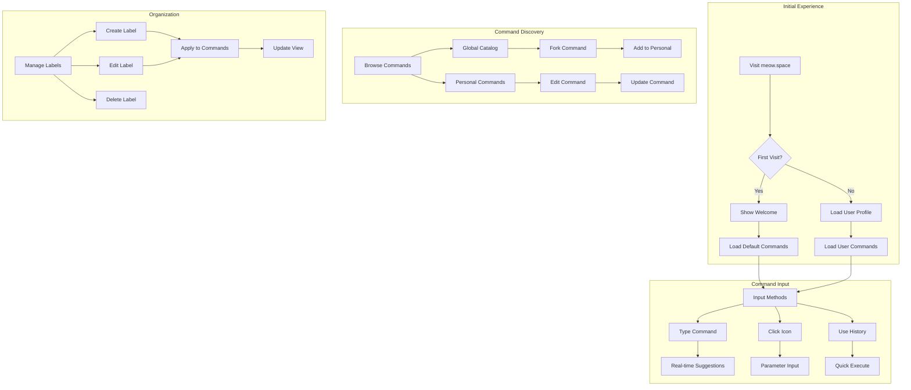

# User Interaction Flow

This document describes the various ways users can interact with meows.space and the system's responses.

## Flow Diagram

## Interaction Modes

1. **Command Input**

   - Direct typing in command box
   - Icon grid clicking
   - Command history navigation
   - Real-time suggestions
   - Parameter completion

2. **Command Discovery**

   - Browse global catalog
   - Search by name/description
   - Filter by labels
   - Sort by popularity
   - Preview commands

3. **Command Organization**

   - Create and manage labels
   - Organize commands
   - Customize icon grid
   - Set favorites
   - Manage history

4. **Command Customization**
   - Edit command properties
   - Customize URL templates
   - Set default parameters
   - Configure shortcuts
   - Test modifications

## User Interface Elements

1. **Main Interface**

   - Command input box
   - Icon grid
   - Label filters
   - Search results
   - Command suggestions

2. **Command Icons**

   - Command name
   - Description
   - URL preview
   - Parameter hints
   - Action buttons

3. **Organization Tools**
   - Label manager
   - Grid customizer
   - History viewer
   - Settings panel
   - Help resources

## Feedback Mechanisms

1. **Visual Feedback**

   - Real-time suggestions
   - Command validation
   - Execution status
   - Sync indicators
   - Error messages

2. **Interactive Elements**
   - Hover previews
   - Click actions
   - Drag-and-drop
   - Context menus
   - Keyboard shortcuts

## Accessibility

- Keyboard navigation
- Screen reader support
- High contrast mode
- Focus management
- ARIA attributes
