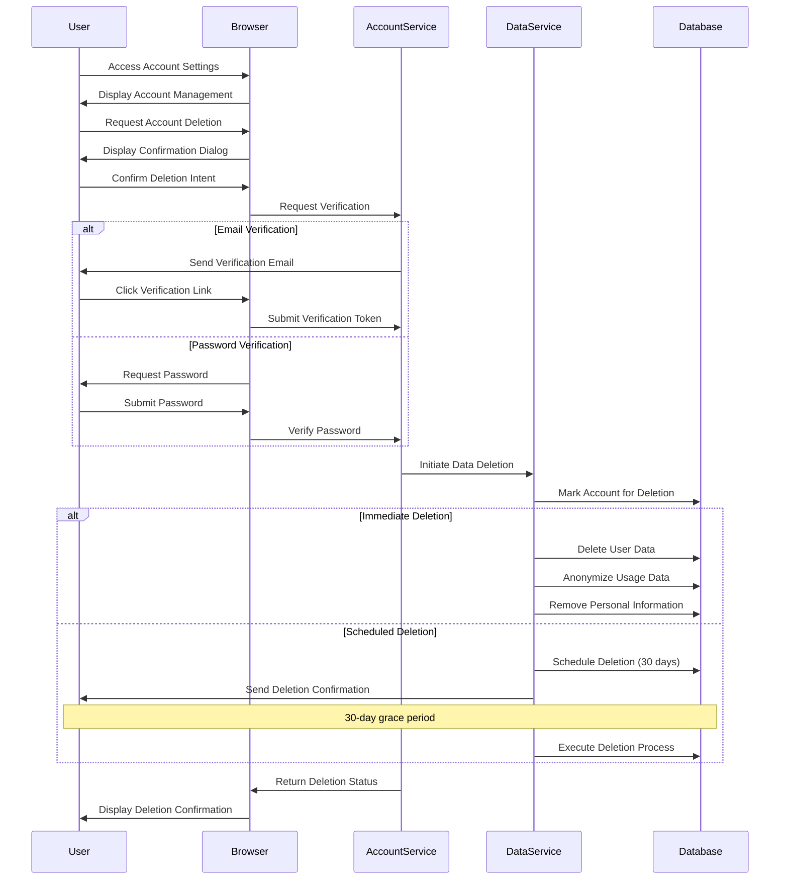

# Account Deletion Flow

This document describes the account deletion process in meows.space, including data removal, verification, and privacy considerations.

## Flow Diagram

## Flow Description

### Deletion Request

1. **Initiation**

   - User navigates to account settings
   - System displays account management options
   - User selects "Delete Account" option
   - System displays confirmation dialog with:
     - Warning about permanent data loss
     - Information about what will be deleted
     - Option to download personal data before deletion
     - Confirmation input field

2. **Verification**
   - System requires identity verification before proceeding
   - Verification methods include:
     - Email verification link
     - Password confirmation
     - Two-factor authentication (if enabled)
   - User completes verification step
   - System validates identity before proceeding

### Data Removal Process

1. **Data Marking**

   - Account is marked for deletion in database
   - User is logged out of all active sessions
   - Access tokens are immediately revoked
   - Account status is changed to "pending deletion"

2. **Grace Period**

   - System implements a 30-day grace period
   - User receives email confirmation with:
     - Deletion confirmation
     - Instructions to cancel deletion if requested in error
     - Date when deletion will be finalized
   - During grace period:
     - Account remains inaccessible
     - Data is preserved but unavailable
     - User can reactivate account by logging in

3. **Data Deletion**
   - After grace period expires, system:
     - Permanently deletes user profile data
     - Removes personal commands and collections
     - Deletes authentication credentials
     - Removes email and personal identifiers
   - Shared content is either:
     - Attributed to "Anonymous" user
     - Deleted if no longer relevant
     - Transferred to system ownership if valuable to community

### Privacy Considerations

- **Data Retention**

  - Usage analytics are anonymized but retained
  - Contributions to public catalogs remain with attribution removed
  - System logs are purged of personally identifiable information
  - Backup data is scheduled for removal within 90 days

- **Confirmation**
  - Final deletion confirmation email is sent
  - No personal data is included in confirmation
  - No further communication is sent to deleted accounts
  - Reusing the email for a new account is permitted after deletion

## Cancellation Process

1. **Deletion Cancellation**
   - User can cancel deletion during grace period by:
     - Clicking cancellation link in confirmation email
     - Logging in to account (triggers cancellation prompt)
   - Upon cancellation:
     - Account status is restored to "active"
     - Access is immediately restored
     - Confirmation of cancellation is sent

## Error Handling

- Verification failures provide clear error messages
- Network issues during deletion process are handled gracefully
- Failed deletions are automatically retried
- Support contact information is provided for deletion issues
- Manual deletion option is available through support

## Related Documentation

- [Authentication Integration Overview](../index.md#authentication-integration)
- [Login/Logout Flow](./authentication-login.md)
- [Data Privacy](../technical/security.md#data-privacy)
- [Data Retention Policy](../technical/security.md#data-retention)
- [Account Management](../pages/settings.md#account-management)
