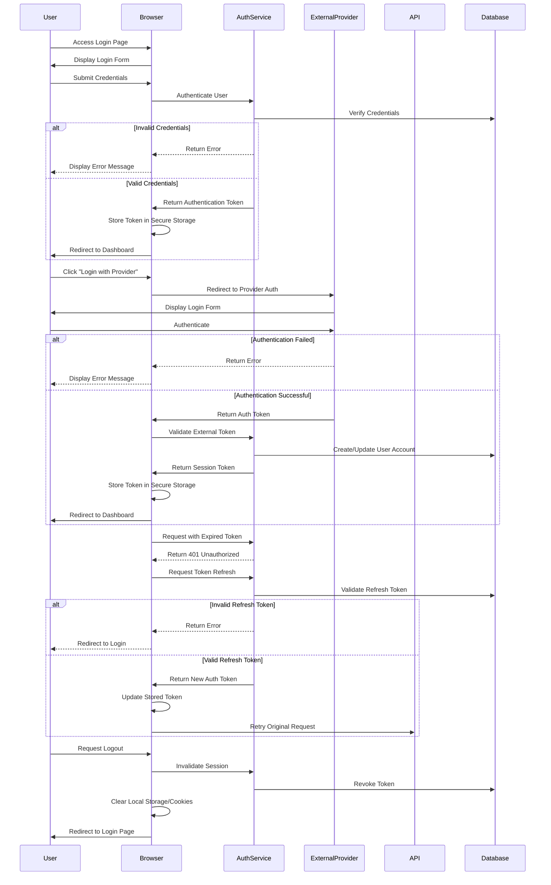

# Authentication Login/Logout Flow

This document describes the login and logout processes in meows.space, including standard email/password authentication and OAuth provider authentication.

## Flow Diagram

## Flow Description

### Login Process

1. **Standard Email/Password Login**

   - User navigates to login page
   - System displays login form with email and password fields
   - User submits credentials
   - System validates credentials against stored user data
   - If valid, authentication token is generated and returned
   - Token is stored in secure browser storage (HTTP-only cookies)
   - User is redirected to dashboard/main page
   - If invalid, appropriate error message is displayed

2. **External Provider Authentication**

   - User clicks "Login with [Provider]" (GitHub, Google, Facebook)
   - Browser redirects to provider's authentication page
   - User authenticates with the external provider
   - Provider returns authentication token to browser
   - Browser sends token to meows.space auth service
   - System validates token and creates/updates user account
   - Session token is generated and returned
   - Token is stored in secure browser storage
   - User is redirected to dashboard

3. **Session Management**
   - Authentication tokens have a short expiration time (1 hour)
   - Refresh tokens have a longer expiration (2 weeks)
   - When auth token expires, system attempts refresh
   - If refresh succeeds, new auth token is issued
   - If refresh fails, user is redirected to login
   - Active sessions are tracked in the database

### Logout Process

1. **User-Initiated Logout**

   - User requests logout through UI
   - System invalidates session on server
   - Authentication tokens are revoked in database
   - Local storage and cookies are cleared
   - User is redirected to login page

2. **Log-off from All Devices**

   - User can initiate a complete log-off from all devices
   - System invalidates all active sessions for the user
   - All refresh tokens are revoked across all devices
   - Security timestamp is updated to prevent token reuse
   - Confirmation email is sent to user about the log-off
   - This feature is useful when:
     - User suspects unauthorized access
     - User has lost a device
     - User wants to ensure security across all sessions

3. **Automatic Logout**
   - Occurs when refresh token expires
   - Occurs when security violation is detected
   - Occurs after extended period of inactivity
   - User receives notification of session expiration
   - User is redirected to login page

## Security Considerations

- Passwords are hashed using bcrypt with appropriate work factor
- Authentication tokens use short expiration with refresh mechanism
- HTTPS is required for all authentication operations
- Rate limiting is implemented for login attempts
- Session tokens are stored in HTTP-only cookies
- CSRF protection is implemented for all authenticated requests
- OAuth state parameters prevent CSRF attacks during provider auth
- IP address changes trigger additional verification

## Error Handling

- Invalid credentials trigger appropriate error messages
- Account lockout occurs after multiple failed attempts
- Network errors during authentication display user-friendly messages
- OAuth provider failures include fallback options
- Session expiration provides clear re-authentication path

## Related Documentation

- [[../index#authentication-integration|Authentication Integration Overview]]
- [[./authentication-registration|Registration Flow]]
- [[../technical/security#authentication|Authentication Security]]
- [[../pages/login|Login Page]]
- [[../components/AuthForms|Authentication Form Components]]
