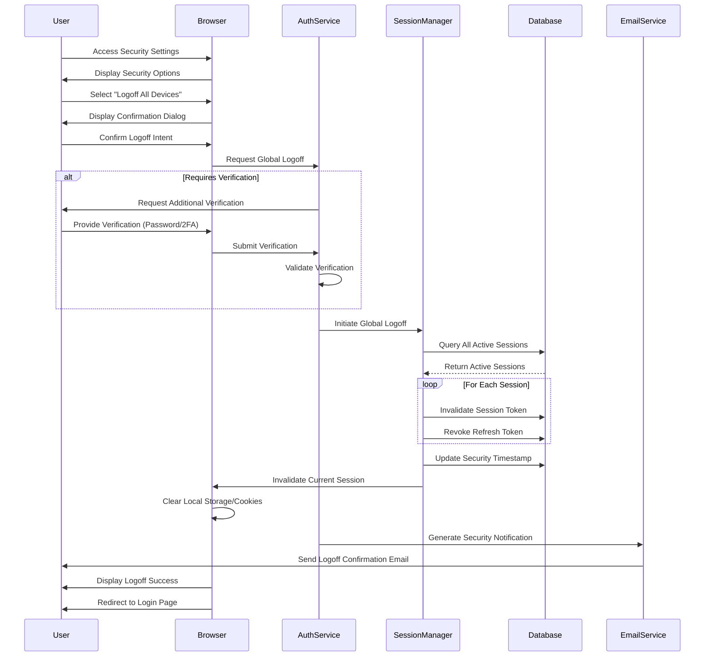

# Authentication Logoff Flow

This document describes the logoff process in meows.space, which allows users to terminate all active sessions across all devices simultaneously.

## Flow Diagram

## Flow Description

### Logoff Initiation

1. **Access Point**

   - User accesses security settings through account menu
   - System displays security management options
   - User selects "Logoff from all devices" option
   - System displays confirmation dialog explaining the action

2. **Verification**
   - System may require additional verification for security
   - Verification methods include:
     - Password confirmation
     - Two-factor authentication code
     - Email verification link
   - User completes verification step
   - System validates identity before proceeding

### Session Termination

1. **Session Identification**

   - System queries database for all active sessions associated with user
   - Sessions are identified by:
     - Session tokens
     - Refresh tokens
     - Device information
     - IP addresses
     - Last activity timestamps

2. **Token Revocation**

   - System invalidates all session tokens in database
   - All refresh tokens are revoked to prevent regeneration
   - Security timestamp is updated to invalidate any cached tokens
   - Authentication servers are notified to reject any existing tokens

3. **Current Session Handling**
   - Current session is terminated last
   - Local storage and cookies are cleared from current browser
   - User is redirected to login page with appropriate message

### Security Measures

1. **Notification**

   - System sends security notification email containing:
     - Confirmation of global logoff action
     - Timestamp of the action
     - Approximate number of sessions terminated
     - Instructions if action was not initiated by user

2. **Audit Trail**
   - System logs the global logoff event with:
     - Timestamp
     - Initiating device information
     - IP address
     - Number of sessions terminated
   - This information is available in the user's security log

### Use Cases

The global logoff feature is particularly useful in several scenarios:

1. **Security Concerns**

   - User suspects unauthorized access to their account
   - User notices suspicious activity in their usage history
   - User receives notification of login from unknown location

2. **Device Management**

   - User has lost a device with active sessions
   - User has changed employment and used work devices
   - User wants to ensure no sessions remain on shared computers

3. **Account Maintenance**
   - User has changed critical account information
   - User is performing security audit of their accounts
   - User wants to ensure clean state across all devices

## Error Handling

- Network issues during logoff process are handled with retry mechanisms
- Partial logoff completion is detected and reported
- Failed logoffs trigger appropriate error messages with support options
- System monitors for unusual logoff patterns that might indicate attacks

## Related Documentation

- [Login/Logout Flow](./authentication-login.md)
- Session Management (Documentation moved)
- Token Revocation (Documentation moved)
- [Security Settings](../pages/settings.md#security)
