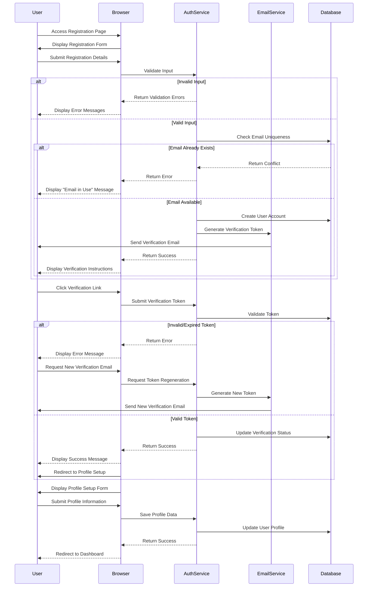

# Authentication Registration Flow

This document describes the user registration process in meows.space, including account creation, email verification, and initial profile setup.

## Flow Diagram

## Flow Description

### Registration Process

1. **Account Creation**

   - User navigates to registration page
   - System displays registration form with required fields:
     - Email address
     - Password (with strength requirements)
     - Password confirmation
     - Terms of service acceptance
   - User submits registration details
   - System validates input:
     - Email format validation
     - Password strength requirements
     - Terms acceptance verification
   - System checks email uniqueness in database
   - If email is available, user account is created with:
     - Hashed password
     - Unverified status
     - Registration timestamp
     - Unique verification token
   - If email exists, appropriate error message is displayed

2. **Email Verification**

   - System generates a secure verification token
   - Verification email is sent to user's email address
   - Email contains verification link with embedded token
   - User clicks verification link in email
   - System validates the verification token
   - If token is valid:
     - User account is marked as verified
     - User is redirected to profile setup
   - If token is invalid or expired:
     - Error message is displayed
     - Option to request new verification email is provided

3. **Profile Setup**
   - After verification, user is prompted to complete profile
   - Profile setup form includes:
     - Display name
     - Profile picture (optional)
     - Default preferences
   - User submits profile information
   - System saves profile data
   - User is redirected to dashboard with completed account

### Alternative Registration Methods

1. **OAuth Provider Registration**

   - User selects "Register with [Provider]"
   - OAuth flow is initiated with the provider
   - Upon successful authentication, system:
     - Creates new user account if email is unique
     - Links to existing account if email already exists
     - Marks email as verified (trusted from provider)
     - Redirects to profile setup if new account

2. **Invitation-Based Registration**
   - User receives invitation email with registration link
   - Link contains pre-verified token and invitation code
   - Registration form pre-fills email from invitation
   - Upon submission, account is created with verified status
   - User bypasses email verification step
   - User proceeds directly to profile setup

## Security Considerations

- Registration rate limiting prevents abuse
- Email verification prevents account spoofing
- Password requirements enforce minimum security standards:
  - Minimum 8 characters
  - Mix of uppercase, lowercase, numbers, and symbols
  - Not matching common password patterns
- HTTPS is required for all registration operations
- Verification tokens expire after 24 hours
- Verification links are single-use only
- Registration IP address is logged for security monitoring

## Error Handling

- Validation errors provide specific feedback on form issues
- Email uniqueness checks prevent duplicate accounts
- Token expiration provides clear renewal path
- Network errors during registration display user-friendly messages
- Incomplete registrations can be resumed

## Related Documentation

- Authentication Integration Overview (Documentation moved)
- [Login/Logout Flow](./authentication-login.md)
- Authentication Security (Documentation moved)
- [Registration Page](../pages/register.md)
- [Authentication Form Components](../components/AuthForms.md)
