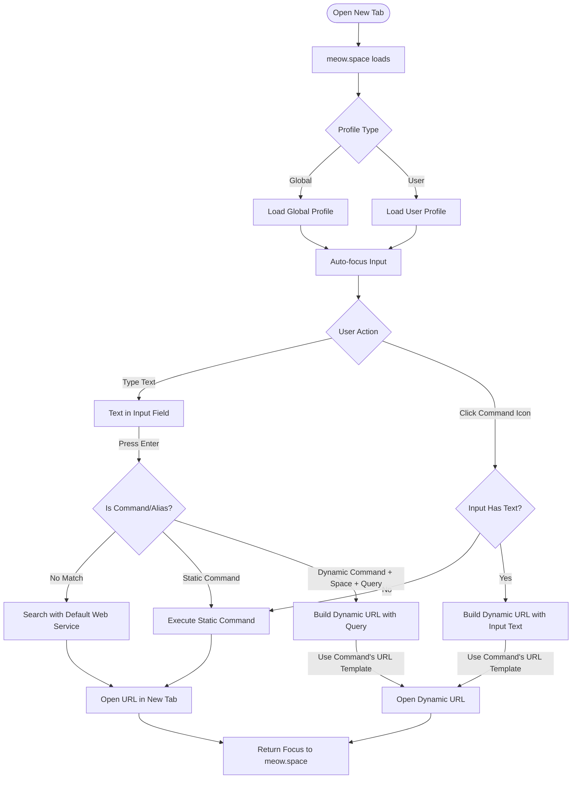

# Command Execution Flow

This document describes the flow of command execution in meows.space, from user input to URL navigation.

## Flow Diagram

## Flow Description

1. **Initial Load**

   - User opens a new tab
   - meow.space loads
   - System determines profile type (Global/User)
   - Input field receives focus automatically

2. **User Interaction**

   - User can either:
     - Type text in the input field
     - Click a command icon in the grid

3. **Command Processing**

   - For typed input:
     - System checks if input matches a command/alias
     - If no match, uses default search service
     - If static command, executes directly
     - If dynamic command, builds URL with query
   - For clicked icons:
     - If input field empty, executes static command
     - If input field has text, uses as parameter

4. **URL Navigation**
   - System opens appropriate URL in new tab
   - Focus returns to meow.space input
   - Command is added to history

## Error Handling

- Invalid commands default to search
- Parameter validation occurs before URL generation
- Network errors display user notifications
- Focus always returns to input for quick recovery

## Performance Considerations

- Command matching uses prefix-based search
- URL templates are pre-compiled
- Command history uses LRU caching
- Icon grid loads progressively

## Related Documentation

- Command Execution Overview (Documentation moved)
- Command Processing Pipeline (Documentation moved)
- [SearchBar Component](../components/SearchBar.md)
- [ServiceGrid Component](../components/ServiceGrid.md)
- [Command Management Flow](command-management.md)
