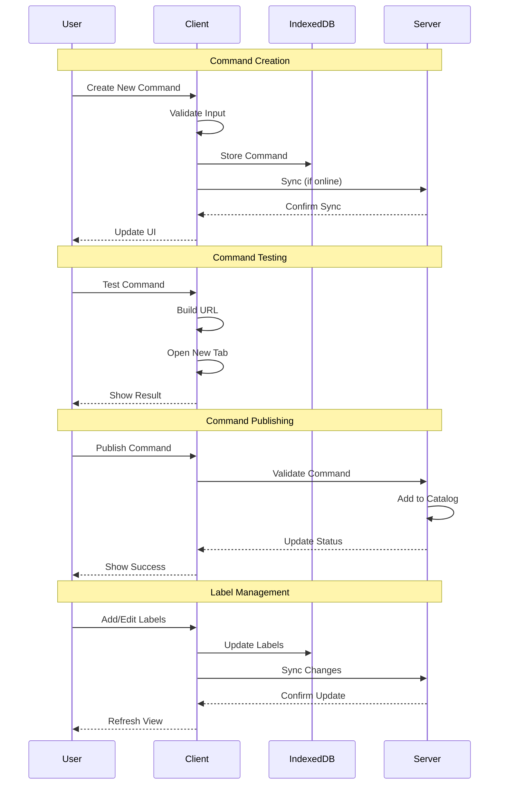

# Command Management Flow

This document describes how commands are created, edited, and organized in meows.space.

## Flow Diagram

## Flow Description

1. **Command Creation**

   - User initiates command creation
   - System validates input:
     - Command name uniqueness
     - URL template format
     - Parameter definitions
   - Command is stored locally first
   - Changes sync to server when online

2. **Command Testing**

   - User tests new command
   - System builds URL with test parameters
   - New tab opens with result
   - User verifies behavior
   - Command can be adjusted if needed

3. **Command Publishing**

   - User chooses to publish command
   - System validates command:
     - All required fields present
     - Test execution successful
     - No security issues
   - Command added to global catalog
   - Original remains in user's collection

4. **Label Management**
   - User manages command labels
   - Labels are stored locally
   - Changes sync in background
   - UI updates to reflect changes
   - Command visibility updates based on labels

## State Management

1. **Local State**

   - Commands stored in IndexedDB
   - Labels managed locally
   - Command history tracked
   - User preferences saved

2. **Server State**
   - Public command catalog
   - User account data
   - Usage statistics
   - Sync status

## Security Considerations

- Commands are private by default
- Publishing requires explicit action
- URL templates are validated
- Parameter sanitization enforced
- Rate limiting on publishing

## Related Documentation

- Command Organization Overview (Documentation moved)
- Command Types (Documentation moved)
- [ServiceBuilder Component](../components/ServiceBuilder.md)
- [LabelBar Component](../components/LabelBar.md)
- [Command Execution Flow](command-execution.md)
- [User Interaction Patterns](user-interaction.md)
