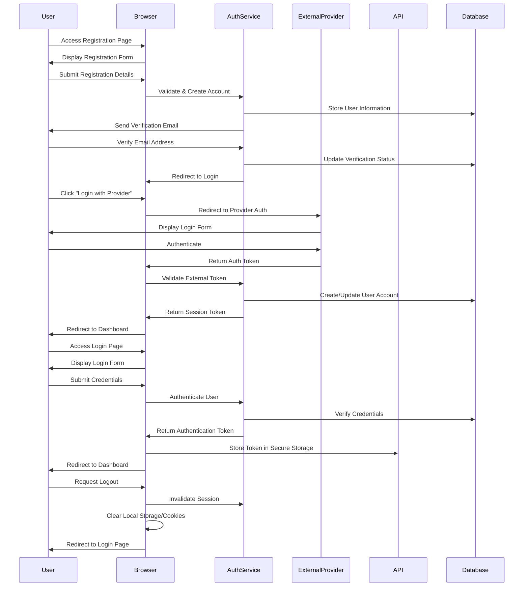

# Profile Management Flow

This document describes the authentication processes in meows.space, including registration, login, and logout flows.

## Flow Diagram

## Flow Description

1. **Registration Process**

   - User navigates to registration page
   - System displays registration form with required fields
   - User submits registration details
   - System validates input and creates account
   - Verification email is sent to user
   - User verifies email address
   - System updates verification status
   - User is redirected to login page

2. **External Provider Authentication**

   - User clicks "Login with [Provider]" (GitHub, Gmail, Facebook)
   - Browser redirects to provider's authentication page
   - User authenticates with the external provider
   - Provider returns authentication token to browser
   - Browser sends token to meows.space auth service
   - System validates token and creates/updates user account
   - Session token is generated and returned
   - User is redirected to dashboard

3. **Login Process**

   - User navigates to login page
   - System displays login form
   - User submits credentials
   - System authenticates user against database
   - Authentication token is generated and returned
   - Token is stored in secure browser storage
   - User is redirected to dashboard/main page

4. **Logout Process**
   - User requests logout
   - System invalidates session on server
   - Local storage and cookies are cleared
   - User is redirected to login page

## Security Considerations

- Passwords are hashed using bcrypt with appropriate work factor
- Authentication tokens use short expiration with refresh mechanism
- HTTPS is required for all authentication operations
- Rate limiting is implemented for login attempts
- Session tokens are stored in HTTP-only cookies
- CSRF protection is implemented for all authenticated requests

## Error Handling

- Invalid credentials trigger appropriate error messages
- Account lockout occurs after multiple failed attempts
- Email verification failures provide clear recovery options
- Network errors during authentication display user-friendly messages

## Related Documentation

- [[../index#authentication-integration|Authentication Integration Overview]]
- [[../technical/security#authentication|Authentication Security]]
- [[../pages/login|Login Page]]
- [[../pages/register|Registration Page]]
- [[../components/AuthForms|Authentication Form Components]]
