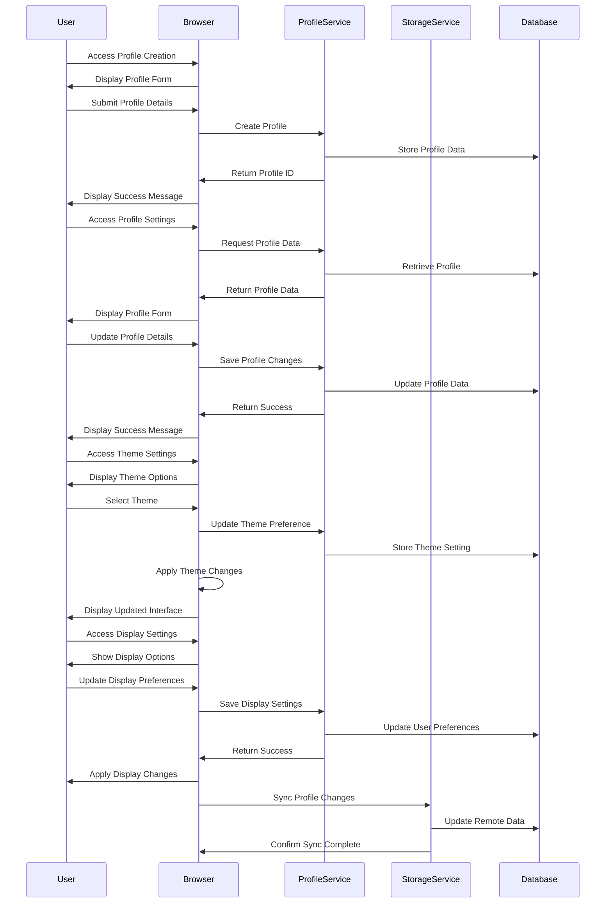

# Profile Management Flow

This document describes the profile management processes in meows.space, including profile creation, customization, and settings management.

## Flow Diagram

## Flow Description

1. **Profile Creation**

   - User completes initial profile setup after registration
   - System displays profile creation form with fields:
     - Display name
     - Profile picture (optional)
     - Default browser preference
     - Theme preference
   - User submits profile information
   - System creates profile record in database
   - Profile ID is associated with user account
   - Success confirmation is displayed to user

2. **Profile Customization**

   - User accesses profile settings page
   - System retrieves current profile data
   - User can modify profile information:
     - Update display name
     - Change profile picture
     - Modify email preferences
     - Update notification settings
   - System validates and saves changes
   - Profile updates are synchronized across devices
   - Success confirmation is displayed to user

3. **Theme Management**

   - User accesses theme settings
   - System displays available theme options:
     - Light theme
     - Dark theme
     - System preference (follows OS setting)
     - High contrast (accessibility option)
   - User selects preferred theme
   - System stores theme preference in profile
   - Interface updates immediately to reflect change
   - Theme preference applies across all devices

4. **Command Display Preferences**

   - User accesses display settings
   - System shows command display options:
     - Grid view vs. list view
     - Icon size preference
     - Commands per page
     - Default sorting method
     - Label visibility options
   - User updates display preferences
   - System saves preferences to profile
   - Interface updates to reflect new settings
   - Settings synchronize across devices

5. **Profile Data Synchronization**

   - Profile changes are stored locally first
   - System queues changes for synchronization
   - When online, changes are pushed to server
   - Server validates and applies changes
   - Synchronization status is reported to user
   - Conflicts are resolved using last-writer-wins
   - Profile data is synchronized across all devices

## Multiple Profiles Support

meows.space supports multiple profiles per user account:

- Users can create separate profiles for different contexts (work, personal, projects)
- Each profile maintains its own:
  - Set of commands
  - Display preferences
  - Organization structure
  - Default settings
- Profile switching is available from the user menu
- Active profile is indicated in the interface
- Profiles are synchronized independently
- Users can create, rename, and delete profiles

## Privacy and Data Management

- Profile data is stored securely with appropriate encryption
- Users can export their profile data in standard formats
- Data deletion options allow removing specific profile elements
- Complete profile deletion is available with confirmation
- Privacy settings control what profile data is visible to others
- Data retention policies are clearly communicated

## Related Documentation

- [User Profiles Overview](../RE.md#user-profiles)
- [Login/Logout Flow](./authentication-login.md)
- [Registration Flow](./authentication-registration.md)
- [Settings Page](../pages/settings.md)
- [Profile Editor Component](../components/ProfileEditor.md)
