Welcome to the meows.space documentation. This knowledge base contains detailed documentation for the meows.space URL command multiplexer project.


Table of Contents

- [Overview](#overview)
- [Core Concept](#core-concept)
- [Command System](#command-system)
  - [Command Types](#command-types)
    - [Static Commands](#static-commands)
    - [Dynamic Commands](#dynamic-commands)
  - [Command Processing Pipeline](#command-processing-pipeline)
  - [Command Execution](#command-execution)
- [Command Organization and Catalog](#command-organization-and-catalog)
  - [Global Catalog](#global-catalog)
  - [Inventory](#inventory)
  - [Social Sharing](#social-sharing)
  - [User Profiles](#user-profiles)
- [System Integration \& Feedback](#system-integration--feedback)
  - [Authentication Integration](#authentication-integration)
  - [Local-First Architecture Integration](#local-first-architecture-integration)
  - [Browser Integration](#browser-integration)
  - [External Services](#external-services)
  - [User Feedback Mechanisms](#user-feedback-mechanisms)
    - [In-app Feedback](#in-app-feedback)
    - [Analytics Integration](#analytics-integration)
    - [Support Channels](#support-channels)
- [System Architecture](#system-architecture)
  - [State Management](#state-management)
    - [State Architecture](#state-architecture)
    - [Runtime State](#runtime-state)
    - [Persistent State](#persistent-state)
  - [Data Synchronization](#data-synchronization)
    - [Local-First Operations](#local-first-operations)
    - [System Flow](#system-flow)
  - [Frontend Architecture](#frontend-architecture)
    - [Technical Implementation](#technical-implementation)
    - [Loading \& Performance](#loading--performance)
      - [Progressive Loading Strategy](#progressive-loading-strategy)
      - [Performance Optimization Techniques](#performance-optimization-techniques)
  - [Backend Architecture](#backend-architecture)
    - [API Implementation](#api-implementation)
    - [Data Storage](#data-storage)
    - [Security Implementation](#security-implementation)
- [Glossary](#glossary)
- [Artifacts](#artifacts)
  - [Flow charts](#flow-charts)
  - [Data Models](#data-models)
  - [Pages](#pages)
  - [Components](#components)
  - [API Endpoints](#api-endpoints)

---

## Overview

meows.space is a URL command multiplexer that transforms text commands into parameterized URLs. The system implements a browser-based interface with a local-first architecture, enabling offline command management and online URL resolution.

Users define commands that expand to full URLs with optional parameters. For example, `g cats` expands to `google.com/search?q=cats`, and `gh profile` expands to `github.com/profile`.

The system features a graphical interface with a Windows 95-style icon grid and organization tools. The three-layer state management provides offline capabilities while maintaining cross-device synchronization. The architecture implements progressive loading and local-first operations for performance optimization.

## Core Concept

meows.space transforms text inputs into navigable URLs through predefined templates. The system processes user commands and converts them to structured URLs using either static mappings or dynamic parameter interpolation.

The browser-based execution enables direct navigation to destinations. Command management functions offline, while URL resolution requires network connectivity.

## Command System

The command system forms the core of meows.space, transforming user text inputs into parameterized URLs through a structured pipeline. It processes raw text commands, identifies command patterns, extracts parameters, and constructs destination URLs based on predefined templates. This system enables users to quickly navigate to web destinations using shorthand commands rather than typing full URLs.

### Command Types

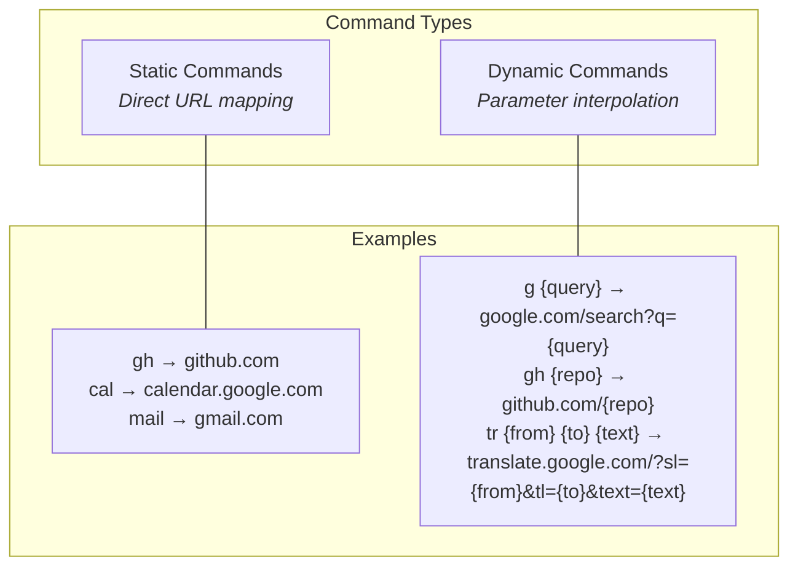

The system supports two fundamental command types:

#### Static Commands

Static commands provide direct URL mappings without parameters:

```text
gm → gmail.com
cal → calendar.com
docs → docs.google.com
```

These commands navigate directly to the specified URL when invoked, serving as shortcuts for frequently accessed destinations.

#### Dynamic Commands

Dynamic commands incorporate parameters into URL templates:

```text
# Search engines
g {query} → google.com/search?q={query}
yt {query} → youtube.com/results?search_query={query}
gh {query} → github.com/search?q={query}

# Direct navigation
gh/r {repo} → github.com/{repo}
npm {pkg} → npmjs.com/package/{pkg}
maps {loc} → google.com/maps/search/{loc}

# Multiple parameters
tr {from} {to} {text} → translate.google.com/?sl={from}&tl={to}&text={text}
```

These commands support multiple parameters with interpolation into the final URL.

### Command Processing Pipeline

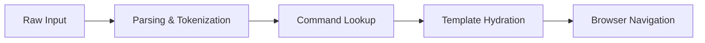

| Stage                      | Description                                       | Example                                         |
| -------------------------- | ------------------------------------------------- | ----------------------------------------------- |
| **Raw Input**              | User-entered text command                         | `g cats`                                        |
| **Parsing & Tokenization** | Breaks down input into command and parameters     | Command: `g`, Params: `cats`                    |
| **Command Lookup**         | Identifies the command and retrieves its template | Template: `google.com/search?q={query}`         |
| **Template Hydration**     | Populates the template with extracted parameters  | Result: `google.com/search?q=cats`              |
| **Browser Navigation**     | Opens the generated URL in the browser            | _Browser navigates to Google search for "cats"_ |

### Command Execution

When a user interacts with meows.space, the command execution process follows a natural flow from input to navigation:


The user begins by either typing a command or clicking an icon in the grid. For text input, the system parses the command and identifies whether it's static or dynamic. Static commands immediately resolve to their target URL, while dynamic commands extract parameters from the input and interpolate them into the URL template.

When a user clicks an icon, the system checks if there's text in the input field that should be used as a parameter. If parameters are needed, they're extracted from the input; otherwise, the system uses the direct URL associated with the command.

Once the final URL is constructed, the browser opens it in a new tab, and focus returns to meows.space for the next command. This streamlined process allows users to quickly navigate to their desired destinations with minimal effort.

## Command Organization and Catalog

The system provides both global catalog and user inventory with a flexible organization system. Users can have multiple profiles, each with its own set of commands and labels.

### Global Catalog

The global catalog serves as a distributed registry for command discovery and sharing. It contains commands created and shared by the community:

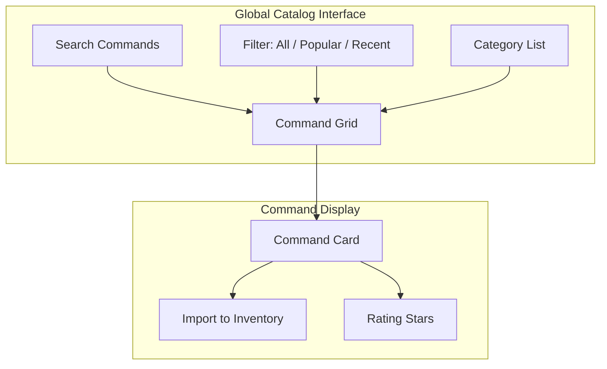

### Inventory

Each user has a personal inventory where they can create, customize, and organize their own commands. The inventory uses a label-based indexing system:

```text
[Search]
- Google {shortcut: "g"}
- YouTube {shortcut: "yt"}
- Wikipedia {shortcut: "wiki"}

[Development]
- MDN {url: "developer.mozilla.org"}
- DevDocs {url: "devdocs.io/{topic}"}
- GitHub {url: "github.com/{repo}"}
- npm {url: "npmjs.com/package/{pkg}"}
```

Each command is represented by an icon in the grid. These icons are either automatically fetched from the domain favicon or custom icons uploaded by the user. Below each icon is the command name, similar to desktop shortcuts in traditional operating systems.

The organization system uses a flat label structure where each command can have multiple labels. This design enables commands to appear in different contexts based on their categorization. For example, a GitHub search command might appear under both "Development" and "Search" labels.

### Social Sharing

The system enables command sharing between users, enhancing collaboration and discovery:

- Users can share individual commands or collections via direct links
- Commands can be liked or favorited to build personal collections
- Popular commands rise to the top of the global catalog
- Users can import shared commands directly to their personal inventory
- Command creators receive attribution when their commands are shared
- Privacy settings allow users to control which commands are publicly visible

This social layer builds community around command creation while maintaining individual productivity as the core focus.

### User Profiles

Users can create multiple profiles, each with its own:

- Set of commands (each profile has its own distinct commands)
- Active label (the currently selected label for filtering)
- Set of labels shown under the input field
- Default browser settings

Each profile functions as a separate workspace, allowing users to maintain different command sets for different contexts, such as work, personal, or specific projects. The same command cannot have different parameters across profiles - if a user needs a variation of a command, they must create a new command in that profile.

## System Integration \& Feedback

### Authentication Integration

meows.space implements authentication through OAuth-based providers including GitHub, LinkedIn, and Facebook. This approach eliminates the need for direct username/password management while providing secure identity verification. Authentication is only required for command management functions, not for basic command execution, maintaining a low barrier to entry for new users.

The authentication system integrates with the local-first architecture, storing authentication tokens in secure browser storage and refreshing them as needed. This enables offline access to authenticated features while maintaining security standards.

### Local-First Architecture Integration

The local-first architecture forms the foundation of the system's integration approach. Command execution occurs primarily in the browser, with local storage handling command data persistence. This architecture enables offline functionality for core features while maintaining cross-device synchronization when connectivity is available.

Synchronization is implemented selectively, focusing on command management rather than execution. This approach minimizes network dependencies while ensuring data consistency across devices. The system operates independently of external services for core functionality, enhancing reliability and reducing potential points of failure.

### Browser Integration

meows.space operates as a standalone web application without requiring browser extensions or plugins. This design decision simplifies deployment and reduces maintenance overhead while ensuring broad compatibility across browsers and platforms. The system maintains its own command history and state management, independent of browser history or bookmark systems.

Future versions may implement optional browser integrations, such as bookmark synchronization or browser extension features, but these remain supplementary rather than core requirements. This approach maintains the system's independence while allowing for enhanced functionality for users who desire deeper browser integration.

### External Services

The system generates URLs without requiring external API access or service credentials, maintaining independence from third-party services for core functionality. This design eliminates API limits, quotas, and credential management concerns that typically accompany external service dependencies.

For services that require authentication, such as private GitHub repositories, the system passes authentication through the browser's standard mechanisms rather than storing or managing service credentials directly. This approach maintains security while enabling access to authenticated services when needed.

### User Feedback Mechanisms

#### In-app Feedback

The system implements a unified feedback mechanism accessible through the main navigation menu. Users can submit bug reports, feature suggestions, and general feedback through a single form interface that categorizes submissions for appropriate routing and response. This streamlined approach simplifies the feedback process while ensuring that user input reaches the appropriate teams.

The feedback system captures contextual information such as browser version and system configuration to assist in issue diagnosis, while maintaining user privacy by excluding personal data unless explicitly provided by the user.

#### Analytics Integration

meows.space implements Google Analytics to monitor system usage patterns and identify opportunities for improvement. The analytics implementation tracks feature usage, user flows, and interaction patterns without capturing personally identifiable information. This data informs development priorities and interface optimizations based on actual usage rather than assumptions.

The analytics system implements appropriate data retention policies and provides users with clear information about data collection practices. Users can opt out of analytics collection through the settings interface if desired.

#### Support Channels

The system provides a unified support channel through a dedicated email address that handles all types of inquiries. This approach simplifies the support process for users while ensuring that questions reach the appropriate team members for resolution. Support documentation complements direct assistance, providing self-service options for common questions and issues.

## System Architecture

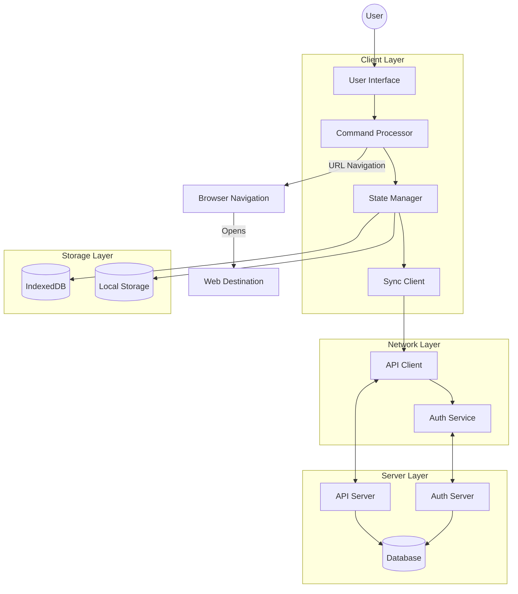

meows.space implements a layered architecture with clear separation of concerns:

1. **Client Layer**: Handles user interaction, command processing, state management, and synchronization
2. **Storage Layer**: Provides persistent local storage through IndexedDB and browser local storage
3. **Network Layer**: Manages communication with server APIs and authentication services
4. **Server Layer**: Hosts API endpoints, authentication services, and database storage

This architecture enables the local-first approach, where commands can be managed offline while still providing synchronization capabilities when online. The system prioritizes client-side processing for command execution, with server components primarily supporting data persistence and sharing functionality.

### State Management

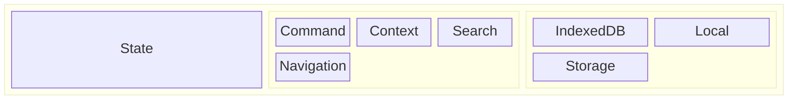

The state management system handles data persistence and retrieval across different storage layers. It maintains application state during runtime and across sessions.

#### State Architecture

The state architecture consists of two primary components: runtime state in memory and persistent state in storage. Runtime state provides fast access to frequently used data, while persistent state ensures data durability across sessions.

#### Runtime State

Runtime state contains the active application context during a session:

- **Command context** maintains the currently active command and its parameters. This includes the command being edited or executed, along with any extracted parameters.
- **UI state** tracks the current interface configuration, including selected commands, active panels, search queries, and scroll positions.
- **Command history** keeps a record of recently executed commands in an LRU cache, enabling quick access to frequently used commands without database queries.
- **Search index** provides an in-memory structure for fast command lookup, using prefix-based searching and fuzzy matching algorithms.

#### Persistent State

Persistent state maintains durable data across browser sessions:

- **Command definitions** store all user-defined commands, including their URLs, parameters, and metadata. This forms the core of the user's command library.
- **User profiles** contain user information, including display name, email, and authentication details.
- **User preferences** store interface settings, default behaviors, and personalization options that persist across sessions.
- **Command history** maintains a comprehensive log of executed commands with timestamps and execution contexts.
- **Organization structure** stores the folder hierarchy, labels, and categorization system for commands.
- **Pending changes** queue modifications made while offline, ensuring they're synchronized when connectivity is restored.

### Data Synchronization

The data synchronization system manages bidirectional data flow between client and server databases.

#### Local-First Operations

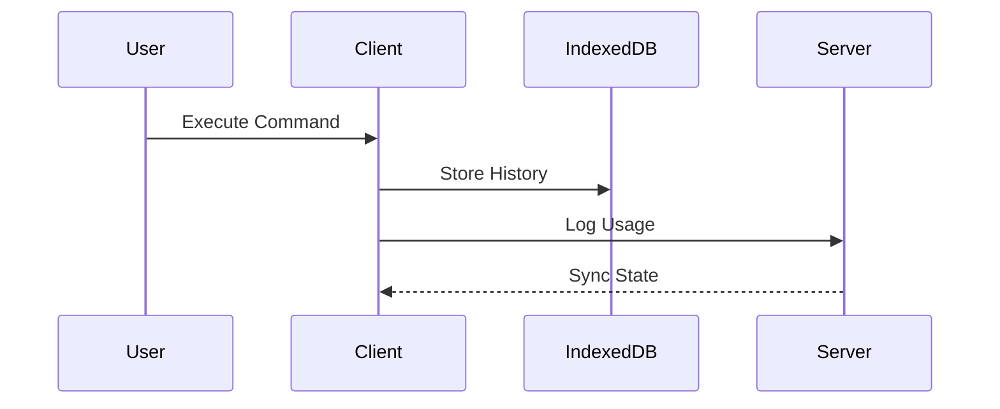

The system handles two primary processes:

**Command Management Synchronization** uses a transaction-based approach. When users modify commands, the system first applies changes to the local IndexedDB, then queues them for server synchronization. Each change is timestamped and assigned a unique transaction ID. When online, the system transmits these changes to the server in batches. For concurrent edits from multiple devices, the system applies last-writer-wins conflict resolution, with special handling for structural conflicts like command deletion followed by modification.

**Command Execution** records command usage statistics. When a user executes a command, the system logs this event locally and, when online, transmits usage data to the server for analytics. The browser handles the actual URL navigation after command processing.

#### System Flow

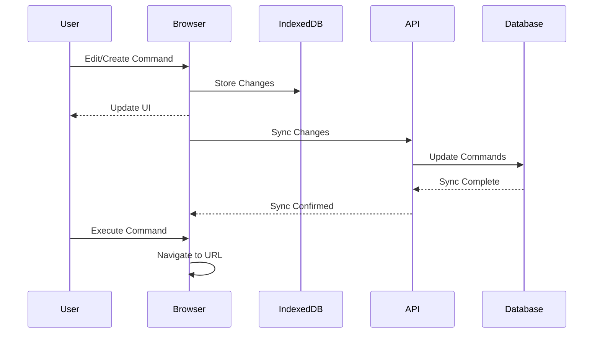

This diagram shows the data flow during command management and execution. Command edits are immediately stored in IndexedDB and reflected in the UI. When online, changes are synchronized with the server. For command execution, the browser constructs the URL and performs navigation directly.

### Frontend Architecture

The frontend architecture implements a single-page application with a focus on performance, offline capabilities, and responsive design.

#### Technical Implementation

The frontend architecture is designed around these principles:

- Component-based UI architecture
- Strong type safety throughout the codebase
- Scoped styling to prevent conflicts
- Client-side storage for offline functionality
- Service workers for offline capabilities and caching

#### Loading & Performance

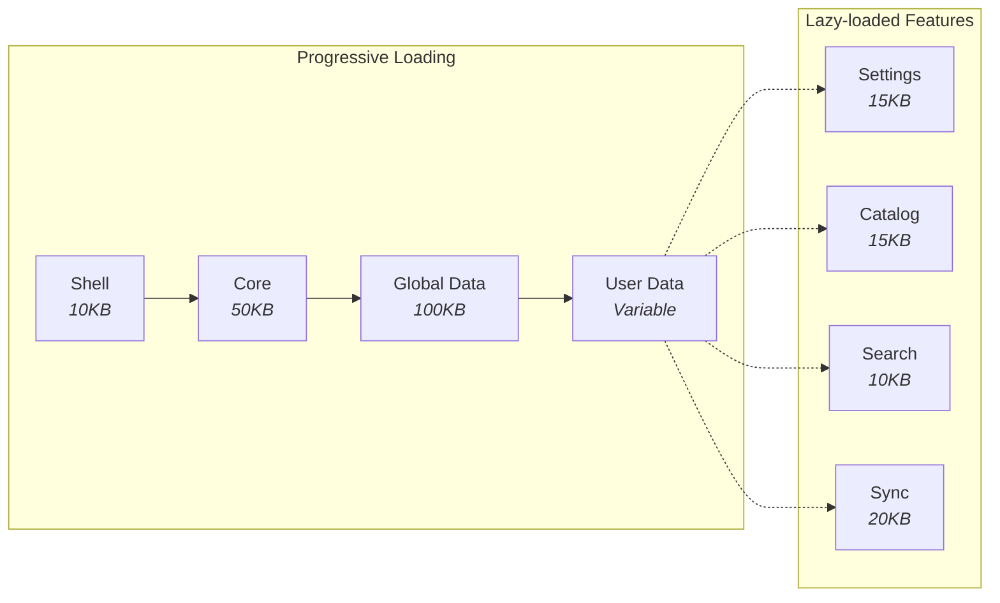

The application implements a sequential loading strategy to reduce initial load time. Through progressive loading and code splitting, the system loads critical functionality first while deferring non-essential features.

##### Progressive Loading Strategy

The application loads in a defined sequence:

1. **Shell (10KB)** loads first, containing the HTML structure, critical CSS, and minimal JavaScript for command input. This initial payload loads in approximately 200ms on standard connections, providing immediate access to the command input field.

2. **Core (50KB)** loads second, including the command parser, state management system, and primary UI components. This enables basic command execution while additional components continue loading.

3. **Global Data (100KB)** loads third, containing the public command catalog, default templates, and system configuration. This data is cached and shared across users, allowing non-authenticated users to access public commands.

4. **User Data (Variable Size)** loads last for authenticated users, including personal commands, preferences, history, and folder structure.

##### Performance Optimization Techniques

The application implements multiple optimization techniques:

**Code Splitting** divides the application into separate chunks that load on demand. Features like settings, command catalog, search functionality, and synchronization components load only when accessed, reducing initial load time.

**Virtual Rendering** for grids and lists renders only visible items, maintaining consistent performance with large command sets. This uses windowed rendering that creates DOM elements only for items in the viewport.

**Bundle Optimization** includes tree-shaking to remove unused code, module deduplication to reduce redundancy, and critical CSS extraction. The delivery pipeline uses Brotli compression, cache control with ETags, and content-based versioning.

**Data Prefetching** loads data before user interaction, such as prefetching command details on hover or loading the next page of results before reaching the current page end.

**Caching Strategy** uses multiple storage mechanisms:

- Browser cache for static assets
- Client-side database for command data and user preferences
- Memory cache for frequently accessed data
- Service worker for offline functionality

### Backend Architecture

#### API Implementation

The backend implements a REST API with endpoints for:

- Command storage and retrieval
- User authentication
- Cross-device synchronization

API endpoints use standard HTTP methods and return JSON responses with appropriate status codes. Authentication uses session tokens with configurable expiration.

For detailed information about API endpoints, see the [API Endpoints](#api-endpoints) section.

#### Data Storage

Data is stored in two layers:

- Client-side storage for local persistence
- Server-side database for remote storage

The database schema mirrors the data models with tables for commands, users, and usage data. Indexes are implemented on frequently queried fields to optimize read performance.

#### Security Implementation

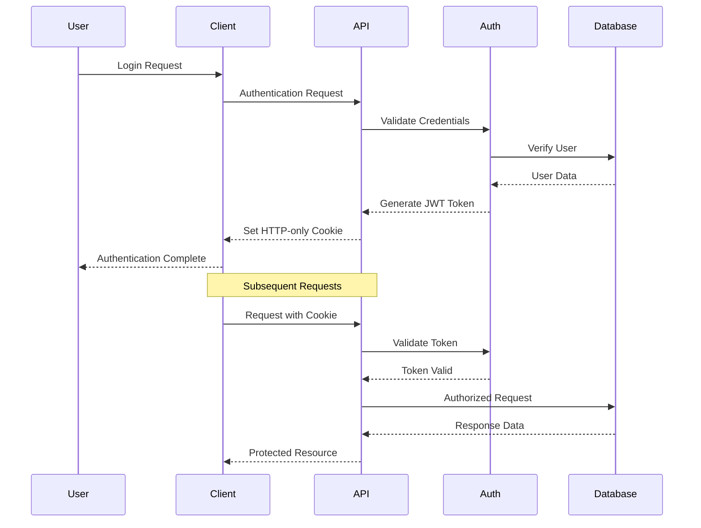

Authentication uses session-based tokens stored in HTTP-only cookies with secure and SameSite attributes. User passwords are hashed using bcrypt with appropriate work factors. All API communications require HTTPS, with HSTS headers enforcing secure connections. The system implements rate limiting for authentication endpoints and uses CSRF tokens for state-changing operations.

For data at rest, the database implements field-level encryption for sensitive information. Access controls enforce user-specific data boundaries, preventing unauthorized access to other users' commands and settings.

## Glossary

This glossary standardizes terminology used throughout the meows.space documentation to ensure consistency and clarity.

| Term               | Definition                                                                                                                                                                                                                                                                            |
| ------------------ | ------------------------------------------------------------------------------------------------------------------------------------------------------------------------------------------------------------------------------------------------------------------------------------- |
| Command            | A text shortcut that expands to a full URL, optionally with parameters. The core unit of functionality in meows.space.                                                                                                                                                                |
| Service            | A web destination that can be accessed via commands. Represented visually as an icon in the ServiceGrid.                                                                                                                                                                              |
| Command vs Service | Commands are text inputs (e.g., "g cats") that users type, while Services are the URL templates (e.g., "google.com/search?q={query}") that define how commands are processed into navigable URLs. Commands reference Services, and the combination produces the final URL navigation. |
| Parameter          | A variable portion of a command that gets interpolated into the final URL.                                                                                                                                                                                                            |
| Template           | The URL pattern associated with a command, containing placeholders for parameters.                                                                                                                                                                                                    |
| Label              | A categorization label applied to commands for organization and filtering.                                                                                                                                                                                                            |
| Global Catalog     | A shared, community-maintained collection of commands available to all users. Contains verified, popular commands that can be imported to a user's inventory.                                                                                                                         |
| Inventory          | A user's private collection of commands, customized to their specific needs and preferences. Commands in the inventory can be created, edited, and organized by the user.                                                                                                             |
| Profile            | A user's workspace containing their commands, preferences, and settings.                                                                                                                                                                                                              |
| Static Command     | A command that maps directly to a URL without parameters.                                                                                                                                                                                                                             |
| Dynamic Command    | A command that incorporates parameters into a URL template.                                                                                                                                                                                                                           |
| ServiceGrid        | The Windows 95-style icon grid component that displays commands as interactive tiles.                                                                                                                                                                                                 |
| Command Execution  | The process of transforming a text command into a URL and navigating to it.                                                                                                                                                                                                           |
| Command Management | The process of creating, editing, and organizing commands.                                                                                                                                                                                                                            |

## Artifacts

### Flow charts

| Flow                                                    | Description                                                                                                                      | Key Steps                                                                                   |
| ------------------------------------------------------- | -------------------------------------------------------------------------------------------------------------------------------- | ------------------------------------------------------------------------------------------- |
| [Command Execution](flows/command-execution.md)         | Traces the journey from user input to URL navigation, showing how commands are parsed, parameters extracted, and URLs generated. | Input parsing → Command lookup → Parameter extraction → URL generation → Browser navigation |
| [Command Management](flows/command-management.md)       | Documents the creation, editing, and organization of commands, including validation, storage, and synchronization processes.     | Command creation → Validation → Storage → Synchronization → Organization                    |
| [User Interaction Patterns](flows/user-interaction.md)  | Illustrates common user workflows across different pages, highlighting interaction patterns and navigation flows.                | Search → Execute → Organize → Customize → Share                                             |
| [Profile Management](flows/profile-management.md)       | Details the user profile management processes including preferences, settings, and profile data management.                      | Profile creation → Customization → Settings management → Data synchronization               |
| [Authentication Login](flows/authentication-login.md)   | Documents the login and logout processes, including standard and OAuth authentication flows with security considerations.        | Credential submission → Validation → Token generation → Session management → Logout         |
| [Authentication Logoff](flows/authentication-logoff.md) | Details the process of terminating all active sessions across all devices simultaneously for security purposes.                  | Access security settings → Verification → Session termination → Security notification       |
| [Registration](flows/authentication-registration.md)    | Describes the user registration process including account creation, email verification, and initial profile setup.               | Account creation → Email verification → Profile setup → Dashboard access                    |
| [Account Deletion](flows/account-deletion.md)           | Details the account deletion process including verification, data removal, grace period, and privacy considerations.             | Deletion request → Verification → Data marking → Grace period → Permanent deletion          |

### Data Models

The following class diagram provides a high-level overview of the data model relationships in meows.space. This is a simplified representation; complete and detailed models can be found in their respective model files. The diagram illustrates the relationships between commands, services, labels, users, and their associated entities.

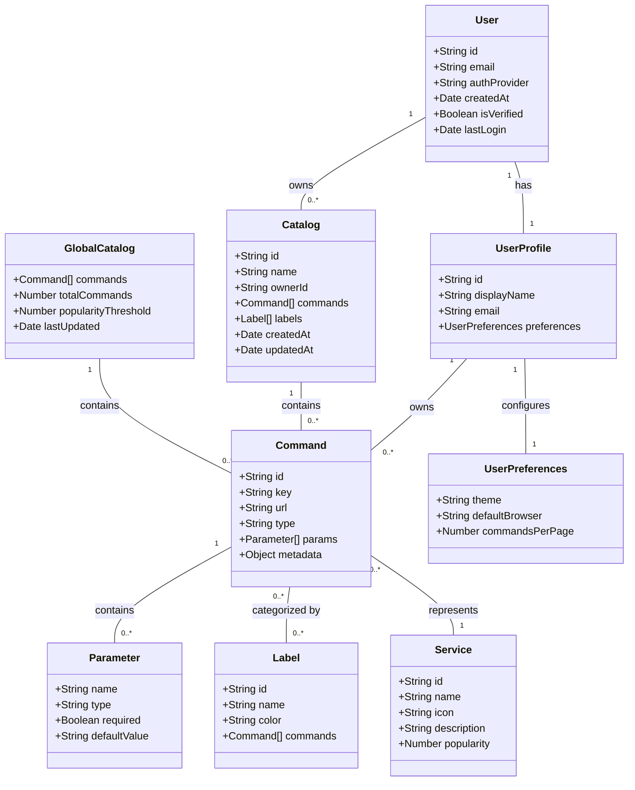

For API error handling, the system implements a standardized error response format:

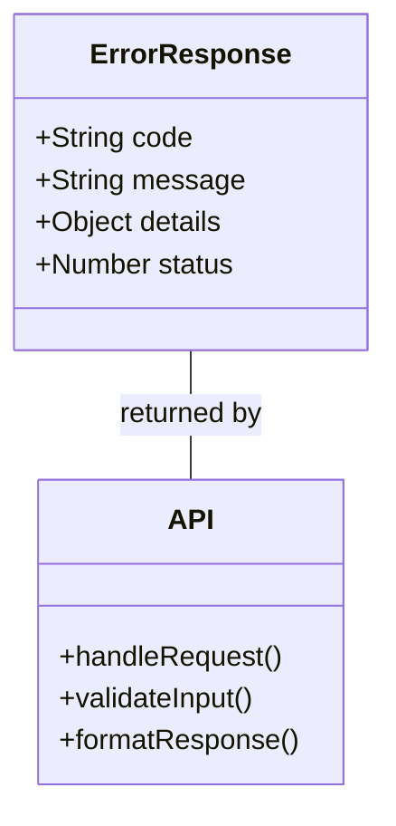

| Model                                          | Description                                                                                                                                                                         | Key Properties                          |
| ---------------------------------------------- | ----------------------------------------------------------------------------------------------------------------------------------------------------------------------------------- | --------------------------------------- |
| [Command](models/command.md)                   | Defines the structure of command objects, including static and dynamic variants. Commands connect user input to URL templates and manage parameter extraction.                      | id, key, url, type, params, metadata    |
| [Service](models/service.md)                   | Represents service metadata including icons, descriptions, and usage statistics. Services provide the visual representation of commands in the UI.                                  | id, name, icon, description, popularity |
| [Label](models/label.md)                       | Implements the label-based organization system, allowing commands to be categorized and filtered. Labels can be applied to multiple commands and commands can have multiple labels. | id, name, color, commands               |
| [User](models/user.md)                         | Stores core user account information including authentication details, email verification status, and account creation metadata.                                                    | id, email, authProvider, isVerified     |
| [User Profile](models/user-profile.md)         | Manages user profile information, display preferences, and interface settings. Connected to the core User model.                                                                    | id, displayName, email, preferences     |
| [User Preferences](models/user-preferences.md) | Stores user-specific settings including theme preferences, default behaviors, and interface configurations.                                                                         | theme, defaultBrowser, commandsPerPage  |
| [Inventory](models/inventory.md)               | Represents a user's personal collection of commands, organized with labels and metadata.                                                                                            | id, name, ownerId, commands, labels     |
| [Global Catalog](models/global-catalog.md)     | Implements the shared, community-maintained collection of commands available to all users. Contains popularity metrics and curation data.                                           | commands, totalCommands, lastUpdated    |
| [Error Response](models/error-response.md)     | Defines the standardized format for API error responses across the system.                                                                                                          | code, message, details, status          |

### Pages

| Page                                          | Route                                               | Description                                                                                                             | Key Features                                                |
| --------------------------------------------- | --------------------------------------------------- | ----------------------------------------------------------------------------------------------------------------------- | ----------------------------------------------------------- |
| **[Main Search](pages/main-search.md)**       | **/**                                               | Primary interface for command execution, featuring a prominent search bar and quick access to frequently used commands. | Command input, history, suggestions, quick execution        |
| **[Inventory](pages/inventory.md)**           | **/personal**                                       | User's workspace for managing personal commands, with organization tools and customization options.                     | Command grid, label filtering, drag-and-drop organization   |
| [Settings](pages/settings.md)                 | &nbsp;&nbsp;&nbsp;&nbsp;/personal/settings          | Configuration interface for user preferences, appearance settings, and default behaviors.                               | Theme selection, display options, default settings          |
| [Create Command](pages/create-command.md)     | &nbsp;&nbsp;&nbsp;&nbsp;/personal/command/create    | Form interface for creating new command templates with parameter configuration and validation.                          | Template builder, parameter editor, preview functionality   |
| [Edit Command](pages/create-command.md)       | &nbsp;&nbsp;&nbsp;&nbsp;/personal/command/edit/[id] | Editing interface for existing commands, allowing modification of templates and parameters.                             | Template editing, parameter configuration, usage statistics |
| **[Global Catalog](pages/global-catalog.md)** | **/catalog**                                        | Discovery interface for community-shared commands, with filtering, sorting, and import capabilities.                    | Command discovery, popularity sorting, import functionality |
| [Service Details](pages/service-details.md)   | &nbsp;&nbsp;&nbsp;&nbsp;/catalog/service/[id]       | Detailed view of a specific service or command, showing metadata, usage information, and related commands.              | Command details, usage statistics, related commands         |
| [Login](pages/login.md)                       | **/auth/login**                                     | Authentication interface for existing users, with multiple login options and security features.                         | Email/password login, OAuth providers, security measures    |
| [Register](pages/register.md)                 | **/auth/register**                                  | Registration interface for new users, with account creation and verification processes.                                 | Account creation, email verification, initial setup         |
| **[Help](pages/help.md)**                     | **/help**                                           | User guidance with visual demonstrations and explanations of key features and workflows.                                | GIF demonstrations, feature explanations, usage tips        |
| **[About](pages/about.md)**                   | **/about**                                          | Information about the project, team, and technology stack, with links to resources and documentation.                   | Project information, team details, technology overview      |
| **[Feedback](pages/feedback.md)**             | **/feedback**                                       | Interface for users to submit feedback, report issues, and suggest improvements.                                        | Feedback form, issue reporting, feature requests            |
| **[Privacy Policy](pages/privacy-policy.md)** | **/privacy**                                        | Legal information about data handling practices, user rights, and compliance measures.                                  | Data collection, user rights, security measures             |
| **[Terms of Use](pages/terms-of-use.md)**     | **/terms**                                          | Legal terms governing the use of the service, user responsibilities, and limitations.                                   | Usage terms, user obligations, liability limitations        |

### Components

| Component                                      | Description                                                                                                                                  | Usage                                  |
| ---------------------------------------------- | -------------------------------------------------------------------------------------------------------------------------------------------- | -------------------------------------- |
| [Header](components/Header.md)                 | Primary navigation interface with logo, navigation menu, search bar, and user menu. Maintains consistent placement across all pages.         | All pages                              |
| [Footer](components/Footer.md)                 | Secondary navigation with legal links, support resources, and copyright information. Provides access to terms, privacy policy, and help.     | All pages                              |
| [SearchBar](components/SearchBar.md)           | Primary command input with autocomplete and history. Processes user text input and triggers command execution.                               | Main Search, Inventory, Global Catalog |
| [ServiceGrid](components/ServiceGrid.md)       | Windows 95-style icon grid displaying commands as interactive tiles. Supports drag-and-drop organization and visual categorization.          | Main Search, Inventory, Global Catalog |
| [LabelBar](components/LabelBar.md)             | Label-based filtering system allowing users to organize and filter commands by categories. Implements multi-select filtering with AND logic. | Inventory, Global Catalog              |
| [ServiceBuilder](components/ServiceBuilder.md) | Form interface for creating and editing service definitions. Includes parameter configuration, validation, and preview functionality.        | Inventory, Service Details             |
| [CommandIcon](components/CommandIcon.md)       | Visual representation of a command with favicon and label. Displays the command's icon and name in the ServiceGrid.                          | ServiceGrid, Inventory, Global Catalog |
| [CatalogView](components/CatalogView.md)       | Container component for displaying and managing catalogs. Handles catalog navigation, filtering, and command display.                        | Inventory, Global Catalog              |
| [CommandCard](components/CommandCard.md)       | Card component displaying command information, including icon, name, description, and usage statistics.                                      | Inventory, Global Catalog              |
| [ImportButton](components/ImportButton.md)     | Button for importing commands from the global catalog to a user's inventory. Includes confirmation and success states.                       | Global Catalog                         |

### API Endpoints

| Endpoint                      | Method | Description                   | Cached   | Auth Required |
| ----------------------------- | ------ | ----------------------------- | -------- | ------------- |
| `/api/auth/login`             | POST   | User login                    | No       | No            |
| `/api/auth/logout`            | POST   | User logout                   | No       | Yes           |
| `/api/auth/logoff`            | POST   | User log-off from all devices | No       | Yes           |
| `/api/auth/register`          | POST   | New user registration         | No       | No            |
| `/api/auth/session`           | GET    | Get current session           | No       | Yes           |
| `/api/auth/refresh`           | POST   | Refresh access token          | No       | Yes           |
| `/api/services`               | GET    | List all services             | Yes (5m) | No            |
| `/api/services/:id`           | GET    | Get service details           | No       | No            |
| `/api/services`               | POST   | Create new service            | No       | Yes           |
| `/api/services/:id`           | PUT    | Update service                | No       | Yes           |
| `/api/services/:id`           | DELETE | Delete service                | No       | Yes           |
| `/api/services/search`        | GET    | Search services               | No       | No            |
| `/api/labels`                 | GET    | List all labels               | Yes (5m) | No            |
| `/api/labels`                 | POST   | Create new label              | No       | Yes           |
| `/api/labels/:id`             | PUT    | Update label                  | No       | Yes           |
| `/api/labels/:id`             | DELETE | Delete label                  | No       | Yes           |
| `/api/labels/trending`        | GET    | Get trending labels           | No       | No            |
| `/api/inventory`              | GET    | Get user's inventory          | No       | Yes           |
| `/api/inventory/commands`     | GET    | Get inventory commands        | No       | Yes           |
| `/api/inventory/commands`     | POST   | Add command to inventory      | No       | Yes           |
| `/api/inventory/commands/:id` | PUT    | Update inventory command      | No       | Yes           |
| `/api/inventory/commands/:id` | DELETE | Remove command from inventory | No       | Yes           |
| `/api/inventory/share/:id`    | POST   | Share command                 | No       | Yes           |
| `/api/catalogs/global`        | GET    | Get global catalog            | Yes (1h) | No            |
| `/api/user/preferences`       | GET    | Get user preferences          | No       | Yes           |
| `/api/user/preferences`       | PUT    | Update preferences            | No       | Yes           |
| `/api/user/history`           | GET    | Get search history            | No       | Yes           |
| `/api/user/history`           | DELETE | Clear history                 | No       | Yes           |
| `/api/user/favorites`         | GET    | Get favorite services         | No       | Yes           |
| `/api/user/favorites/:id`     | POST   | Add to favorites              | No       | Yes           |
| `/api/user/favorites/:id`     | DELETE | Remove from favorites         | No       | Yes           |
| `/api/providers`              | GET    | List search providers         | Yes (1h) | No            |
| `/api/providers/:id/search`   | GET    | Execute provider search       | No       | No            |
| `/api/providers/default`      | GET    | Get default provider          | No       | Yes           |
| `/api/providers/default`      | PUT    | Set default provider          | No       | Yes           |
| `/api/analytics/event`        | POST   | Log user event                | No       | No            |
| `/api/analytics/trending`     | GET    | Get trending services         | Yes (1h) | No            |
| `/api/analytics/popular`      | GET    | Get popular services          | No       | No            |
| `/api/analytics/metrics`      | GET    | Get usage metrics             | No       | Yes           |

\* The global catalog can be accessed without authentication, but the user's inventory requires authentication.
