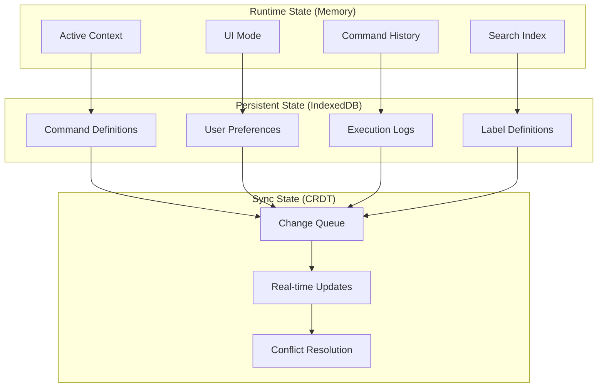

Welcome to the meows.space documentation. This knowledge base contains comprehensive documentation for the meows.space URL command multiplexer project.

## Overview

meows.space is a URL command multiplexer that transforms text commands into parameterized URLs. The system implements a browser-based interface with a local-first architecture, enabling offline command management and online URL resolution.

Users define commands that expand to full URLs with optional parameters. For example, `g cats` expands to `google.com/search?q=cats`, and `gh profile` expands to `github.com/profile`.

The system features a graphical interface with a Windows 95-style icon grid and organization tools. Its three-layer state management provides offline capabilities while maintaining cross-device synchronization. The architecture implements progressive loading and local-first operations for performance optimization.

## Core Concept

meows.space transforms text inputs into navigable URLs through predefined templates. The system processes user commands and converts them to structured URLs using either static mappings or dynamic parameter interpolation.

The browser-based execution enables direct navigation to destinations. Command management functions offline, while URL resolution requires network connectivity.

## Technical Architecture

The system architecture prioritizes performance, offline capability, and security:

- Local-first implementation with client-side command execution
- Progressive loading sequence:
  - Initial shell (30KB)
  - Core runtime (100KB)
  - User context data (70KB)
- CRDT-based synchronization for conflict resolution
- Full offline support for command management
- Security implementation with JWT, HTTPS, and URL validation

## Command Types

### Static Commands

Static commands provide direct URL mappings without parameters:

```text
gm → gmail.com
cal → calendar.com
docs → docs.google.com
```

These commands navigate directly to the specified URL when invoked, serving as shortcuts for frequently accessed destinations.

### Dynamic Commands

Dynamic commands incorporate parameters into URL templates:

```text
# Search engines
g {query} → google.com/search?q={query}
yt {query} → youtube.com/results?search_query={query}
gh {query} → github.com/search?q={query}

# Direct navigation
gh/r {repo} → github.com/{repo}
npm {pkg} → npmjs.com/package/{pkg}
maps {loc} → google.com/maps/search/{loc}

# Multiple parameters
tr {from} {to} {text} → translate.google.com/?sl={from}&tl={to}&text={text}
```

These commands support multiple parameters with interpolation into the final URL.

## Command Execution

When a user interacts with meows.space, the command execution process follows a natural flow from input to navigation:


The user begins by either typing a command or clicking an icon in the grid. For text input, the system parses the command and identifies whether it's static or dynamic. Static commands immediately resolve to their target URL, while dynamic commands extract parameters from the input and interpolate them into the URL template.

When a user clicks an icon, the system checks if there's text in the input field that should be used as a parameter. If parameters are needed, they're extracted from the input; otherwise, the system uses the direct URL associated with the command.

Once the final URL is constructed, the browser opens it in a new tab, and focus returns to meows.space for the next command. This streamlined process allows users to quickly navigate to their desired destinations with minimal effort.

## Command Organization and Catalog

The system provides both global and personal command catalogs with a flexible organization system. Users can have multiple profiles, each with its own set of commands and labels.

### Global Catalog

The global catalog serves as a distributed registry for command discovery and sharing. It contains commands created and shared by the community:

```text
[Development]
gh, npm, devdocs, stackoverflow, caniuse

[Media]
yt, spotify, netflix, imdb, soundcloud

[Knowledge]
wikipedia, wolfram, scholar, arxiv, pubmed
```

The catalog collects anonymous usage data and incorporates a star-based rating system. Users can rate commands from one to five stars, helping others discover the most useful and reliable commands. These ratings, combined with usage statistics, determine the popularity sorting in the catalog.

Commands are organized by labels and can be sorted by:

- Star rating (highest to lowest)
- Popularity (most used)
- Recency (newest first)
- Alphabetically (A to Z)

### Personal Catalog

Each user has a personal catalog where they can create, customize, and organize their own commands. The personal catalog uses a label-based indexing system:

```text
[Search]
- Google {shortcut: "g"}
- YouTube {shortcut: "yt"}
- Wikipedia {shortcut: "wiki"}

[Development]
- MDN {url: "developer.mozilla.org"}
- DevDocs {url: "devdocs.io/{topic}"}
- GitHub {url: "github.com/{repo}"}
- npm {url: "npmjs.com/package/{pkg}"}
```

Each command is represented by an icon in the grid. These icons are either automatically fetched from the domain favicon or custom icons uploaded by the user. Below each icon is the command name, similar to desktop shortcuts in traditional operating systems.

The organization system uses a flat label structure where each command can have multiple labels. This design enables commands to appear in different contexts based on their categorization. For example, a GitHub search command might appear under both "Development" and "Search" labels.

Users can filter the icon grid by selecting one or more labels, with the interface showing only commands that match all selected labels. This approach provides a flexible yet powerful way to organize and access commands based on their purpose and usage context.

### User Profiles

Users can create multiple profiles, each with its own:

- Set of commands (each profile has its own distinct commands)
- Active label (the currently selected label for filtering)
- Set of labels shown under the input field
- Default browser settings

Each profile functions as a separate workspace, allowing users to maintain different command sets for different contexts, such as work, personal, or specific projects. The same command cannot have different parameters across profiles - if a user needs a variation of a command, they must create a new command in that profile.

## State Management

The system implements a three-layer state architecture:



- Runtime state: In-memory storage for active context, UI state, history, and search
- Persistent state: IndexedDB storage for commands, preferences, logs, and label definitions
- Sync state: Simple change queue with conflict resolution

The system uses a synchronization mechanism that ensures changes made on one device are propagated to all other devices where the user is logged in. Changes are queued locally and synchronized when the device is online, ensuring a seamless experience across devices.

## Documentation Structure

### Core Documentation
- [[core/architecture|System Architecture]]

### Technical Documentation
- [[technical/technology|Technical Implementation]]
- [[technical/components|Component Architecture]]
- [[technical/endpoints|API Endpoints]]
- [[technical/pages|Page Structure]]
- [[technical/system-integration|System Integration & Feedback]]

### Pages
- [[pages/main-search|Main Search Page]]
- [[pages/personal-catalog|Personal Catalog Page]]
- [[pages/global-catalog|Global Catalog Page]]
- [[pages/settings|Settings Page]]

### Components
- [[components/index|UI Components Overview]]
- [[components/SearchBar|SearchBar Component]]
- [[components/ServiceGrid|ServiceGrid Component]]
- [[components/TagBar|TagBar Component]]
- [[components/CommandBuilder|CommandBuilder Component]]

### Data Models
- [[models/command|Command Model]]
- [[models/service|Service Model]]
- [[models/tag|Tag Model]]
- [[models/user-profile|User Profile Model]]
- [[models/user-preferences|User Preferences Model]]

### Flow Documentation
- [[flows/command-execution|Command Execution Flow]]
- [[flows/command-management|Command Management Flow]]
- [[flows/user-interaction|User Interaction Patterns]]

## Tags
#meows #documentation #index 
