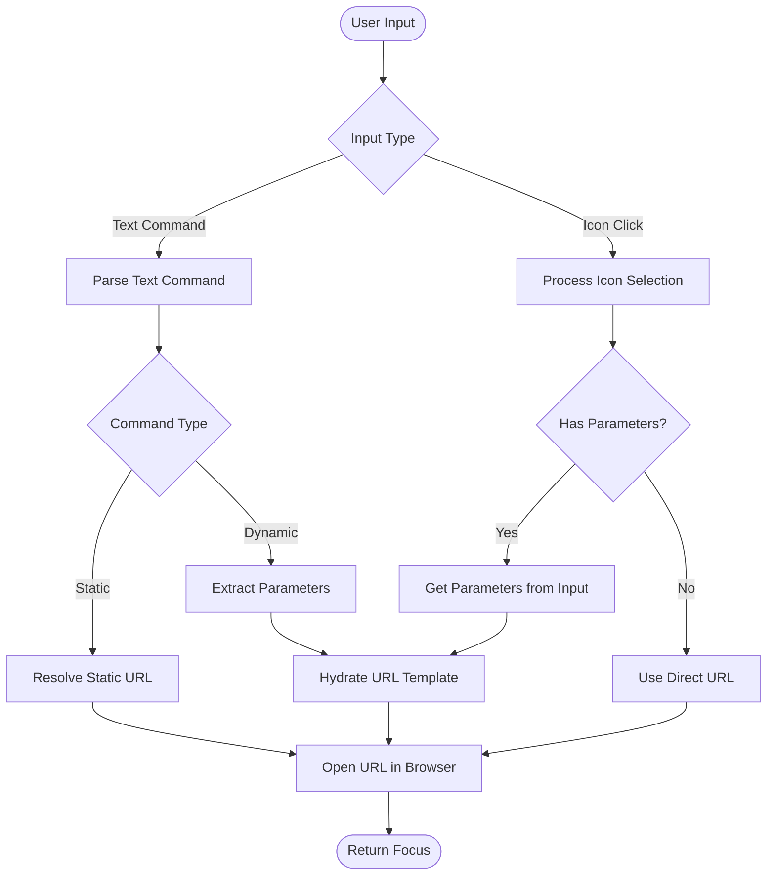

Welcome to the meows.space documentation. This knowledge base contains detailed documentation for the meows.space URL command multiplexer project.


- [Overview](#overview)
- [Core Concept](#core-concept)
- [Command Types](#command-types)
  - [Static Commands](#static-commands)
  - [Dynamic Commands](#dynamic-commands)
- [Command Execution](#command-execution)
- [Command Organization and Catalog](#command-organization-and-catalog)
  - [Global Catalog](#global-catalog)
  - [Personal Catalog](#personal-catalog)
  - [User Profiles](#user-profiles)
- [Artifacts](#artifacts)
- [Flow Documentation](#flow-documentation)
- [Data Models](#data-models)
- [Pages](#pages)
- [Components](#components)
- [API Endpoints](#api-endpoints)

---

## Overview

meows.space is a URL command multiplexer that transforms text commands into parameterized URLs. The system implements a browser-based interface with a local-first architecture, enabling offline command management and online URL resolution.

Users define commands that expand to full URLs with optional parameters. For example, `g cats` expands to `google.com/search?q=cats`, and `gh profile` expands to `github.com/profile`.

The system features a graphical interface with a Windows 95-style icon grid and organization tools. The three-layer state management provides offline capabilities while maintaining cross-device synchronization. The architecture implements progressive loading and local-first operations for performance optimization.

---

## Core Concept

meows.space transforms text inputs into navigable URLs through predefined templates. The system processes user commands and converts them to structured URLs using either static mappings or dynamic parameter interpolation.

The browser-based execution enables direct navigation to destinations. Command management functions offline, while URL resolution requires network connectivity.

---

## Command Types

### Static Commands

Static commands provide direct URL mappings without parameters:

```text
gm → gmail.com
cal → calendar.com
docs → docs.google.com
```

These commands navigate directly to the specified URL when invoked, serving as shortcuts for frequently accessed destinations.

### Dynamic Commands

Dynamic commands incorporate parameters into URL templates:

```text
# Search engines
g {query} → google.com/search?q={query}
yt {query} → youtube.com/results?search_query={query}
gh {query} → github.com/search?q={query}

# Direct navigation
gh/r {repo} → github.com/{repo}
npm {pkg} → npmjs.com/package/{pkg}
maps {loc} → google.com/maps/search/{loc}

# Multiple parameters
tr {from} {to} {text} → translate.google.com/?sl={from}&tl={to}&text={text}
```

These commands support multiple parameters with interpolation into the final URL.

---

## Command Execution

When a user interacts with meows.space, the command execution process follows a natural flow from input to navigation:



The user begins by either typing a command or clicking an icon in the grid. For text input, the system parses the command and identifies whether it's static or dynamic. Static commands immediately resolve to their target URL, while dynamic commands extract parameters from the input and interpolate them into the URL template.

When a user clicks an icon, the system checks if there's text in the input field that should be used as a parameter. If parameters are needed, they're extracted from the input; otherwise, the system uses the direct URL associated with the command.

Once the final URL is constructed, the browser opens it in a new tab, and focus returns to meows.space for the next command. This streamlined process allows users to quickly navigate to their desired destinations with minimal effort.

---

## Command Organization and Catalog

The system provides both global and personal command catalogs with a flexible organization system. Users can have multiple profiles, each with its own set of commands and labels.

### Global Catalog

The global catalog serves as a distributed registry for command discovery and sharing. It contains commands created and shared by the community:

```text
[Development]
gh, npm, devdocs, stackoverflow, caniuse

[Media]
yt, spotify, netflix, imdb, soundcloud

[Knowledge]
wikipedia, wolfram, scholar, arxiv, pubmed
```

The catalog collects anonymous usage data and incorporates a star-based rating system. Users can rate commands from one to five stars, helping others discover the most useful and reliable commands. These ratings, combined with usage statistics, determine the popularity sorting in the catalog.

Commands are organized by labels and can be sorted by:

- Star rating (highest to lowest)
- Popularity (most used)
- Recency (newest first)
- Alphabetically (A to Z)

### Personal Catalog

Each user has a personal catalog where they can create, customize, and organize their own commands. The personal catalog uses a label-based indexing system:

```text
[Search]
- Google {shortcut: "g"}
- YouTube {shortcut: "yt"}
- Wikipedia {shortcut: "wiki"}

[Development]
- MDN {url: "developer.mozilla.org"}
- DevDocs {url: "devdocs.io/{topic}"}
- GitHub {url: "github.com/{repo}"}
- npm {url: "npmjs.com/package/{pkg}"}
```

Each command is represented by an icon in the grid. These icons are either automatically fetched from the domain favicon or custom icons uploaded by the user. Below each icon is the command name, similar to desktop shortcuts in traditional operating systems.

The organization system uses a flat label structure where each command can have multiple labels. This design enables commands to appear in different contexts based on their categorization. For example, a GitHub search command might appear under both "Development" and "Search" labels.

### User Profiles

Users can create multiple profiles, each with its own:

- Set of commands (each profile has its own distinct commands)
- Active label (the currently selected label for filtering)
- Set of labels shown under the input field
- Default browser settings

Each profile functions as a separate workspace, allowing users to maintain different command sets for different contexts, such as work, personal, or specific projects. The same command cannot have different parameters across profiles - if a user needs a variation of a command, they must create a new command in that profile.

---

## Artifacts

| Document                                                 | Description                                                                                          | Key Topics                                                                      |
| -------------------------------------------------------- | ---------------------------------------------------------------------------------------------------- | ------------------------------------------------------------------------------- |
| **[[technical/architecture\|System Architecture]]**      | Detailed overview of the system's structural design, core components, and their interactions.        | Component architecture, data flow, state management, performance optimization   |
| **[[technical/technology\|Technical Implementation]]**   | In-depth documentation of the implementation technologies, patterns, and practices.                  | React implementation, TypeScript usage, build process, deployment strategy      |
| **[[technical/components\|Component Architecture]]**     | Specification of the UI component system, including composition patterns and state management.       | Component hierarchy, state management, styling approach, accessibility features |
| **[[technical/endpoints\|API Endpoints]]**               | Documentation of the API endpoints, request/response formats, and authentication requirements.       | REST endpoints, GraphQL schema, authentication, rate limiting, error handling   |
| **[[technical/system-integration\|System Integration]]** | Guidelines for integrating with external systems, including webhooks, extensions, and data exchange. | Extension points, webhook specifications, data formats, security considerations |

## Flow Documentation

| Flow                                                  | Description                                                                                                                      | Key Steps                                                                                   |
| ----------------------------------------------------- | -------------------------------------------------------------------------------------------------------------------------------- | ------------------------------------------------------------------------------------------- |
| [[flows/command-execution\|Command Execution]]        | Traces the journey from user input to URL navigation, showing how commands are parsed, parameters extracted, and URLs generated. | Input parsing → Command lookup → Parameter extraction → URL generation → Browser navigation |
| [[flows/command-management\|Command Management]]      | Documents the creation, editing, and organization of commands, including validation, storage, and synchronization processes.     | Command creation → Validation → Storage → Synchronization → Organization                    |
| [[flows/user-interaction\|User Interaction Patterns]] | Illustrates common user workflows across different pages, highlighting interaction patterns and navigation flows.                | Search → Execute → Organize → Customize → Share                                             |

## Data Models

| Model                                         | Description                                                                                                                                                                     | Key Properties                          |
| --------------------------------------------- | ------------------------------------------------------------------------------------------------------------------------------------------------------------------------------- | --------------------------------------- |
| [[models/command\|Command]]                   | Defines the structure of command objects, including static and dynamic variants. Commands connect user input to URL templates and manage parameter extraction.                  | id, key, url, type, params, metadata    |
| [[models/service\|Service]]                   | Represents service metadata including icons, descriptions, and usage statistics. Services provide the visual representation of commands in the UI.                              | id, name, icon, description, popularity |
| [[models/tag\|Tag]]                           | Implements the label-based organization system, allowing commands to be categorized and filtered. Tags can be applied to multiple commands and commands can have multiple tags. | id, name, color, commands               |
| [[models/user-profile\|User Profile]]         | Manages user account information, authentication state, and cross-device synchronization. Profiles store user-specific data and preferences.                                    | id, displayName, email, preferences     |
| [[models/user-preferences\|User Preferences]] | Stores user-specific settings including theme preferences, default behaviors, and interface configurations.                                                                     | theme, defaultBrowser, commandsPerPage  |
| [[models/error-response\|Error Response]]     | Defines the standardized format for API error responses across the system.                                                                                                      | code, message, details, status          |

## Pages

| Page                                             | Route                                               | Description                                                                                                             | Key Features                                                |
| ------------------------------------------------ | --------------------------------------------------- | ----------------------------------------------------------------------------------------------------------------------- | ----------------------------------------------------------- |
| **[[pages/main-search\|Main Search]]**           | **/**                                               | Primary interface for command execution, featuring a prominent search bar and quick access to frequently used commands. | Command input, history, suggestions, quick execution        |
| **[[pages/personal-catalog\|Personal Catalog]]** | **/personal**                                       | User's workspace for managing personal commands, with organization tools and customization options.                     | Command grid, label filtering, drag-and-drop organization   |
| [[pages/settings\|Settings]]                     | &nbsp;&nbsp;&nbsp;&nbsp;/personal/settings          | Configuration interface for user preferences, appearance settings, and default behaviors.                               | Theme selection, display options, default settings          |
| [[pages/create-command\|Create Command]]         | &nbsp;&nbsp;&nbsp;&nbsp;/personal/command/create    | Form interface for creating new command templates with parameter configuration and validation.                          | Template builder, parameter editor, preview functionality   |
| [[pages/create-command\|Edit Command]]           | &nbsp;&nbsp;&nbsp;&nbsp;/personal/command/edit/[id] | Editing interface for existing commands, allowing modification of templates and parameters.                             | Template editing, parameter configuration, usage statistics |
| **[[pages/global-catalog\|Global Catalog]]**     | **/catalog**                                        | Discovery interface for community-shared commands, with filtering, sorting, and import capabilities.                    | Command discovery, popularity sorting, import functionality |
| [[pages/service-details\|Service Details]]       | &nbsp;&nbsp;&nbsp;&nbsp;/catalog/service/[id]       | Detailed view of a specific service or command, showing metadata, usage information, and related commands.              | Command details, usage statistics, related commands         |
| **Authentication**                               | **/auth**                                           | User authentication and registration flows, supporting both email/password and OAuth providers.                         | Login, registration, account management                     |
| [[pages/login\|Login]]                           | &nbsp;&nbsp;&nbsp;&nbsp;/auth/login                 | Authentication interface for existing users, with multiple login options and security features.                         | Email/password login, OAuth providers, security measures    |
| [[pages/register\|Register]]                     | &nbsp;&nbsp;&nbsp;&nbsp;/auth/register              | Registration interface for new users, with account creation and verification processes.                                 | Account creation, email verification, initial setup         |
| **[[pages/help\|Help]]**                         | **/help**                                           | User guidance with visual demonstrations and explanations of key features and workflows.                                | GIF demonstrations, feature explanations, usage tips        |
| **[[pages/about\|About]]**                       | **/about**                                          | Information about the project, team, and technology stack, with links to resources and documentation.                   | Project information, team details, technology overview      |
| **[[pages/feedback\|Feedback]]**                 | **/feedback**                                       | Interface for users to submit feedback, report issues, and suggest improvements.                                        | Feedback form, issue reporting, feature requests            |
| **[[pages/privacy-policy\|Privacy Policy]]**     | **/privacy**                                        | Legal information about data handling practices, user rights, and compliance measures.                                  | Data collection, user rights, security measures             |
| **[[pages/terms-of-use\|Terms of Use]]**         | **/terms**                                          | Legal terms governing the use of the service, user responsibilities, and limitations.                                   | Usage terms, user obligations, liability limitations        |

## Components

| Component                                     | Description                                                                                                                                  | Usage                                         |
| --------------------------------------------- | -------------------------------------------------------------------------------------------------------------------------------------------- | --------------------------------------------- |
| [[components/SearchBar\|SearchBar]]           | Primary command input with autocomplete and history. Processes user text input and triggers command execution.                               | Main Search, Personal Catalog, Global Catalog |
| [[components/ServiceGrid\|ServiceGrid]]       | Windows 95-style icon grid displaying commands as interactive tiles. Supports drag-and-drop organization and visual categorization.          | Main Search, Personal Catalog, Global Catalog |
| [[components/TagBar\|TagBar]]                 | Label-based filtering system allowing users to organize and filter commands by categories. Implements multi-select filtering with AND logic. | Personal Catalog, Global Catalog              |
| [[components/CommandBuilder\|CommandBuilder]] | Form interface for creating and editing command templates. Includes parameter configuration, validation, and preview functionality.          | Personal Catalog, Service Details             |

## API Endpoints

| Endpoint                    | Method | Description             | Cached   |
| --------------------------- | ------ | ----------------------- | -------- |
| `/api/auth/login`           | POST   | User login              | No       |
| `/api/auth/logout`          | POST   | User logout             | No       |
| `/api/auth/register`        | POST   | New user registration   | No       |
| `/api/auth/session`         | GET    | Get current session     | No       |
| `/api/auth/refresh`         | POST   | Refresh access token    | No       |
| `/api/services`             | GET    | List all services       | Yes (5m) |
| `/api/services/:id`         | GET    | Get service details     | No       |
| `/api/services`             | POST   | Create new service      | No       |
| `/api/services/:id`         | PUT    | Update service          | No       |
| `/api/services/:id`         | DELETE | Delete service          | No       |
| `/api/services/search`      | GET    | Search services         | No       |
| `/api/tags`                 | GET    | List all tags           | Yes (5m) |
| `/api/tags`                 | POST   | Create new tag          | No       |
| `/api/tags/:id`             | PUT    | Update tag              | No       |
| `/api/tags/:id`             | DELETE | Delete tag              | No       |
| `/api/tags/trending`        | GET    | Get trending tags       | No       |
| `/api/user/preferences`     | GET    | Get user preferences    | No       |
| `/api/user/preferences`     | PUT    | Update preferences      | No       |
| `/api/user/history`         | GET    | Get search history      | No       |
| `/api/user/history`         | DELETE | Clear history           | No       |
| `/api/user/favorites`       | GET    | Get favorite services   | No       |
| `/api/user/favorites/:id`   | POST   | Add to favorites        | No       |
| `/api/user/favorites/:id`   | DELETE | Remove from favorites   | No       |
| `/api/providers`            | GET    | List search providers   | Yes (1h) |
| `/api/providers/:id/search` | GET    | Execute provider search | No       |
| `/api/providers/default`    | GET    | Get default provider    | No       |
| `/api/providers/default`    | PUT    | Set default provider    | No       |
| `/api/analytics/event`      | POST   | Log user event          | No       |
| `/api/analytics/trending`   | GET    | Get trending services   | Yes (1h) |
| `/api/analytics/popular`    | GET    | Get popular services    | No       |
| `/api/analytics/metrics`    | GET    | Get usage metrics       | No       |
