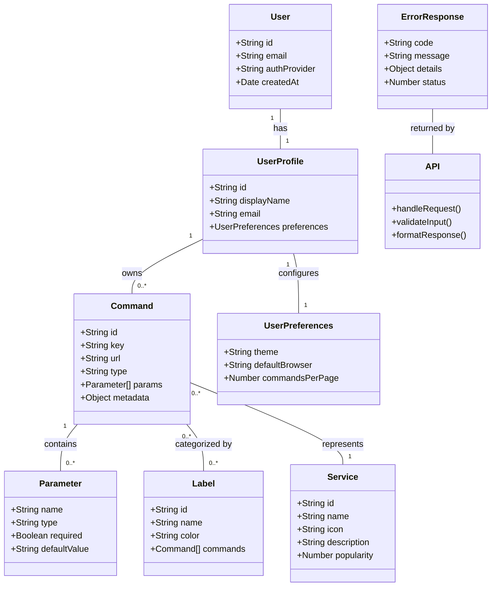

Welcome to the meows.space documentation. This knowledge base contains detailed documentation for the meows.space URL command multiplexer project.


Table of Contents

- [Overview](#overview)
- [Core Concept](#core-concept)
- [System Architecture](#system-architecture)
- [Command System](#command-system)
  - [Command Types](#command-types)
    - [Static Commands](#static-commands)
    - [Dynamic Commands](#dynamic-commands)
  - [Command Processing Pipeline](#command-processing-pipeline)
  - [Command Execution](#command-execution)
- [Command Organization and Catalog](#command-organization-and-catalog)
  - [Global Catalog](#global-catalog)
  - [Personal Catalog](#personal-catalog)
  - [User Profiles](#user-profiles)
- [State Management](#state-management)
  - [State Architecture](#state-architecture)
  - [Runtime State](#runtime-state)
  - [Persistent State](#persistent-state)
- [Data Synchronization](#data-synchronization)
  - [Local-First Operations](#local-first-operations)
  - [System Flow](#system-flow)
- [Frontend Architecture](#frontend-architecture)
  - [Technical Implementation](#technical-implementation)
  - [Loading \& Performance](#loading--performance)
    - [Progressive Loading Strategy](#progressive-loading-strategy)
    - [Performance Optimization Techniques](#performance-optimization-techniques)
- [Backend Architecture](#backend-architecture)
  - [API Implementation](#api-implementation)
  - [Data Storage](#data-storage)
  - [Security Implementation](#security-implementation)
- [System Integration \& Feedback](#system-integration--feedback)
  - [Authentication Integration](#authentication-integration)
  - [Local-First Architecture Integration](#local-first-architecture-integration)
  - [Browser Integration](#browser-integration)
  - [External Services](#external-services)
  - [User Feedback Mechanisms](#user-feedback-mechanisms)
    - [In-app Feedback](#in-app-feedback)
    - [Analytics Integration](#analytics-integration)
    - [Support Channels](#support-channels)
  - [Future Development](#future-development)
    - [Social Features](#social-features)
- [Glossary](#glossary)
- [Artifacts](#artifacts)
  - [Flow charts](#flow-charts)
  - [Data Models](#data-models)
  - [Pages](#pages)
  - [Components](#components)
  - [API Endpoints](#api-endpoints)

---

## Overview

meows.space is a URL command multiplexer that transforms text commands into parameterized URLs. The system implements a browser-based interface with a local-first architecture, enabling offline command management and online URL resolution.

Users define commands that expand to full URLs with optional parameters. For example, `g cats` expands to `google.com/search?q=cats`, and `gh profile` expands to `github.com/profile`.

The system features a graphical interface with a Windows 95-style icon grid and organization tools. The three-layer state management provides offline capabilities while maintaining cross-device synchronization. The architecture implements progressive loading and local-first operations for performance optimization.

---

## Core Concept

meows.space transforms text inputs into navigable URLs through predefined templates. The system processes user commands and converts them to structured URLs using either static mappings or dynamic parameter interpolation.

The browser-based execution enables direct navigation to destinations. Command management functions offline, while URL resolution requires network connectivity.

---

## System Architecture


meows.space transforms text inputs into parameterized URLs through a local-first architecture. The system operates as a command multiplexer with URL routing and command history management, enabling offline command management and online URL resolution.

---

## Command System

The command system forms the core of meows.space, transforming user text inputs into parameterized URLs through a structured pipeline. It processes raw text commands, identifies command patterns, extracts parameters, and constructs destination URLs based on predefined templates. This system enables users to quickly navigate to web destinations using shorthand commands rather than typing full URLs.

### Command Types


The system supports two fundamental command types:

#### Static Commands

Static commands provide direct URL mappings without parameters:

```text
gm → gmail.com
cal → calendar.com
docs → docs.google.com
```

These commands navigate directly to the specified URL when invoked, serving as shortcuts for frequently accessed destinations.

#### Dynamic Commands

Dynamic commands incorporate parameters into URL templates:

```text
# Search engines
g {query} → google.com/search?q={query}
yt {query} → youtube.com/results?search_query={query}
gh {query} → github.com/search?q={query}

# Direct navigation
gh/r {repo} → github.com/{repo}
npm {pkg} → npmjs.com/package/{pkg}
maps {loc} → google.com/maps/search/{loc}

# Multiple parameters
tr {from} {to} {text} → translate.google.com/?sl={from}&tl={to}&text={text}
```

These commands support multiple parameters with interpolation into the final URL.

### Command Processing Pipeline


The pipeline processes commands through these stages:

1. **Input parsing and tokenization** - Breaks down raw input into tokens
2. **Command lookup and parameter extraction** - Matches tokens to commands
3. **URL template hydration** - Populates templates with parameters
4. **Browser navigation** - Performs the navigation operation

### Command Execution

When a user interacts with meows.space, the command execution process follows a natural flow from input to navigation:


The user begins by either typing a command or clicking an icon in the grid. For text input, the system parses the command and identifies whether it's static or dynamic. Static commands immediately resolve to their target URL, while dynamic commands extract parameters from the input and interpolate them into the URL template.

When a user clicks an icon, the system checks if there's text in the input field that should be used as a parameter. If parameters are needed, they're extracted from the input; otherwise, the system uses the direct URL associated with the command.

Once the final URL is constructed, the browser opens it in a new tab, and focus returns to meows.space for the next command. This streamlined process allows users to quickly navigate to their desired destinations with minimal effort.

---

## Command Organization and Catalog

The system provides both global and personal command catalogs with a flexible organization system. Users can have multiple profiles, each with its own set of commands and labels.

### Global Catalog

The global catalog serves as a distributed registry for command discovery and sharing. It contains commands created and shared by the community:

```text
[Development]
gh, npm, devdocs, stackoverflow, caniuse

[Media]
yt, spotify, netflix, imdb, soundcloud

[Knowledge]
wikipedia, wolfram, scholar, arxiv, pubmed
```

The catalog collects anonymous usage data and incorporates a star-based rating system. Users can rate commands from one to five stars, helping others discover the most useful and reliable commands. These ratings, combined with usage statistics, determine the popularity sorting in the catalog.

Commands are organized by labels and can be sorted by:

- Star rating (highest to lowest)
- Popularity (most used)
- Recency (newest first)
- Alphabetically (A to Z)

### Personal Catalog

Each user has a personal catalog where they can create, customize, and organize their own commands. The personal catalog uses a label-based indexing system:

```text
[Search]
- Google {shortcut: "g"}
- YouTube {shortcut: "yt"}
- Wikipedia {shortcut: "wiki"}

[Development]
- MDN {url: "developer.mozilla.org"}
- DevDocs {url: "devdocs.io/{topic}"}
- GitHub {url: "github.com/{repo}"}
- npm {url: "npmjs.com/package/{pkg}"}
```

Each command is represented by an icon in the grid. These icons are either automatically fetched from the domain favicon or custom icons uploaded by the user. Below each icon is the command name, similar to desktop shortcuts in traditional operating systems.

The organization system uses a flat label structure where each command can have multiple labels. This design enables commands to appear in different contexts based on their categorization. For example, a GitHub search command might appear under both "Development" and "Search" labels.

### User Profiles

Users can create multiple profiles, each with its own:

- Set of commands (each profile has its own distinct commands)
- Active label (the currently selected label for filtering)
- Set of labels shown under the input field
- Default browser settings

Each profile functions as a separate workspace, allowing users to maintain different command sets for different contexts, such as work, personal, or specific projects. The same command cannot have different parameters across profiles - if a user needs a variation of a command, they must create a new command in that profile.

---

## State Management


The state management system handles data persistence and retrieval across different storage layers. It maintains application state during runtime and across sessions.

### State Architecture

The state architecture consists of two primary components: runtime state in memory and persistent state in IndexedDB. Runtime state provides fast access to frequently used data, while persistent state ensures data durability across sessions.

### Runtime State

Runtime state contains the active application context during a session:

- **Command context** maintains the currently active command and its parameters. This includes the command being edited or executed, along with any extracted parameters.
- **UI state** tracks the current interface configuration, including selected commands, active panels, search queries, and scroll positions.
- **Command history** keeps a record of recently executed commands in an LRU cache, enabling quick access to frequently used commands without database queries.
- **Search index** provides an in-memory structure for fast command lookup, using prefix-based searching and fuzzy matching algorithms.

### Persistent State

Persistent state maintains durable data across browser sessions:

- **Command definitions** store all user-defined commands, including their URLs, parameters, and metadata. This forms the core of the user's command library.
- **User profiles** contain user information, including display name, email, and authentication details.
- **User preferences** store interface settings, default behaviors, and personalization options that persist across sessions.
- **Command history** maintains a comprehensive log of executed commands with timestamps and execution contexts.
- **Organization structure** stores the folder hierarchy, labels, and categorization system for commands.
- **Pending changes** queue modifications made while offline, ensuring they're synchronized when connectivity is restored.

---

## Data Synchronization

The data synchronization system manages bidirectional data flow between client and server databases.

### Local-First Operations


The system handles two primary processes:

**Command Management Synchronization** uses a transaction-based approach. When users modify commands, the system first applies changes to the local IndexedDB, then queues them for server synchronization. Each change is timestamped and assigned a unique transaction ID. When online, the system transmits these changes to the server in batches. For concurrent edits from multiple devices, the system applies last-writer-wins conflict resolution, with special handling for structural conflicts like command deletion followed by modification.

**Command Execution** records command usage statistics. When a user executes a command, the system logs this event locally and, when online, transmits usage data to the server for analytics. The browser handles the actual URL navigation after command processing.

### System Flow


This diagram shows the data flow during command management and execution. Command edits are immediately stored in IndexedDB and reflected in the UI. When online, changes are synchronized with the server. For command execution, the browser constructs the URL and performs navigation directly.

---

## Frontend Architecture

The frontend architecture implements a React-based single-page application with a focus on performance, offline capabilities, and responsive design.

### Technical Implementation

The frontend is built using:

- **React** for component-based UI development
- **TypeScript** for type safety and developer experience
- **CSS Modules** for component-scoped styling
- **IndexedDB** for client-side storage
- **Service Workers** for offline capabilities

### Loading & Performance


The application implements a sequential loading strategy to reduce initial load time. Through progressive loading and code splitting, the system loads critical functionality first while deferring non-essential features.

#### Progressive Loading Strategy

The application loads in a defined sequence:

1. **Shell (10KB)** loads first, containing the HTML structure, critical CSS, and minimal JavaScript for command input. This initial payload loads in approximately 200ms on standard connections, providing immediate access to the command input field.

2. **Core (50KB)** loads second, including the command parser, state management system, and primary UI components. This enables basic command execution while additional components continue loading.

3. **Global Data (100KB)** loads third, containing the public command catalog, default templates, and system configuration. This data is cached and shared across users, allowing non-authenticated users to access public commands.

4. **User Data (Variable Size)** loads last for authenticated users, including personal commands, preferences, history, and folder structure.

#### Performance Optimization Techniques

The application implements multiple optimization techniques:

**Code Splitting** divides the application into separate chunks that load on demand. Features like settings, command catalog, search functionality, and synchronization components load only when accessed, reducing initial load time.

**Virtual Rendering** for grids and lists renders only visible items, maintaining consistent performance with large command sets. This uses windowed rendering that creates DOM elements only for items in the viewport.

**Bundle Optimization** includes tree-shaking to remove unused code, module deduplication to reduce redundancy, and critical CSS extraction. The delivery pipeline uses Brotli compression, cache control with ETags, and content-based versioning.

**Data Prefetching** loads data before user interaction, such as prefetching command details on hover or loading the next page of results before reaching the current page end.

**Caching Strategy** uses multiple storage mechanisms:

- Browser cache for static assets
- IndexedDB for command data and user preferences
- Memory cache for frequently accessed data
- Service worker for offline functionality

---

## Backend Architecture

### API Implementation

The backend implements a REST API with endpoints for:

- Command storage and retrieval
- User authentication
- Cross-device synchronization

API endpoints use standard HTTP methods and return JSON responses with appropriate status codes. Authentication uses session tokens with configurable expiration.

For detailed information about API endpoints, see the [API Endpoints](#api-endpoints) section.

### Data Storage

Data is stored in two layers:

- IndexedDB for local client-side persistence
- PostgreSQL for server-side storage

The database schema mirrors the data models with tables for commands, users, and usage data. Indexes are implemented on frequently queried fields to optimize read performance.

### Security Implementation


Authentication uses session-based tokens stored in HTTP-only cookies. User passwords are hashed using bcrypt with a work factor of 10. HTTPS is required for all API communications.

---

## System Integration & Feedback

### Authentication Integration

meows.space implements authentication through OAuth-based providers including GitHub, LinkedIn, and Facebook. This approach eliminates the need for direct username/password management while providing secure identity verification. Authentication is only required for command management functions, not for basic command execution, maintaining a low barrier to entry for new users.

The authentication system integrates with the local-first architecture, storing authentication tokens in secure browser storage and refreshing them as needed. This enables offline access to authenticated features while maintaining security standards.

### Local-First Architecture Integration

The local-first architecture forms the foundation of the system's integration approach. Command execution occurs primarily in the browser, with local storage handling command data persistence. This architecture enables offline functionality for core features while maintaining cross-device synchronization when connectivity is available.

Synchronization is implemented selectively, focusing on command management rather than execution. This approach minimizes network dependencies while ensuring data consistency across devices. The system operates independently of external services for core functionality, enhancing reliability and reducing potential points of failure.

### Browser Integration

meows.space operates as a standalone web application without requiring browser extensions or plugins. This design decision simplifies deployment and reduces maintenance overhead while ensuring broad compatibility across browsers and platforms. The system maintains its own command history and state management, independent of browser history or bookmark systems.

Future versions may implement optional browser integrations, such as bookmark synchronization or browser extension features, but these remain supplementary rather than core requirements. This approach maintains the system's independence while allowing for enhanced functionality for users who desire deeper browser integration.

### External Services

The system generates URLs without requiring external API access or service credentials, maintaining independence from third-party services for core functionality. This design eliminates API limits, quotas, and credential management concerns that typically accompany external service dependencies.

For services that require authentication, such as private GitHub repositories, the system passes authentication through the browser's standard mechanisms rather than storing or managing service credentials directly. This approach maintains security while enabling access to authenticated services when needed.

### User Feedback Mechanisms

#### In-app Feedback

The system implements a unified feedback mechanism accessible through the main navigation menu. Users can submit bug reports, feature suggestions, and general feedback through a single form interface that categorizes submissions for appropriate routing and response. This streamlined approach simplifies the feedback process while ensuring that user input reaches the appropriate teams.

The feedback system captures contextual information such as browser version and system configuration to assist in issue diagnosis, while maintaining user privacy by excluding personal data unless explicitly provided by the user.

#### Analytics Integration

meows.space implements Google Analytics to monitor system usage patterns and identify opportunities for improvement. The analytics implementation tracks feature usage, user flows, and interaction patterns without capturing personally identifiable information. This data informs development priorities and interface optimizations based on actual usage rather than assumptions.

The analytics system implements appropriate data retention policies and provides users with clear information about data collection practices. Users can opt out of analytics collection through the settings interface if desired.

#### Support Channels

The system provides a unified support channel through a dedicated email address that handles all types of inquiries. This approach simplifies the support process for users while ensuring that questions reach the appropriate team members for resolution. Support documentation complements direct assistance, providing self-service options for common questions and issues.

### Future Development

The system roadmap includes planned enhancements that build upon the current architecture while maintaining compatibility with existing functionality.

#### Social Features

Planned social capabilities will enable command sharing between users, including the ability to like or favorite commands and share command configurations with other users. These features will enhance the community aspects of the platform while maintaining the system's focus on individual productivity. Social features will be implemented as optional enhancements rather than core requirements.

Implementation will follow a phased approach, with core functionality deployed first, followed by additional features based on user feedback and usage patterns. This approach ensures stability while enabling continuous improvement based on real-world usage.

---

## Glossary

This glossary standardizes terminology used throughout the meows.space documentation to ensure consistency and clarity.

| Term               | Definition                                                                                                                                                                       |
| ------------------ | -------------------------------------------------------------------------------------------------------------------------------------------------------------------------------- |
| Command            | A text shortcut that expands to a full URL, optionally with parameters. The core unit of functionality in meows.space.                                                           |
| Service            | A web destination that can be accessed via commands. Represented visually as an icon in the ServiceGrid.                                                                         |
| Parameter          | A variable portion of a command that gets interpolated into the final URL.                                                                                                       |
| Template           | The URL pattern associated with a command, containing placeholders for parameters.                                                                                               |
| Label              | A categorization tag applied to commands for organization and filtering.                                                                                                         |
| Global Catalog     | A shared, community-maintained collection of commands available to all users. Contains verified, popular commands that can be imported to a user's personal catalog.             |
| Personal Catalog   | A user's private collection of commands, customized to their specific needs and preferences. Commands in the personal catalog can be created, edited, and organized by the user. |
| Profile            | A user's workspace containing their personal commands, preferences, and settings.                                                                                                |
| Static Command     | A command that maps directly to a URL without parameters.                                                                                                                        |
| Dynamic Command    | A command that incorporates parameters into a URL template.                                                                                                                      |
| ServiceGrid        | The Windows 95-style icon grid component that displays commands as interactive tiles.                                                                                            |
| Command Execution  | The process of transforming a text command into a URL and navigating to it.                                                                                                      |
| Command Management | The process of creating, editing, and organizing commands.                                                                                                                       |

---

## Artifacts

### Flow charts

| Flow                                                  | Description                                                                                                                      | Key Steps                                                                                   |
| ----------------------------------------------------- | -------------------------------------------------------------------------------------------------------------------------------- | ------------------------------------------------------------------------------------------- |
| [[flows/command-execution\|Command Execution]]        | Traces the journey from user input to URL navigation, showing how commands are parsed, parameters extracted, and URLs generated. | Input parsing → Command lookup → Parameter extraction → URL generation → Browser navigation |
| [[flows/command-management\|Command Management]]      | Documents the creation, editing, and organization of commands, including validation, storage, and synchronization processes.     | Command creation → Validation → Storage → Synchronization → Organization                    |
| [[flows/user-interaction\|User Interaction Patterns]] | Illustrates common user workflows across different pages, highlighting interaction patterns and navigation flows.                | Search → Execute → Organize → Customize → Share                                             |
| [[flows/profile-management\|Profile Management]]      | Details the user authentication processes including login, logout, and registration flows with security considerations.          | Registration → Email verification → Login → Session management → Logout                     |

### Data Models

The following class diagram provides a high-level overview of the data model relationships in meows.space. This is a simplified representation; complete and detailed models can be found in their respective model files. The diagram illustrates the relationships between commands, services, labels, users, and their associated entities.



| Model                                         | Description                                                                                                                                                                         | Key Properties                          |
| --------------------------------------------- | ----------------------------------------------------------------------------------------------------------------------------------------------------------------------------------- | --------------------------------------- |
| [[models/command\|Command]]                   | Defines the structure of command objects, including static and dynamic variants. Commands connect user input to URL templates and manage parameter extraction.                      | id, key, url, type, params, metadata    |
| [[models/service\|Service]]                   | Represents service metadata including icons, descriptions, and usage statistics. Services provide the visual representation of commands in the UI.                                  | id, name, icon, description, popularity |
| [[models/label\|Label]]                       | Implements the label-based organization system, allowing commands to be categorized and filtered. Labels can be applied to multiple commands and commands can have multiple labels. | id, name, color, commands               |
| [[models/user-profile\|User Profile]]         | Manages user account information, authentication state, and cross-device synchronization. Profiles store user-specific data and preferences.                                        | id, displayName, email, preferences     |
| [[models/user-preferences\|User Preferences]] | Stores user-specific settings including theme preferences, default behaviors, and interface configurations.                                                                         | theme, defaultBrowser, commandsPerPage  |
| [[models/error-response\|Error Response]]     | Defines the standardized format for API error responses across the system.                                                                                                          | code, message, details, status          |

### Pages

| Page                                             | Route                                               | Description                                                                                                             | Key Features                                                |
| ------------------------------------------------ | --------------------------------------------------- | ----------------------------------------------------------------------------------------------------------------------- | ----------------------------------------------------------- |
| **[[pages/main-search\|Main Search]]**           | **/**                                               | Primary interface for command execution, featuring a prominent search bar and quick access to frequently used commands. | Command input, history, suggestions, quick execution        |
| **[[pages/personal-catalog\|Personal Catalog]]** | **/personal**                                       | User's workspace for managing personal commands, with organization tools and customization options.                     | Command grid, label filtering, drag-and-drop organization   |
| [[pages/settings\|Settings]]                     | &nbsp;&nbsp;&nbsp;&nbsp;/personal/settings          | Configuration interface for user preferences, appearance settings, and default behaviors.                               | Theme selection, display options, default settings          |
| [[pages/create-command\|Create Command]]         | &nbsp;&nbsp;&nbsp;&nbsp;/personal/command/create    | Form interface for creating new command templates with parameter configuration and validation.                          | Template builder, parameter editor, preview functionality   |
| [[pages/create-command\|Edit Command]]           | &nbsp;&nbsp;&nbsp;&nbsp;/personal/command/edit/[id] | Editing interface for existing commands, allowing modification of templates and parameters.                             | Template editing, parameter configuration, usage statistics |
| **[[pages/global-catalog\|Global Catalog]]**     | **/catalog**                                        | Discovery interface for community-shared commands, with filtering, sorting, and import capabilities.                    | Command discovery, popularity sorting, import functionality |
| [[pages/service-details\|Service Details]]       | &nbsp;&nbsp;&nbsp;&nbsp;/catalog/service/[id]       | Detailed view of a specific service or command, showing metadata, usage information, and related commands.              | Command details, usage statistics, related commands         |
| **Authentication**                               | **/auth**                                           | User authentication and registration flows, supporting both email/password and OAuth providers.                         | Login, registration, account management                     |
| [[pages/login\|Login]]                           | &nbsp;&nbsp;&nbsp;&nbsp;/auth/login                 | Authentication interface for existing users, with multiple login options and security features.                         | Email/password login, OAuth providers, security measures    |
| [[pages/register\|Register]]                     | &nbsp;&nbsp;&nbsp;&nbsp;/auth/register              | Registration interface for new users, with account creation and verification processes.                                 | Account creation, email verification, initial setup         |
| **[[pages/help\|Help]]**                         | **/help**                                           | User guidance with visual demonstrations and explanations of key features and workflows.                                | GIF demonstrations, feature explanations, usage tips        |
| **[[pages/about\|About]]**                       | **/about**                                          | Information about the project, team, and technology stack, with links to resources and documentation.                   | Project information, team details, technology overview      |
| **[[pages/feedback\|Feedback]]**                 | **/feedback**                                       | Interface for users to submit feedback, report issues, and suggest improvements.                                        | Feedback form, issue reporting, feature requests            |
| **[[pages/privacy-policy\|Privacy Policy]]**     | **/privacy**                                        | Legal information about data handling practices, user rights, and compliance measures.                                  | Data collection, user rights, security measures             |
| **[[pages/terms-of-use\|Terms of Use]]**         | **/terms**                                          | Legal terms governing the use of the service, user responsibilities, and limitations.                                   | Usage terms, user obligations, liability limitations        |

### Components

The component architecture follows a hierarchical structure with:

- **Container Components**: Handle data fetching and state management
- **Presentational Components**: Focus on rendering UI elements
- **Hooks**: Encapsulate reusable logic and state management
- **Context Providers**: Manage global state and theme

This architecture promotes separation of concerns, reusability, and maintainability across the application. Container components manage data flow and business logic, while presentational components focus on the UI rendering. Hooks extract and share stateful logic between components, and context providers manage global state accessible throughout the component tree.

| Component                                     | Description                                                                                                                                  | Usage                                         |
| --------------------------------------------- | -------------------------------------------------------------------------------------------------------------------------------------------- | --------------------------------------------- |
| [[components/Header\|Header]]                 | Primary navigation interface with logo, navigation menu, search bar, and user menu. Maintains consistent placement across all pages.         | All pages                                     |
| [[components/Footer\|Footer]]                 | Secondary navigation with legal links, support resources, and copyright information. Provides access to terms, privacy policy, and help.     | All pages                                     |
| [[components/SearchBar\|SearchBar]]           | Primary command input with autocomplete and history. Processes user text input and triggers command execution.                               | Main Search, Personal Catalog, Global Catalog |
| [[components/ServiceGrid\|ServiceGrid]]       | Windows 95-style icon grid displaying commands as interactive tiles. Supports drag-and-drop organization and visual categorization.          | Main Search, Personal Catalog, Global Catalog |
| [[components/TagBar\|TagBar]]                 | Label-based filtering system allowing users to organize and filter commands by categories. Implements multi-select filtering with AND logic. | Personal Catalog, Global Catalog              |
| [[components/CommandBuilder\|CommandBuilder]] | Form interface for creating and editing command templates. Includes parameter configuration, validation, and preview functionality.          | Personal Catalog, Service Details             |

### API Endpoints

| Endpoint                    | Method | Description             | Cached   |
| --------------------------- | ------ | ----------------------- | -------- |
| `/api/auth/login`           | POST   | User login              | No       |
| `/api/auth/logout`          | POST   | User logout             | No       |
| `/api/auth/register`        | POST   | New user registration   | No       |
| `/api/auth/session`         | GET    | Get current session     | No       |
| `/api/auth/refresh`         | POST   | Refresh access token    | No       |
| `/api/services`             | GET    | List all services       | Yes (5m) |
| `/api/services/:id`         | GET    | Get service details     | No       |
| `/api/services`             | POST   | Create new service      | No       |
| `/api/services/:id`         | PUT    | Update service          | No       |
| `/api/services/:id`         | DELETE | Delete service          | No       |
| `/api/services/search`      | GET    | Search services         | No       |
| `/api/tags`                 | GET    | List all tags           | Yes (5m) |
| `/api/tags`                 | POST   | Create new tag          | No       |
| `/api/tags/:id`             | PUT    | Update tag              | No       |
| `/api/tags/:id`             | DELETE | Delete tag              | No       |
| `/api/tags/trending`        | GET    | Get trending tags       | No       |
| `/api/user/preferences`     | GET    | Get user preferences    | No       |
| `/api/user/preferences`     | PUT    | Update preferences      | No       |
| `/api/user/history`         | GET    | Get search history      | No       |
| `/api/user/history`         | DELETE | Clear history           | No       |
| `/api/user/favorites`       | GET    | Get favorite services   | No       |
| `/api/user/favorites/:id`   | POST   | Add to favorites        | No       |
| `/api/user/favorites/:id`   | DELETE | Remove from favorites   | No       |
| `/api/providers`            | GET    | List search providers   | Yes (1h) |
| `/api/providers/:id/search` | GET    | Execute provider search | No       |
| `/api/providers/default`    | GET    | Get default provider    | No       |
| `/api/providers/default`    | PUT    | Set default provider    | No       |
| `/api/analytics/event`      | POST   | Log user event          | No       |
| `/api/analytics/trending`   | GET    | Get trending services   | Yes (1h) |
| `/api/analytics/popular`    | GET    | Get popular services    | No       |
| `/api/analytics/metrics`    | GET    | Get usage metrics       | No       |
