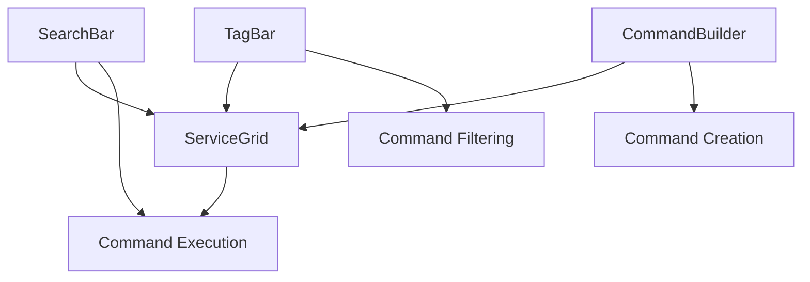

# UI Components

This section documents the core UI components used in meows.space. These components form the building blocks of the user interface and implement the key interaction patterns.

## Core Components

### Command Input and Execution

- [[SearchBar|SearchBar Component]] - The primary command input mechanism
- [[CommandBuilder|CommandBuilder Component]] - Interface for creating and editing commands

### Command Organization and Display

- [[ServiceGrid|ServiceGrid Component]] - Windows 95-style icon grid for commands
- [[TagBar|TagBar Component]] - Category-based filtering for commands

## Component Relationships

## Component Usage by Page

| Component | Main Search | Personal Catalog | Global Catalog | Settings | Service Details |
|-----------|-------------|------------------|----------------|----------|-----------------|
| SearchBar | ✓           | ✓                | ✓              |          |                 |
| ServiceGrid | ✓         | ✓                | ✓              |          |                 |
| TagBar    |             | ✓                | ✓              |          |                 |
| CommandBuilder |        | ✓                |                |          | ✓               |

## Implementation Details

All components are implemented using:
- React functional components
- TypeScript for type safety
- CSS Modules for styling
- Context API for state management

## Related Documentation

- [[../technical/technology|Technical Implementation]]
- [[../flows/user-interaction|User Interaction Patterns]] 
