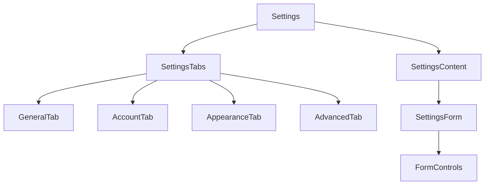

# Settings Page (/settings)

The Settings page provides a centralized interface for managing user preferences, account settings, and application configuration. It allows users to customize their experience and manage their account.

## Page Structure

## Components

### Primary Components

- `SettingsTabs` - Navigation tabs
  - `GeneralTab` - Basic settings
  - `AccountTab` - User account
  - `AppearanceTab` - Visual settings
  - `AdvancedTab` - Technical settings
- `SettingsContent` - Settings display
  - `SettingsForm` - Form controls
  - `FormControls` - Input elements

### Functionality

- Preference management
- Account settings
- Theme customization
- Provider defaults
- Data management
- Export/import

## Settings Categories

### General Settings

- Default search provider
- New tab behavior
- Command history limit
- Startup behavior

### Account Settings

- Profile information
- Authentication
- Subscription management
- Data synchronization

### Appearance Settings

- Theme selection
- Grid layout
- Icon size
- Font settings

### Advanced Settings

- Data export/import
- Cache management
- Developer options
- Keyboard shortcuts

## State Management

The Settings page manages the following state:

- Active tab
- Form values
- Validation state
- Save status
- User preferences
- Account information

## Related Components

- `PreferenceControls` - Settings input components
- `ThemeSelector` - Theme customization
- `AccountManager` - User account interface

## Related Documentation

- [[../technical/technology|Technical Implementation]]
- [[../models/user-preferences|User Preferences Model]]
- [[../models/user-profile|User Profile Model]] 
