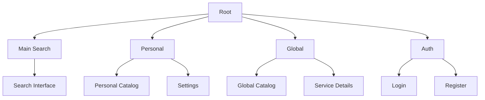

# Page Structure

## Page Map



## Core Pages

### Main Search (/)

Landing page with primary search interface

- Instant search access
- Command execution
- Quick navigation

### Personal Catalog (/personal)

User's workspace

- Personal service collection
- Tag organization
- Usage history

### Global Catalog (/catalog)

Service discovery

- Community services
- Trending/Popular
- Service details

### Settings (/settings)

User preferences

- Search provider defaults
- UI preferences
- Tag management

## Authentication

### Login (/auth/login)

- Email/password
- OAuth providers:
  - GitHub
  - Google

### Register (/auth/register)

- Account creation
- Email verification
- Initial setup

## Dynamic Routes

### Service Details (/service/[id])

```typescript
type Params = {
  id: string; // Service identifier
};
```

- Service metadata
- Usage stats
- Related services

## Data Loading

### Infinite Scroll

- Virtual rendering for performance
- Load more trigger at scroll threshold
- Maintains scroll position
- Prefetches next batch

### Real-time Updates

- WebSocket for live updates
- Optimistic UI updates
- Background sync
- Error recovery

## Related Components

- [[../components/SearchBar|SearchBar Component]]
- [[../components/ServiceGrid|ServiceGrid Component]]
- [[../components/TagBar|TagBar Component]]

## Related Documentation

- [[../technical/technology|Technical Implementation]]
- [[endpoints|API Endpoints]]
- [[../flows/user-interaction|User Interaction Patterns]] 
