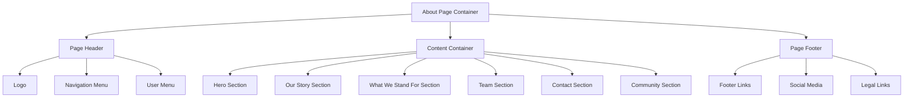

# About meows.space

## Page Structure

The About page implements a standard content page layout organized as a vertical stack of content sections. The page is framed by a consistent header and footer that appear across the entire application.



The header contains the application logo, main navigation menu, and user menu for account access. The content area is divided into distinct sections that tell the story of meows.space, explain its mission, introduce the team, provide contact information, and describe community support options. The footer provides additional navigation links, social media connections, and legal information.

## Component Architecture

The page uses a composition of reusable components arranged in a hierarchical structure. The `PageHeader` component handles site-wide navigation and branding, while the `ContentContainer` manages the layout and styling of the main content sections. Each content section is implemented as a `ContentSection` component with specific styling and content variations.

The `TeamProfiles` component displays information about team members with links to their GitHub and Twitter profiles. The `ContactInfo` component provides structured contact information with protected email addresses and external links. The `PageFooter` component contains organized link groups for site navigation, social media, and legal pages.

All external links are handled through a common `ExternalLink` component that manages security attributes and visual indicators for links that navigate away from the site. Email addresses are protected using a `ProtectedEmail` component that obfuscates addresses to prevent scraping while maintaining usability.

## User Interaction Patterns

Users interact with the About page primarily through content consumption and link navigation. The page serves as an informational resource rather than an interactive application, with most interactions involving following links to other pages or external resources.

Navigation interactions allow users to move between different sections of the application using the header menu, access related pages through contextual links, or visit external resources like team member profiles and community forums. Contact actions enable users to communicate with the team through email links, report issues via the GitHub repository, or support the project through donations.

The page maintains minimal state, primarily managing UI states like hover effects on links, the mobile navigation menu toggle, and donation button interactions. These states are handled through CSS rather than JavaScript state management to minimize complexity.

## Content

```text
# About meows.space

meows.space is a URL command multiplexer that transforms simple text commands into fully-formed URLs. It allows you to navigate the web faster using shorthand commands like "g cats" to search Google for cats, or "gh profile" to go to your GitHub profile.

## Our Story

The journey began almost 15 years ago under the name "mfacil" (from Portuguese "muito fácil" meaning "too easy"). Life, work, and various priorities kept the project in waiting, but the vision remained alive. Today, that vision has evolved into meows.space, carrying forward the same core purpose: helping humanity regain precious moments from their daily digital lives.

## What We Stand For

In a world where major tech companies compete to own your browser's homepage and new tab experience, meows.space offers something different. We believe in a free, democratic web where your digital identity travels with you. No matter which device you use, your personal space should be truly yours – just log in, and you're home.

## The Team

meows.space is developed by [Bruno Palma](https://github.com/m3au) and [Gustavo Nips](https://github.com/gustavonips) under the Open Wings banner. This project stands as a tribute to our friend [Maurício Chicalski](https://github.com/mchicalski), whose passion for technology inspired us all to pursue software engineering. While Maurício is no longer with us, completing this project honors his memory and the impact he had on our lives.

You can find us on Twitter: [@m3au](https://twitter.com/brun0vop) and [@gustavonips](https://twitter.com/gustavonips)

## Contact & Support

For legal inquiries and GDPR requests: legal@meows.space
For everything else: hello@meows.space

Found a bug? Open an issue on our [GitHub repository](https://github.com/m3au/meows/issues).

### Community Forums

Join our community discussions:
- [GitHub Discussions](https://github.com/m3au/meows/discussions)

## Community & Support

meows.space is and will remain a non-profit initiative. We're not here to monetize your browsing experience – we're here to liberate it. The platform is supported by our community through contributions to the open-source codebase, participation in discussions, and occasional donations that help keep our servers running and our domain active.

If you'd like to be part of this journey, join our discussions, contribute to the code, or support us in keeping the lights on. Every contribution, whether it's your time, expertise, or support, helps make the web a little more open and a little more personal.

[Buy me a coffee ☕](https://www.buymeacoffee.com/m3au)
```

## Related Documentation

The About page integrates with several shared components documented elsewhere in the system. The `Header` component provides consistent navigation across the application, while the `Footer` component ensures uniform layout and links at the bottom of each page. Both components are fully documented in their respective files with detailed API specifications.

For content management, the About page connects to related informational pages including the Help page for user guidance, Feedback page for user input, and legal pages such as Terms of Use and Privacy Policy. These connections create a cohesive information architecture that allows users to find related content through contextual links.

- [Header Component](../components/Header.md)
- [Footer Component](../components/Footer.md)
- [Help Page](help.md)
- [Feedback Page](feedback.md)
- [Terms of Use Page](terms-of-use.md)
- [Privacy Policy Page](privacy-policy.md)
