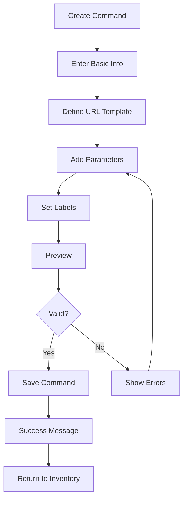

# Create Command Page (/personal/command/create)

## Overview

The Create Command page provides an interface for users to create new service definitions or edit existing ones. It offers a structured form with validation and preview capabilities to ensure services are properly configured.

## Route

```
/command/create  // For new commands
/command/edit/[id]  // For editing existing commands
```

## Page Components

### Command Form

- Command name input
- Command shortcut input
- URL template builder
- Parameter configuration
- Icon selection/upload
- Label assignment

### Template Builder

- URL pattern input with parameter highlighting
- Parameter definition fields
- Parameter validation rules
- Default value configuration

### Preview Section

- Live command preview
- Test execution capability
- Validation feedback
- Example usage

## User Flow



## Functionality

### Command Validation

- Required fields: name, shortcut, URL template
- Shortcut uniqueness verification
- URL template syntax validation
- Parameter consistency check

### Parameter Configuration

- Name and description
- Type (string, number, boolean, enum)
- Required/optional status
- Default values
- Validation rules (regex, min/max length)

### Icon Management

- Automatic favicon fetching from domain
- Custom icon upload (PNG, SVG)
- Icon preview and cropping

## Related Components

- [ServiceBuilder Component](../components/ServiceBuilder.md)
- [ParameterEditor Component](../components/ParameterEditor.md)
- [IconSelector Component](../components/IconSelector.md)

## Related Pages

- [Inventory](inventory.md)
- [Global Catalog](global-catalog.md)
- [Service Details](service-details.md)
