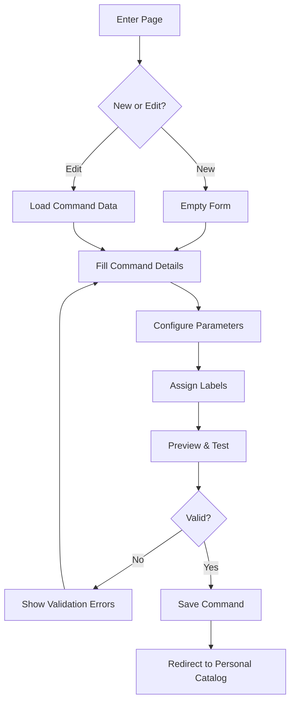

# Create Command Page

## Overview

The Create Command page provides an interface for users to create new command templates or edit existing ones. It offers a structured form with validation and preview capabilities to ensure commands are properly configured.

## Route

```
/command/create  // For new commands
/command/edit/[id]  // For editing existing commands
```

## Page Components

### Command Form

- Command name input
- Command shortcut input
- URL template builder
- Parameter configuration
- Icon selection/upload
- Label assignment

### Template Builder

- URL pattern input with parameter highlighting
- Parameter definition fields
- Parameter validation rules
- Default value configuration

### Preview Section

- Live command preview
- Test execution capability
- Validation feedback
- Example usage

## User Flow



## Functionality

### Command Validation

- Required fields: name, shortcut, URL template
- Shortcut uniqueness verification
- URL template syntax validation
- Parameter consistency check

### Parameter Configuration

- Name and description
- Type (string, number, boolean, enum)
- Required/optional status
- Default values
- Validation rules (regex, min/max length)

### Icon Management

- Automatic favicon fetching from domain
- Custom icon upload (PNG, SVG)
- Icon preview and cropping

## Related Components

- [[../components/CommandBuilder|CommandBuilder Component]]
- [[../components/ParameterEditor|ParameterEditor Component]]
- [[../components/IconSelector|IconSelector Component]]

## Related Documentation

- [[../models/command|Command Model]]
- [[../flows/command-management|Command Management Flow]]
- [[personal-catalog|Personal Catalog Page]]
