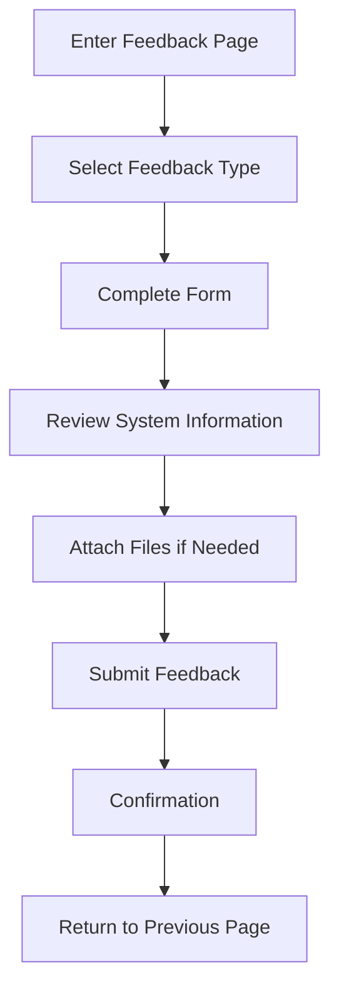

# Feedback Page

## Overview

The Feedback page provides an interface for users to submit feedback, report issues, and suggest improvements for meows.space. It includes structured forms for different types of feedback and mechanisms to include relevant technical information.

## Route

```
/feedback
```

## Page Components

### Feedback Form

- Feedback type selection
- Description input
- Severity/priority selection
- Contact information (optional)
- Attachment capability
- Submission controls

### System Information

- Automatically collected technical details
- Browser and device information
- Application version
- Recent command history (optional)
- Error logs (when applicable)

## Feedback Types

### Bug Reports

- Issue description
- Steps to reproduce
- Expected vs. actual behavior
- Impact assessment
- Error messages/screenshots

### Feature Requests

- Feature description
- Use case explanation
- Priority indication
- Similar existing features
- Implementation suggestions

### General Feedback

- User experience feedback
- Performance observations
- Interface suggestions
- Documentation improvements
- General comments

## Submission Flow



## Data Handling

- Feedback storage and processing
- Personal data handling
- Response mechanisms
- Issue tracking integration
- Feedback aggregation and analysis

## Related Documentation

- [Tutorial and Help Page](help.md)
- System Integration & Feedback (Documentation moved)
