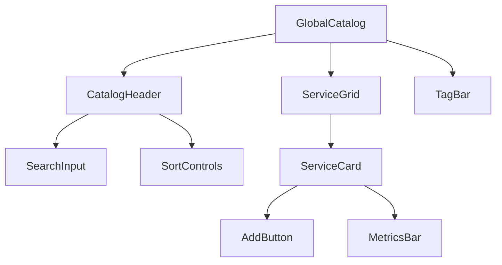

# Global Catalog Page (/catalog)

The Global Catalog page serves as a discovery platform for community-shared commands. It provides tools for exploring, searching, and adding commands from the global repository to the user's personal collection.

## Page Structure

## Components

### Primary Components

- `CatalogHeader` - Global search
  - `SearchInput` - Service search
  - `SortControls` - Popularity/recent
- [ServiceGrid](../components/ServiceGrid.md) - Infinite loading grid
  - `ServiceCard` - Service preview
    - `AddButton` - Add to personal
    - `MetricsBar` - Usage stats
- [TagBar](../components/TagBar.md) - Category navigation

### Functionality

- Command discovery
- Infinite scrolling
- Popularity metrics
- Command preview
- Add to personal collection
- Category navigation

## State Management

The Global Catalog page manages the following state:

- Search query
- Active categories
- Sort order
- Scroll position
- Loading state
- Preview state

## User Interactions

1. **Command Discovery**

   - Browse trending commands
   - Filter by categories
   - Search by keyword
   - Sort by popularity/recency

2. **Command Preview**

   - View command details
   - See usage statistics
   - Check community ratings
   - View example usage

3. **Command Collection**
   - Add commands to personal collection
   - Customize before adding
   - Rate community commands
   - Share commands

## Related Components

- [ServiceGrid Component](../components/ServiceGrid.md)
- [TagBar Component](../components/TagBar.md)
- [CommandBuilder Component](../components/CommandBuilder.md)

## Related Documentation

- [Command Management Flow](../flows/command-management.md)
- [Technical Implementation](../technical/technology.md)
- [Command Model](../models/command.md)
- [Tag Model](../models/tag.md)
