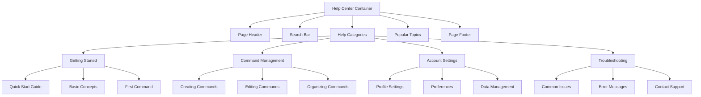
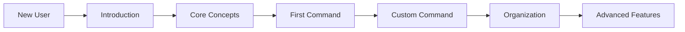

# Help Page

The Help page provides user guidance with visual demonstrations and explanations of key features and workflows. It serves as the primary support resource for users learning to use meows.space.

## Page Structure



## Implementation Details

The Help page is implemented as a React component with the following features:

- Searchable help content with keyword indexing
- Category-based navigation for browsing topics
- Interactive demonstrations with GIF animations
- Step-by-step guides with visual indicators
- Responsive layout that adapts to different screen sizes

## Content Organization

The help content is organized into four primary categories:

1. **Getting Started**: Introductory materials for new users
2. **Command Management**: Guides for creating and organizing commands
3. **Account Settings**: Information about user account management
4. **Troubleshooting**: Solutions for common issues and error states

Each category contains multiple topics with detailed explanations, visual demonstrations, and step-by-step instructions.

## User Journey Visualization



This visualization represents the recommended learning path for new users, guiding them from basic concepts to advanced features in a logical progression.

## Interactive Elements

The Help page includes several interactive elements:

- **Searchable Index**: Full-text search across all help content
- **Interactive Demos**: Step-through demonstrations of key features
- **Code Examples**: Copyable command examples
- **Expandable Sections**: Collapsible content for detailed explanations
- **Feedback Mechanism**: Topic-specific feedback collection

## Usage

```tsx
import { HelpPage } from "pages/Help";

function App() {
  return (
    <Router>
      <Route path="/help" component={HelpPage} />
      <Route path="/help/:topic" component={HelpTopicPage} />
    </Router>
  );
}
```

## Accessibility

The Help page implements the following accessibility features:

- Semantic HTML structure with proper heading hierarchy
- Text alternatives for all visual demonstrations
- Keyboard navigable interface with focus management
- Screen reader optimized content structure
- High contrast mode compatibility

## Related Pages

- [Feedback](feedback.md): Form for submitting questions and suggestions
- [About](about.md): General information about the service
- [Contact](contact.md): Direct support contact options
