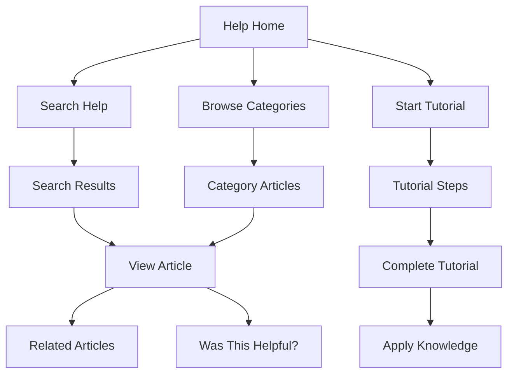

# Tutorial and Help Page

## Overview

The Tutorial and Help page provides comprehensive guidance for users at all experience levels. It includes interactive tutorials, searchable documentation, and troubleshooting resources to help users effectively use meows.space.

## Route

```
/help
/help/tutorial
/help/faq
/help/troubleshooting
```

## Page Components

### Help Center

- Searchable knowledge base
- Categorized help articles
- Video tutorials
- Frequently asked questions
- Troubleshooting guides

### Interactive Tutorial

- Step-by-step guided tour
- Interactive examples
- Progress tracking
- Skill-based learning paths

### Quick Reference

- Command syntax reference
- Keyboard shortcuts
- Common patterns and examples
- Best practices

## Content Sections

### Getting Started

- Basic concepts explanation
- First command creation
- Command execution walkthrough
- Interface orientation

### Advanced Usage

- Parameter configuration
- Multiple parameter commands
- Command organization strategies
- Profile management

### Troubleshooting

- Common issues and solutions
- Error message explanations
- Connectivity troubleshooting
- Data recovery options

## Interactive Elements



## Related Documentation

- [[../flows/user-interaction|User Interaction Patterns]]
- [[../models/command|Command Model]]
- [[create-command|Create Command Page]]
