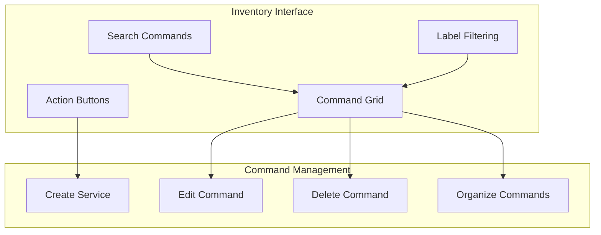

# Inventory Page

The Inventory page serves as the user's primary workspace for managing their personal commands. It provides a complete interface for organizing, editing, and customizing commands.

## Overview

The Inventory page implements a Windows 95-style icon grid interface where each command is represented by an icon. Users can organize these icons using labels, search for specific commands, and perform management actions like creating, editing, and deleting commands.

## Key Features

- **Command Grid**: Visual display of commands as interactive icons
- **Label Filtering**: Filter commands by one or more labels
- **Search**: Find commands by name, URL, or description
- **Drag-and-Drop Organization**: Visually arrange commands within the grid
- **Command Management**: Create, edit, and delete commands
- **Import/Export**: Import commands from the global catalog or export to share

## Interface Components

| Component            | Description                 | Functionality                            |
| -------------------- | --------------------------- | ---------------------------------------- |
| Search Bar           | Command search field        | Filters displayed commands by text match |
| Label Bar            | Horizontal list of labels   | Filters commands by selected labels      |
| Command Grid         | Icon grid display           | Shows commands as interactive icons      |
| Action Buttons       | Command management controls | Create, import, and organize commands    |
| Command Context Menu | Right-click menu            | Edit, delete, share, and manage commands |

## User Interactions

The Inventory page supports several key user interactions:

1. **Browsing Commands**: Users can scroll through their command collection
2. **Filtering by Label**: Click labels to filter the displayed commands
3. **Searching**: Type in the search bar to find specific commands
4. **Creating Commands**: Click the "+" button to create a new command
5. **Editing Commands**: Double-click or right-click a command to edit
6. **Organizing Commands**: Drag and drop commands to rearrange
7. **Importing Commands**: Import commands from the global catalog

## States and Transitions

The Inventory page can exist in several states:

- **Default View**: Shows all commands organized by label
- **Filtered View**: Shows commands matching selected labels
- **Search Results**: Shows commands matching search query
- **Empty State**: Displayed when no commands exist
- **Loading State**: Shown while commands are being loaded
- **Error State**: Displayed when commands cannot be loaded

## Related Components

- [SearchBar](../components/SearchBar.md)
- [ServiceGrid](../components/ServiceGrid.md)
- [LabelBar](../components/LabelBar.md)
- [ServiceBuilder](../components/ServiceBuilder.md)
- [ServiceIcon](../components/ServiceIcon.md)
- [InventoryView](../components/InventoryView.md)

## Related Pages

- [Create Service](create-service.md)
- [Settings](settings.md)
- [Global Catalog](global-catalog.md)

## Technical Implementation

The Inventory page implements client-side filtering and organization, with changes synchronized to persistent storage. Command data is loaded progressively, with frequently used commands prioritized for immediate display.

The drag-and-drop interface uses a grid-based positioning system that maintains organization across different screen sizes and device types.

## Related Documentation

- [Command Management Flow](../flows/command-management.md)
- [Inventory Model](../models/inventory.md)
- [Command Model](../models/command.md)
