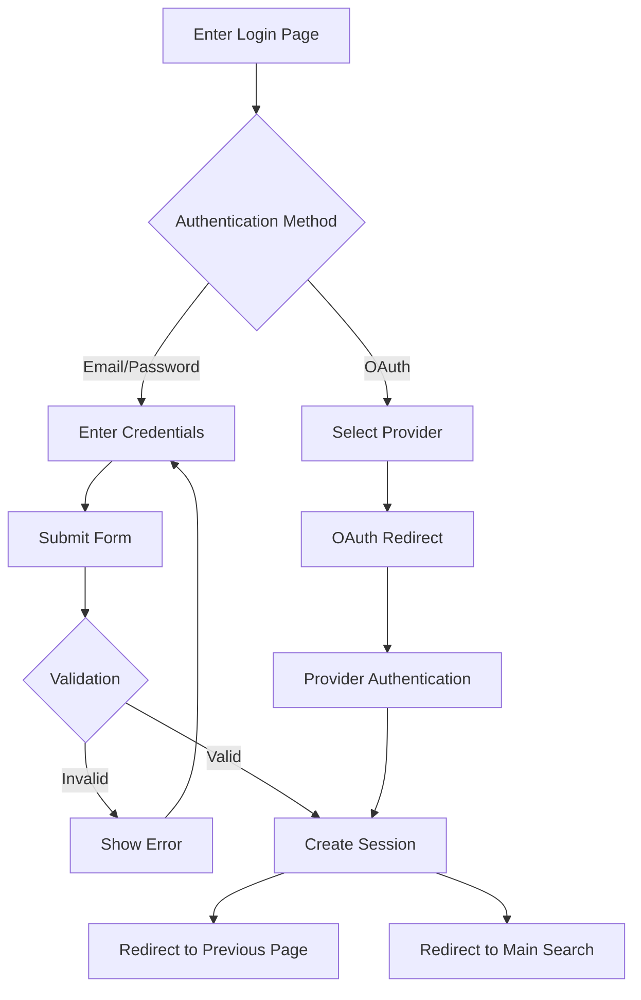

# Login Page

## Overview

The Login page provides an interface for users to authenticate with the meows.space system. It supports multiple authentication methods including email/password and OAuth providers, with security features to protect user accounts.

## Route

```text
/auth/login
```

## Page Components

### Authentication Form

- Email input field
- Password input field with visibility toggle
- Remember me option
- Forgot password link
- Login button with loading state
- Registration link

### OAuth Providers

- GitHub authentication
- Google authentication
- Provider selection interface
- OAuth flow handling

### Security Features

- Rate limiting for failed attempts
- Session management
- Device verification
- IP-based anomaly detection

## User Flow



## Functionality

### Authentication Methods

- Email and password authentication
- OAuth provider integration
- Secure credential validation
- Session token generation

### Security Implementation

- Password hashing
- HTTPS communication
- CSRF protection
- XSS prevention
- Rate limiting

### Error Handling

- Invalid credentials messaging
- Account recovery options
- OAuth failure recovery
- Network error handling

## Related Documentation

- [[register|Register Page]]
- [[../technical/endpoints|API Endpoints]]
- [[../models/user-profile|User Profile Model]]
