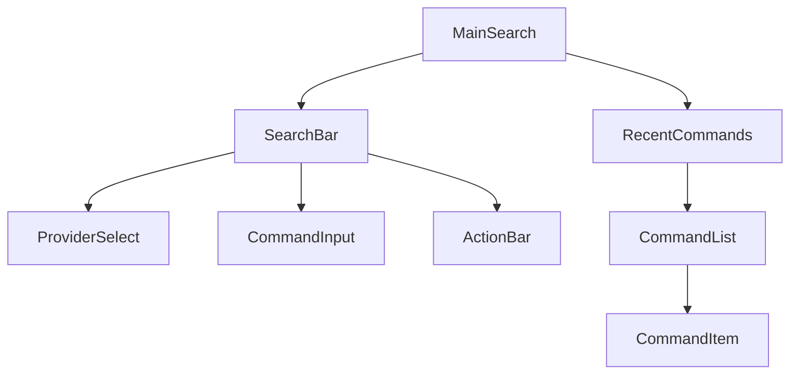

# Main Search Page (/)

The Main Search page serves as the landing page and primary command execution interface. It provides immediate access to the command input field, which automatically receives focus when the page loads.

## Page Structure

## Components

### Primary Components

- [SearchBar](../components/SearchBar.md) - Main command input container
  - `ProviderSelect` - Search engine dropdown
  - `CommandInput` - Command parsing & suggestions
  - `ActionBar` - Execute/clear/settings
- `RecentCommands` - Command history
  - `CommandList` - Virtual list of recent commands
  - `CommandItem` - Individual command with metadata

### Functionality

- Instant command execution
- Command history tracking
- Provider selection
- Command suggestions
- Keyboard navigation

## State Management

The Main Search page manages the following state:

- Current command input
- Selected provider
- Command history
- Suggestion visibility
- Focus state

## User Interactions

1. **Command Entry**

   - User types in the command input
   - System provides real-time suggestions
   - Command is parsed and validated

2. **Command Execution**

   - User presses Enter or clicks Execute
   - Command is processed and URL is generated
   - Browser navigates to the target URL

3. **History Access**
   - User can view recent commands
   - Click on history item to re-execute
   - Clear history option available

## Related Components

- [SearchBar Component](../components/SearchBar.md)
- [ServiceBuilder Component](../components/ServiceBuilder.md)

## Related Documentation

- [Command Execution Flow](../flows/command-execution.md)
- Technical Implementation (Documentation moved)
- [Command Model](../models/command.md)
