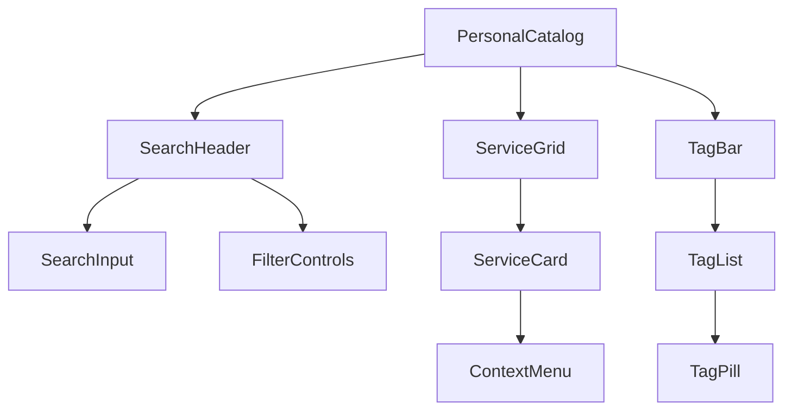

# Personal Catalog Page (/personal)

The Personal Catalog page serves as the user's workspace for managing their collection of commands. It provides tools for organizing, searching, and accessing the user's personal command library.

## Page Structure

## Components

### Primary Components

- `SearchHeader` - Search and filtering
  - `SearchInput` - Full-text search
  - `FilterControls` - Tag/sort controls
- [[../components/ServiceGrid|ServiceGrid]] - Virtual grid of services
  - `ServiceCard` - Service with metadata
  - `ContextMenu` - Service actions
- [[../components/TagBar|TagBar]] - Tag navigation
  - `TagList` - Horizontal virtual list
  - `TagPill` - Individual tag with count

### Functionality

- Command organization
- Tag-based filtering
- Full-text search
- Command execution
- Command editing
- Context menu actions

## State Management

The Personal Catalog page manages the following state:

- Active tags
- Search query
- Sort order
- Selected commands
- Grid layout
- Context menu state

## User Interactions

1. **Command Discovery**
   - Browse commands by scrolling
   - Filter by selecting tags
   - Search by typing in search box

2. **Command Execution**
   - Click on command to execute
   - Right-click for additional options
   - Drag to reorder or organize

3. **Command Management**
   - Add new commands
   - Edit existing commands
   - Delete unwanted commands
   - Organize with tags

## Related Components

- [[../components/ServiceGrid|ServiceGrid Component]]
- [[../components/TagBar|TagBar Component]]
- [[../components/CommandBuilder|CommandBuilder Component]]

## Related Documentation

- [[../flows/command-management|Command Management Flow]]
- [[../technical/technology|Technical Implementation]]
- [[../models/command|Command Model]]
- [[../models/tag|Tag Model]] 
