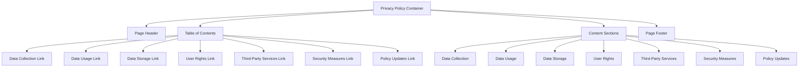
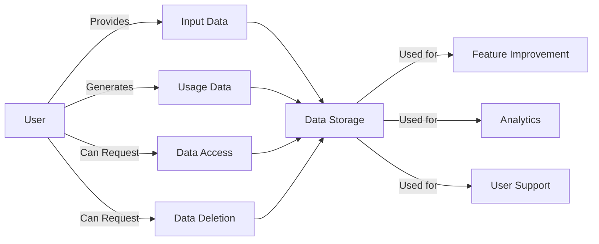

# Privacy Policy Page

The Privacy Policy page documents the data handling practices, user rights, and compliance measures implemented by meows.space. It provides transparency about how user data is collected, stored, processed, and protected.

## Page Structure



## Implementation Details

The Privacy Policy page is implemented as a static React component with the following features:

- Semantic HTML structure with proper heading hierarchy
- Anchor links for in-page navigation
- Responsive layout that adapts to different screen sizes
- Print-friendly styling for offline reference
- Last updated timestamp with version tracking

## Content Sections

The page contains the following primary content sections:

1. **Data Collection**: Documents what data is collected and how
2. **Data Usage**: Explains how collected data is used
3. **Data Storage**: Details where and how data is stored
4. **User Rights**: Outlines user rights regarding their data
5. **Third-Party Services**: Lists external services and their data access
6. **Security Measures**: Describes security implementations
7. **Policy Updates**: Explains how and when the policy may change

## Data Flow Visualization



## Navigation

The page implements the following navigation features:

- Table of contents with anchor links to each section
- Back-to-top links at the end of each section
- Breadcrumb navigation showing the path from the home page
- Related legal document links in the sidebar

## Usage

```tsx
import { PrivacyPolicyPage } from "pages/PrivacyPolicy";

function App() {
  return (
    <Router>
      <Route path="/privacy" component={PrivacyPolicyPage} />
    </Router>
  );
}
```

## Accessibility

The Privacy Policy page implements the following accessibility features:

- Semantic HTML structure with proper heading hierarchy
- High contrast text for readability
- Keyboard navigable table of contents
- Screen reader optimized content structure

## Related Pages

- [TermsOfService](terms-of-use.md): Complementary legal document
- [DataProtection](data-protection.md): Detailed information about data handling
- [About](about.md): General information about the service
