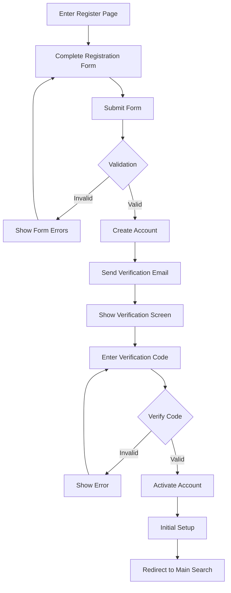

# Register Page

## Overview

The Register page provides an interface for new users to create accounts on meows.space. It includes a registration form, email verification process, and initial setup guidance to help users get started with the platform.

## Route

```text
/auth/register
```

## Page Components

### Registration Form

- Email input with validation
- Password input with strength meter
- Password confirmation
- Username selection
- Terms of service acceptance
- Registration button with loading state
- Login link for existing users

### Email Verification

- Verification email sending
- Verification code input
- Resend verification option
- Email change option

### Initial Setup

- Profile creation guidance
- First command creation
- Catalog exploration
- Tutorial introduction

## User Flow



## Functionality

### Account Creation

- User data validation
- Unique email verification
- Secure password requirements
- Terms acceptance tracking
- Account initialization

### Verification Process

- Secure token generation
- Email delivery system
- Token validation
- Expiration handling
- Resend capabilities

### Onboarding Flow

- Profile setup guidance
- Default command creation
- Feature introduction
- Tutorial access
- Preference configuration

## Related Documentation

- [Login Page](login.md)
- API Endpoints (Documentation moved)
- [User Profile Model](../models/user-profile.md)
- [Tutorial and Help Page](help.md)
