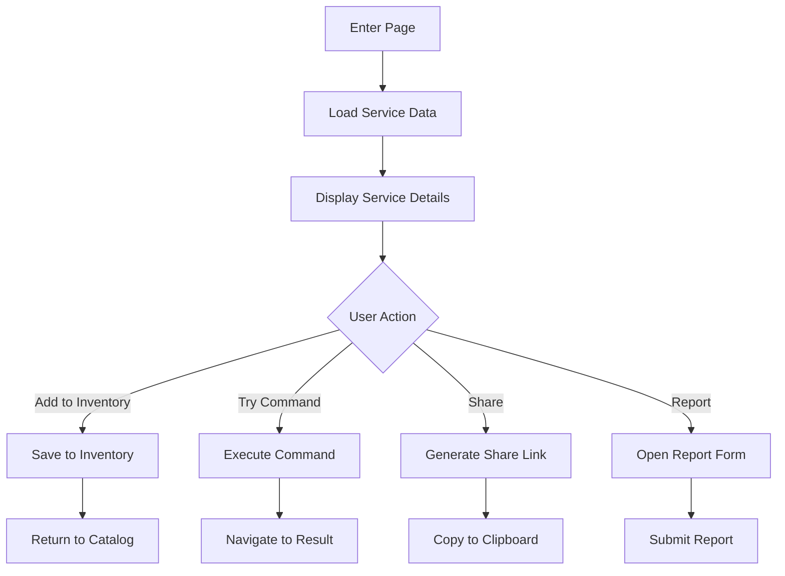

# Service Details Page

## Overview

The Service Details page provides comprehensive information about a specific service or command. It displays metadata, usage statistics, and related services, allowing users to understand and interact with the command.

## Route

```
/service/[id]
```

Where `id` is the unique identifier for the service.

## Page Components

### Service Header

- Service name and icon
- Creator information
- Creation/update date
- Rating and popularity metrics
- Action buttons (add to inventory, share, report)

### Command Information

- Command syntax and shortcut
- URL template structure
- Parameter descriptions
- Example usages
- Implementation details

### Usage Statistics

- Usage frequency
- Popular parameter values
- User adoption rate
- Related commands
- Community rating

### Related Services

- Similar commands
- Commands by same creator
- Frequently used together
- Alternative implementations

## User Flow



## Functionality

### Service Inspection

- View complete command details
- Examine parameter configurations
- See usage examples
- Review implementation details

### Command Testing

- Test command with custom parameters
- Preview resulting URL
- Execute command directly
- View execution history

### Service Management

- Add to inventory
- Customize before adding
- Report issues or violations
- Share with others

## Related Documentation

- [[../models/service|Service Model]]
- [[global-catalog|Global Catalog Page]]
- [[inventory|Inventory]]

## Interface Components

| Component        | Description                 | Functionality                   |
| ---------------- | --------------------------- | ------------------------------- |
| Service Header   | Service name and icon       | Visual identification           |
| Command Details  | URL template and parameters | Technical details               |
| Usage Statistics | Popularity and ratings      | Social proof                    |
| Action Buttons   | Primary interactions        | Add to inventory, share, report |

## User Interactions

The Service Details page supports several key user interactions:

1. **Viewing Details**: Users can view the command's URL template, parameters, and usage statistics
2. **Adding to Inventory**: Users can add the command to their personal inventory
3. **Sharing**: Users can generate a share link for the command
4. **Reporting**: Users can report issues with the command

## Related Pages

- [[global-catalog|Global Catalog]]
- [[inventory|Inventory]]
- [[create-command|Create Command]]
