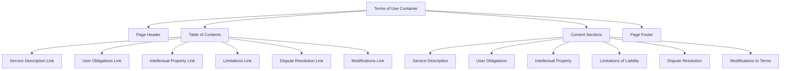

# Terms of Use Page

The Terms of Use page presents the legal terms governing the use of meows.space, including user responsibilities and limitations. It provides a comprehensive reference for the legal agreement between users and the service.

## Page Structure



## Implementation Details

The Terms of Use page is implemented as a static React component with the following features:

- Semantic HTML structure with proper heading hierarchy
- Anchor links for in-page navigation
- Responsive layout that adapts to different screen sizes
- Print-friendly styling for offline reference
- Last updated timestamp with version tracking

## Content Sections

The page contains the following primary content sections:

1. **Service Description**: Defines the scope and nature of meows.space
2. **User Obligations**: Outlines user responsibilities and acceptable use
3. **Intellectual Property**: Clarifies ownership and usage rights
4. **Limitations of Liability**: Defines the boundaries of service responsibility
5. **Dispute Resolution**: Establishes procedures for resolving conflicts
6. **Modifications to Terms**: Explains how and when terms may change

## Navigation

The page implements the following navigation features:

- Table of contents with anchor links to each section
- Back-to-top links at the end of each section
- Breadcrumb navigation showing the path from the home page
- Related legal document links in the sidebar

## Usage

```tsx
import { TermsOfUsePage } from "pages/TermsOfUse";

function App() {
  return (
    <Router>
      <Route path="/terms" component={TermsOfUsePage} />
    </Router>
  );
}
```

## Accessibility

The Terms of Use page implements the following accessibility features:

- Semantic HTML structure with proper heading hierarchy
- High contrast text for readability
- Keyboard navigable table of contents
- Screen reader optimized content structure

## Related Pages

- [PrivacyPolicy](privacy-policy.md): Complementary legal document
- [DataProtection](data-protection.md): Information about data handling practices
- [About](about.md): General information about the service
