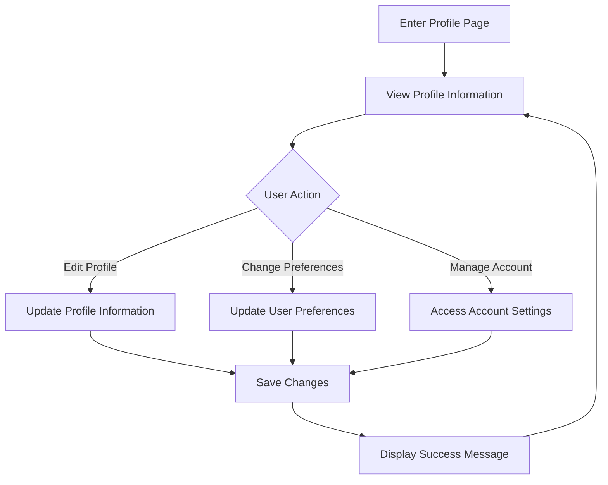

# User Profile Page

## Overview

The User Profile page provides users with a view of their account information and allows them to manage their profile settings. It serves as a central hub for personal information, preferences, and account management.

## Route

```text
/profile
```

## Page Components

### Profile Header

- User avatar/profile picture
- Display name
- Account type and status
- Account creation date
- Last login information

### Profile Information

- Personal details section
  - Display name
  - Email address
  - Profile picture upload/change
  - Bio/description (optional)

### Preference Management

- Interface preferences
  - Theme selection (light/dark/system)
  - Layout options
  - Display density
- Command execution preferences
  - Default browser
  - Command history settings
  - Default search behavior

### Account Management

- Password change (if applicable)
- Connected accounts
- Email preferences
- Data export options
- Account deletion

## User Flow



## Functionality

### Profile Viewing

- Display current profile information
- Show account statistics
- View connected services
- Display activity history

### Profile Editing

- Update display name
- Change profile picture
- Edit personal information
- Update contact details

### Preference Management

- Change interface theme
- Adjust layout preferences
- Configure notification settings
- Set default behaviors

### Account Security

- Change password
- Enable/disable two-factor authentication
- Manage active sessions
- View security log

## Interface Components

| Component           | Description                      | Functionality                        |
| ------------------- | -------------------------------- | ------------------------------------ |
| Profile Header      | User identification area         | Display user info and status         |
| Information Section | Personal details form            | View and edit profile information    |
| Preferences Panel   | User preference controls         | Customize application behavior       |
| Account Section     | Account management options       | Manage security and account settings |
| Activity Timeline   | Recent account activity          | View login history and actions       |
| Connected Services  | Third-party service integrations | Manage service connections           |

## States and Transitions

The User Profile page can exist in several states:

- **View Mode**: Default state showing profile information
- **Edit Mode**: Active when user is editing profile information
- **Loading State**: Shown while profile data is being loaded
- **Error State**: Displayed when profile data cannot be loaded
- **Success State**: Shown briefly after successful updates

## Related Components

- [ProfileEditor](../components/ProfileEditor.md)
- [UserMenu](../components/UserMenu.md)
- [ThemeSelector](../components/ThemeSelector.md)

## Related Pages

- [Settings](settings.md)
- [Inventory](inventory.md)
- [Login](login.md)

## Related Documentation

- [User Profile Model](../models/user-profile.md)
- [User Preferences Model](../models/user-preferences.md)
- [Profile Management Flow](../flows/profile-management.md)
